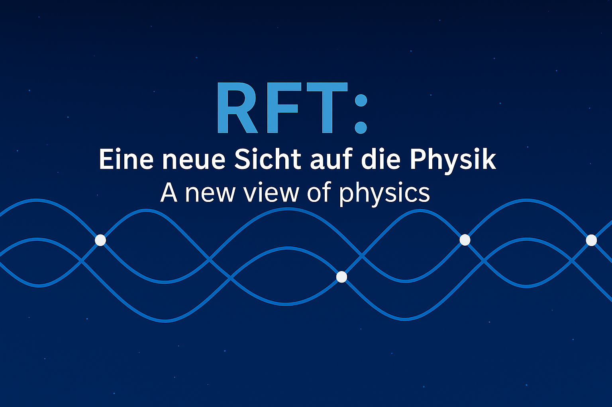

# Resonanzfeldtheorie (RFT)

[🇬🇧 English Version](../en/) | [🏠 Home](../)

---

## 🎯 Über dieses Projekt

Die Resonanzfeldtheorie (RFT) ist ein fundamentalphysikalischer Ansatz zur Beschreibung von:

- **Raumstruktur** als dynamisches Resonanzgitter
- **Teilchenphysik** (Quarks, Photonen) aus Wirbel-Konfigurationen
- **Dunkle Materie** als Gitterverspannung
- **Kosmologie** und Strukturbildung

---

## 📚 Dokumentation -> befindet sich im Aufbau, die Nummerierung und die Themen werden noch angepasst!

### Grundlagen
- [RFT_01: Spin-Quantisierung](docs/RFT_01.md)
- [RFT_02: Universum-Entstehung](docs/RFT_02.md)
- [RFT_04: Kalte Kondensation](docs/RFT_04.md)

### Teilchenphysik
- [RFT_05: Quarks](docs/RFT_05.md)
- [RFT_20: Photonenmodell](docs/RFT_20.md)

### Kosmologie
- [RFT_09: Großraum-Strukturen](docs/RFT_09.md)
- [RFT_15: Dunkle Materie](docs/RFT_15.md)

**[→ Vollständige Dokumentation](docs/)**

---

## 📧 Kontakt

**Email:** rft.projekt@posteo.de

---

## 📖 Zitation

---

## 📜 Lizenz

© 2025 RFT-Physik-Projekt. Alle Rechte vorbehalten.

[CC BY-NC-ND 4.0](https://creativecommons.org/licenses/by-nc-nd/4.0/deed.de)
