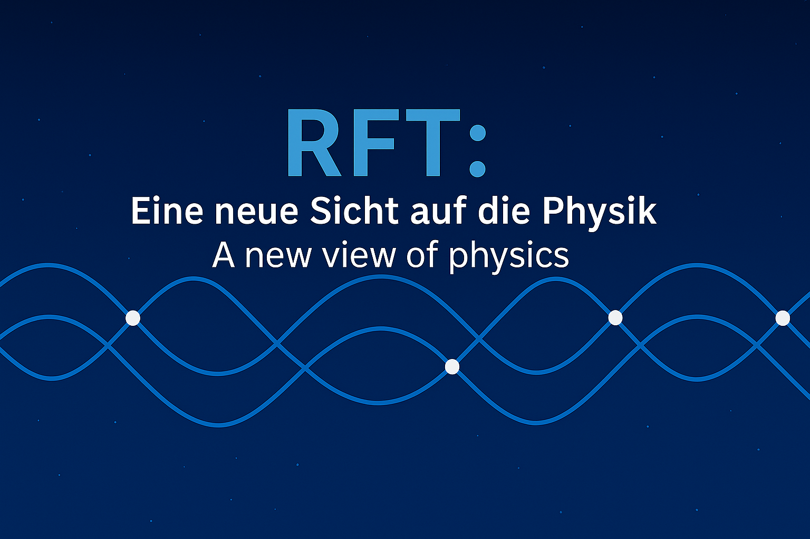

# Resonanzfeldtheorie (RFT)

[🇬🇧 English Version](../../en/) | [👤 Autor](autor.md) | [🤝 Mitwirken](mitwirken.md) | [📧 Kontakt](kontakt.md)

---

## 🎯 Willkommen zur Resonanzfeldtheorie

Die **Resonanzfeldtheorie (RFT)** ist ein neuer fundamentalphysikalischer Ansatz, der Raum, Zeit und Materie als Manifestation eines dynamischen **Resonanzgitters** beschreibt. Sie bietet Erklärungen für:

- **Teilchenphysik:** Quarks und Photonen als stabile Wirbel-Konfigurationen
- **Kosmologie:** Dunkle Materie als Gitter-Verspannung
- **Quantenphänomene:** Doppelspalt-Experiment ohne Wahrscheinlichkeitswellen
- **Gravitation:** Raumzeit-Krümmung aus Resonanz-Prinzipien

> **"Was wäre, wenn das Universum nicht aus Teilchen, sondern aus Schwingungen besteht?"**

---

## 🗺️ Drei Wege zum Einstieg

### 🔍 Für Neugierige & Querdenker
Du suchst nach einer intuitiven, ganzheitlichen Sicht auf die Physik?
**[→ Starte hier mit den faszinierendsten Konzepten](einstieg/neugierige.md)**

### 🧮 Für Physiker & Mathematiker
Du willst die mathematische Struktur und Ableitungen verstehen?
**[→ Beginne mit den Grundlagen & Formalismen](einstieg/physiker.md)**

### 💭 Für Philosophen & Theoretiker
Du interessierst dich für die konzeptuellen Grundlagen und Implikationen?
**[→ Tauche ein in die philosophische Tiefe](einstieg/philosophen.md)**

---

## 📚 Dokumentation im Aufbau

Diese Website wird aktuell aufgebaut. Derzeit sind **7 von 46 Dokumenten** online, viele weitere folgen in Kürze.

**[→ Zur vollständigen (wachsenden) Dokumentation](docs/README.md)**

### 🔬 Aktueller Fokus: LinkedIn-Serie
Ich veröffentliche gerade eine Serie von Posts auf LinkedIn, die in die RFT einführt:

- **Post #1:** Gravitation als Resonanz-Phänomen
- **Post #2:** Dunkle Materie - eine Alternative
- **Post #3:** Der Q-Faktor und die Mathematik der RFT
- **Post #4:** Ein Low-Cost-Experiment zum Selbertesten (~1000€)

**[→ Zur kompletten LinkedIn-Serie](linkedin-serie.md)**

---

## 💎 Kernaussagen der RFT

1. **Raum ist kein passive Bühne**, sondern ein aktives **Resonanzgitter**
2. **Materie entsteht** durch stabile Wirbel-Konfigurationen ("Vortices") im Gitter  
3. **Emergenz statt Reduktion:** Komplexe Phänomene entstehen aus einfachen Resonanz-Prinzipien
4. **Vereinheitlichung:** Die RFT beschreibt Phänomene von der Quanten- bis zur Kosmologischen Skala

---

## 📬 Nächste Schritte

- **Mitlesen:** Durchstöbere die verfügbaren Dokumente
- **Mitdenken:** Schicke Feedback, Kritik oder Fragen
- **Mitwirken:** Unterstütze die Forschung [mit einer Spende](mitwirken.md)

**Letzte Aktualisierung:** März 2025  
**Status:** Website im aktiven Aufbau - weitere Dokumente folgen wöchentlich

---
[🏠 Zur Hauptseite](../../) | [📜 Lizenzinformationen](../../LICENSE)
