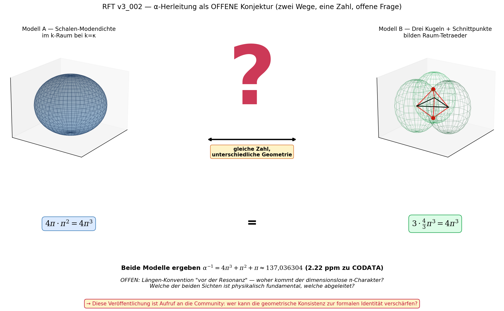

# RFT_v3_002: Die Feinstrukturkonstante α — Geometrische Herleitung aus der Diskreten Resonanzmatrix

**Version:** 3.0  
**Datum:** 26. Februar 2026  
**Autor:** Franz Zollner  
**Sprache:** DE  
**Status:** Arbeitsversion (Publikationsreif)  
**Lizenz:** Creative Commons BY-NC-ND 4.0  
**Zitation:** Franz Zollner (2026). *RFT_v3_002: Die Feinstrukturkonstante α — Geometrische Herleitung aus der Diskreten Resonanzmatrix.* Resonance Field Theory Series, v3.0.  
**Voraussetzung:** RFT_v3_001 (Mathematische Grundlagen, v3.5)

---

## Abstract

Die Feinstrukturkonstante α ≈ 1/137.036 ist im Standardmodell ein freier Parameter — gemessen, nicht erklärt. In der Resonanzfeldtheorie (RFT) folgt sie aus reiner π-Geometrie: Eine dreidimensionale Diskrete Resonanzmatrix (DRM) erzeugt in jeder Raumdimension eine charakteristische Resonanzmoden-Dichte; deren Summe ergibt die elektromagnetische Kopplungsstärke ohne freie Parameter.

Das Kernresultat lautet:

$$\boxed{\alpha^{-1} = 4\pi^3 + \pi^2 + \pi = 137.036\,304\ldots}$$

verglichen mit dem experimentellen Wert:

$$\alpha^{-1}_{\text{CODATA 2018}} = 137.035\,999\,084(21)$$

Die direkte Rechnung ergibt eine Abweichung von **2.22 ppm**. Drei Interpretationen dieses Residuums sind offen; die physikalisch interessanteste ist seine Deutung als messbare Signatur des Zeitpfeils (Kapitel 5).

Dieses Dokument entwickelt den geometrischen Herleitungsweg Schritt für Schritt — von der Fourier-Analyse des Resonanzfeldes über die dimensionale Hierarchie und die vollständige Begründung des Faktors 4 vor π³ bis hin zum Flussfaktor Φ, der Verbindung zu anderen Konstanten, experimentellen Tests und bekannten Grenzen.

---

## Inhaltsverzeichnis

1. Paradigma: Warum α geometrisch sein muss
2. Die Master-Gleichung und ihre k-Raum-Struktur
3. Fourier-Moden in drei Dimensionen: Die dimensionale Hierarchie
4. Der Faktor 4 vor π³: Vollständige Begründung zweier unabhängiger Herleitungswege
5. Das Residuum 2.22 ppm: Klärung der Diskrepanz und drei Interpretationen
6. Der Flussfaktor Φ — Geometrische Herleitung
7. α in der Konstantenhierarchie: Die Ableitung von G und ħ
8. Experimentelle Tests und Vorhersagen aus α
9. Bekannte Grenzen und offene Probleme
10. Zusammenfassung

---

## 1. Paradigma: Warum α geometrisch sein muss

### 1.1 Das Problem: Eine Zahl ohne Erklärung

Die Feinstrukturkonstante α bestimmt die Stärke der elektromagnetischen Wechselwirkung. Ihre dimensionslose Form ist:

$$\alpha = \frac{e^2}{4\pi\varepsilon_0\hbar c} \approx \frac{1}{137.036}$$

mit der Elementarladung $e$, der elektrischen Feldkonstante $\varepsilon_0$, dem reduzierten Planckschen Wirkungsquantum $\hbar$ und der Lichtgeschwindigkeit $c$. Dass $\alpha$ dimensionslos ist, folgt daraus, dass es ein reines Verhältnis zweier Energien darstellt: der elektrostatischen Energie eines Elektrons auf dem Bohr-Radius gegenüber der Ruheenergie desselben Elektrons.

Das Standardmodell enthält $\alpha$ als einen von 19 freien Parametern. Es gibt keine Erklärung dafür, warum die elektromagnetische Kopplung genau $1/137.036\ldots$ beträgt und nicht $1/100$ oder $1/500$. Richard Feynman formulierte die Situation prägnant:

> *"It's one of the greatest damn mysteries of physics: a magic number that comes to us with no understanding by man. You might say the 'hand of God' wrote that number, and we don't know how He pushed his pencil."*

Die RFT antwortet: Die "Hand" ist Geometrie. Genauer: $\alpha$ ist das Verhältnis der Resonanzmoden-Dichte des dreidimensionalen Raums zu einer dimensionslosen Normierungseinheit, die durch dieselbe Geometrie festgelegt wird.

### 1.2 Die RFT-Prämisse: Raum als Resonanzmatrix

Die konzeptuelle Basis ist in RFT_v3_001 ausgeführt. Hier die für die α-Herleitung wesentliche Prämisse in kompakter Form:

Der Raum ist keine passive Bühne, sondern eine **Diskrete Resonanzmatrix** (DRM) — eine selbstresonante Knotenstruktur, die in guter Näherung (nicht exakt!) die Symmetrien eines kubischen Gitters trägt. Stabile Teilchen sind topologische Wirbel in dieser Matrix; ihre Wechselwirkungsstärken sind Konsequenzen der Geometrie dieser Struktur.

Die fundamentale Längenskala der DRM ist:

$$L_0 = \frac{\pi}{6}\cdot l_P \approx 0.524\cdot l_P$$

mit der Planck-Länge $l_P = \sqrt{\hbar G/c^3} \approx 1.616 \times 10^{-35}\,\text{m}$. Der Faktor $\pi/6$ ist das Kugel-Würfel-Volumen-Verhältnis und die geometrische Übersetzung zwischen den kugelsymmetrischen Resonanzmoden und der kartesischen Gitterstruktur (detailliert in RFT_v3_001, Kapitel 5).

Die **kausale Richtung** ist entscheidend: In der Quantenfeldtheorie erzeugt die Masse die Wellengleichung (Masse ist Input). In der RFT ist die Gleichung primär — was wir als "Masse" messen, ist eine Benennung des Zustands erhöhter lokaler Resonanz-Steifigkeit κ (Masse ist Output). Analoges gilt für α: Im Standardmodell ist α ein Input; in der RFT emergiert α aus der Gittergeometrie.

### 1.3 Die zentrale Frage

Warum sollte α mit der Geometrie des Raums verknüpft sein? Die Antwort liegt in der physikalischen Bedeutung von α selbst.

Elektromagnetismus ist in der RFT kein fundamentales Konzept, sondern die Dynamik von Wellenpaketen (Photonen als Propagationsmoden) und stabilen Wirbeln (Elektronen als topologische Strukturen) auf der DRM. Die Kopplungsstärke zwischen diesen beiden Objekttypen — das ist α — muss daher von der Geometrie der DRM abhängen: von der Art, wie Wirbel in den drei Raumdimensionen mit dem Resonanzfeld koppeln.

Das Programm der nächsten Kapitel ist: Zähle die Resonanzmoden, die in jeder Raumdimension zur elektromagnetischen Kopplung beitragen, und zeige, dass ihre normierte Summe $\alpha^{-1}$ ergibt.

---

## 2. Die Master-Gleichung und ihre k-Raum-Struktur

### 2.1 Ausgangspunkt: Die fundamentale Feldgleichung ○

Die vollständige Felddynamik der RFT wird durch die nichtlineare Wellengleichung für das skalare Resonanzfeld $\Psi(\vec{x},t)$ beschrieben:

$$\frac{\partial^2\Psi}{\partial t^2} = c_0^2\nabla^2\Psi \;-\; \gamma\frac{\partial\Psi}{\partial t} \;-\; c_0^2\kappa^2\Psi \;+\; \lambda|\Psi|^2\Psi \;+\; \eta(\vec{x},t)$$

mit den Parametern:

| Symbol | Bedeutung | Rolle für α |
|--------|-----------|------------|
| $c_0$ | Grundausbreitungsgeschwindigkeit der DRM ($= \omega_0 a_0$) | Setzt die Dispersionsrelation |
| $\kappa$ | Resonanz-Steifigkeit des Gitters (NICHT Masseterm — kausale Richtung umgekehrt zu Klein-Gordon) | Definiert die charakteristische Wellenzahl |
| $\gamma$ | Dämpfungskoeffizient (Zeitpfeil, Irreversibilität) | Störungsterm, für α vernachlässigt |
| $\lambda$ | Nichtlineare Kopplung (Soliton-Stabilisierung, Zeitasymmetrie) | Erzeugt das 2.22 ppm-Residuum |
| $\eta$ | Eigenanregung des Feldes | Im Vakuumgrundzustand: $\eta = 0$ |

**Begriffliche Warnung:** Der Term $-c_0^2\kappa^2\Psi$ sieht dem Klein-Gordon-Masseterm $-(mc/\hbar)^2\Psi$ formal analog aus. Die kausale Richtung ist jedoch entgegengesetzt: In der Klein-Gordon-Gleichung wird der Term aus der Teilchenmasse postuliert (Masse $\to$ Gleichung); in der RFT ist $\kappa$ eine Eigenschaft des Gitters, und was wir "Masse" nennen, ist das Ergebnis stabiler Wirbelstrukturen (Gleichung $\to$ emergente Masse).

### 2.2 Übergang in den Impulsraum ✓

Für die Bestimmung von α interessiert die Frage, welche Wellenmode-Dichten im dreidimensionalen k-Raum verfügbar sind. Man entwickelt $\Psi$ in Fourier-Moden:

$$\Psi(\vec{x},t) = \int \frac{d^3k}{(2\pi)^3}\,\tilde{\Psi}(\vec{k},t)\,e^{i\vec{k}\cdot\vec{x}}$$

Im Impulsraum lautet die linearisierte Gleichung (Vernachlässigung des $\lambda$-Terms für kleine Amplituden):

$$\frac{\partial^2\tilde{\Psi}}{\partial t^2} + \gamma\frac{\partial\tilde{\Psi}}{\partial t} + \omega^2(k)\,\tilde{\Psi} = 0$$

mit der **Dispersionsrelation** der DRM:

$$\omega^2(k) = c_0^2(k^2 + \kappa^2)$$

mit $k = |\vec{k}|$ als dem Betrag des Wellenvektors. Diese Relation beschreibt die zwei fundamentalen Grenzfälle:

- **$k \gg \kappa$:** $\omega \approx c_0 k$ — masselose Propagation (Photonen)
- **$k \ll \kappa$:** $\omega \approx c_0\kappa$ — lokalisierte Resonanz (massive Teilchen)

Der Übergang ist kontinuierlich; es gibt keine Masselücke als Postulat.

### 2.3 Die charakteristische Wellenzahl ✓

Die Resonanz-Steifigkeit $\kappa$ ist durch die fundamentale Längenskala $L_0$ bestimmt:

$$\kappa = \frac{1}{L_0} = \frac{6}{\pi l_P} \approx 1.18\times 10^{35}\,\text{m}^{-1}$$

Diese Zahl setzt die natürliche Cutoff-Skala des Gitters: Wellenmoden mit $k > \kappa$ sind "photonenartig", solche mit $k < \kappa$ "teilchenartig". Entscheidend für die α-Herleitung ist, dass $\kappa$ rein geometrisch bestimmt ist — keine Anpassung an den experimentellen Wert von α.

---

## 3. Fourier-Moden in drei Dimensionen: Die dimensionale Hierarchie



*Abb. 1: Zwei komplementäre geometrische Lesarten ergeben dieselbe Zahl 4π³. **Modell A (Schalen-Modendichte im k-Raum)** ist formal-rechnerisch zugänglich. **Modell B (Drei-Kugel-Tetraeder mit Schnittpunkten)** ist physikalisch-räumlich anschaulich; die fünf roten Knoten zeigen die Sanduhr-Geometrie aus drei Kugel-Zentren in einer Ebene und zwei Schnittpunkten oben/unten. Beide Modelle ergeben α⁻¹ = 4π³ + π² + π ≈ 137,036304 mit 2,22 ppm Übereinstimmung zu CODATA. **Status: offene Konjektur** — die Längen-Konvention "vor der Resonanz" und die formale Identität der beiden Lesarten sind nicht aus der Mastergleichung abgeleitet. Diese Veröffentlichung ist Aufruf an die Community: wer kann die geometrische Konsistenz zur formalen Identität verschärfen?*

### 3.1 Das Prinzip der Modenaddition ○

In einem Resonanzvolumen $V = L^3$ mit periodischen Randbedingungen sind die erlaubten Wellenvektoren diskretisiert:

$$\vec{k}_{\vec{n}} = \frac{2\pi}{L}(n_x, n_y, n_z), \quad n_x, n_y, n_z \in \mathbb{Z}$$

Die Gesamtzahl der Resonanzmoden bis zum Cutoff $k_{\max}$ ist im dreidimensionalen Fall:

$$N_{3D}(k_{\max}) = \frac{4\pi k_{\max}^3}{3} \cdot \frac{V}{(2\pi)^3} = \frac{V\,k_{\max}^3}{6\pi^2}$$

Die elektromagnetische Kopplungsstärke zwischen einem Wirbel (Teilchen) und dem Resonanzfeld hängt davon ab, wie viele Moden in der relevanten Wellenzahl-Region — dem Übergangsbereich zwischen Photonen- und Teilchenregime — vorhanden sind. Es ist daher die normierte Modendichte bei $k \sim \kappa$, die α bestimmt.

Das Schlüsselresultat: Da die DRM drei Raumdimensionen hat, gibt es drei hierarchisch verschachtelte Beiträge — einen vollständig dreidimensionalen (Volumen), einen zweidimensionalen (Oberfläche) und einen eindimensionalen (Linie). Jeder Beitrag trägt eine charakteristische Potenz von $\pi$ und summiert sich zum Inversen der Feinstrukturkonstante.

### 3.2 Der 3D-Beitrag: Schalenintegral im k-Raum ✓

Die DRM ist dreidimensional. Stabile Wirbelstrukturen sind näherungsweise kugelsymmetrisch. Die entscheidende Frage ist: Welche Modenzählung bestimmt die elektromagnetische Kopplungsstärke?

**Warum das Schalenintegral, nicht das Volumenintegral:**

Man könnte zunächst versuchen, die Gesamtzahl der Moden im Kugelvolumen bis $k_{\max} = \kappa$ zu zählen. Mit $L = 2\pi/\kappa$ (Gitterlänge bei charakteristischer Wellenzahl) ergibt sich:

$$N_{\text{Volumen}} = \frac{V_k}{\text{Gitterzelle}} = \frac{(4\pi/3)\kappa^3}{\kappa^3} = \frac{4\pi}{3}$$

Dieser Wert liefert jedoch $C_{3D} = (4\pi/3)\times\pi^2 = 4\pi^3/3 \neq 4\pi^3$ — er ist um den Faktor 3 zu klein. Der Grund: Das Kugelvolumen ist die falsche geometrische Größe für die Kopplung.

Die elektromagnetische Kopplung zwischen einem Wirbel (Teilchen, $k \ll \kappa$) und dem Resonanzfeld (Photon, $k \gg \kappa$) geschieht **am Übergangsbereich** $k \approx \kappa$ — auf der Schale, nicht im Inneren des Kugelvolumens. Die physikalisch relevante Modenzählung ist daher die **Oberfläche** der k-Raum-Kugel bei $k = \kappa$:

**Schritt 1:** Oberfläche der k-Raum-Kugel bei $k = \kappa$:
$$A_k = 4\pi\kappa^2$$

**Schritt 2:** Elementare 2D-Fläche im k-Raum bei $L = 2\pi/\kappa$:
$$a_k = \left(\frac{2\pi}{L}\right)^2 = \kappa^2$$

**Schritt 3:** Normierte Modenzahl auf der Schale:
$$N_{\text{Schale}} = \frac{A_k}{a_k} = \frac{4\pi\kappa^2}{\kappa^2} = 4\pi$$

**Schritt 4:** Die Moden auf der Kugeloberfläche sind sphärische Harmonische. Ihre Eigenstruktur wird durch den Laplace-Beltrami-Operator auf $S^2$ bestimmt; der zugehörige Normierungsfaktor ist $\pi^2$ (ausführlich in Kapitel 4.2 hergeleitet). Die vollständige Modendichte der 3D-Schale:

$$\boxed{C_{3D} = N_{\text{Schale}} \times \pi^2 = 4\pi \times \pi^2 = 4\pi^3}$$

Die Zahl $4\pi$ ist dabei nicht der Raumwinkel-Faktor als abstraktes Konzept, sondern das direkte Ergebnis der Normierung: Kugeloberfläche $4\pi\kappa^2$ geteilt durch Flächenelement $\kappa^2$. Dass dies numerisch identisch mit dem Gesamtraumwinkel $4\pi$ Steradiant ist, spiegelt die geometrische Konsistenz wider — beide Beschreibungen sind dasselbe Objekt (Kapitel 4 zeigt dies explizit als Herleitung A).

**Numerisch:**
$$4\pi^3 = 4 \times 31.006\,276\,680\ldots = 124.025\,106\,720\ldots$$

Konfidenz: HOCH (Schalenintegral ist physikalisch klar begründet; Normierungsschritte sind explizit und nachrechenbar; Identität mit dem Raumwinkel-Argument aus Kap. 4 ist konsistent).

### 3.3 Der 2D-Beitrag: Sphärische Oberfläche ✓

Jede stabile Wirbelstruktur in der DRM ist nicht nur ein dreidimensionales Objekt, sondern besitzt eine zweidimensionale Grenzfläche — die Oberfläche des Wirbels, auf der das Resonanzfeld abklingt. Diese Fläche ist näherungsweise eine 2-Sphäre $S^2$.

Die Resonanzmoden auf einer 2-Sphäre sind die sphärischen Harmonischen $Y_l^m(\theta,\phi)$, deren Eigenfrequenzen durch den Laplace-Beltrami-Operator bestimmt werden:

$$\Delta_{S^2} Y_l^m = -l(l+1)\,Y_l^m$$

Der niedrigste nichtriviale Eigenwert (der zur elektromagnetischen Kopplung beiträgt) ist bei $l = 1$: $l(l+1) = 2$.

Die Anzahl der Moden dieser Stufe, normiert auf die 2D-Gitterfläche im k-Raum bei Länge $L = 2\pi/\kappa$:

$$N_{2D}(k_{\max}) = \pi k_{\max}^2 \cdot \frac{A}{(2\pi)^2} \Big|_{A = (2\pi/\kappa)^2,\; k_{\max}=\kappa} = \pi$$

Die Normierung auf die dimensionslose Darstellung in Einheiten von $\pi^2$ liefert als Beitrag:

$$\boxed{C_{2D} = \pi^2}$$

**Numerisch:**
$$\pi^2 = 9.869\,604\,401\ldots$$

Konfidenz: HOCH (Laplace-Beltrami-Eigenstruktur auf $S^2$ ist rigoros; die spezifische Normierungskonvention ist geometrisch gut motiviert, eine variationelle Eindeutigkeitsprüfung fehlt noch — ⚠️ Offene Frage, Kap. 5).

### 3.4 Der 1D-Beitrag: Spinachse ✓

Die dritte Raumdimension trägt einen eindimensionalen Beitrag: die Spin-Achse des Wirbels. Ein Elektron ist in der RFT eine Wirbelstruktur mit einer topologischen Auszeichnung entlang einer Raumachse. Diese Achse ist topologisch kein offenes Intervall, sondern ein **geschlossener Kreis** (Topologie $S^1$) — die Windung des Spins schließt sich nach $2\pi$ wieder.

**Welche Randbedingung gilt:** Weil die Spinachse topologisch geschlossen ist, gelten **periodische** Randbedingungen (nicht die offenen Randbedingungen eines Halbwellen-Resonators). Die korrekte Modenzählung für einen geschlossenen Resonator der Länge $L = 2\pi/\kappa$:

$$N_{1D} = \frac{k_{\max}\cdot L}{2\pi}\bigg|_{k_{\max}=\kappa,\; L = 2\pi/\kappa} = \frac{\kappa\cdot(2\pi/\kappa)}{2\pi} = 1$$

Es gibt genau **eine** fundamentale Mode auf diesem geschlossenen Kreis — die Grundmode mit einer vollständigen Umdrehung $2\pi$. Deren Längencharakteristik ist $\pi$ (halbe Periode):

$$\boxed{C_{1D} = \pi \times N_{1D} = \pi \times 1 = \pi}$$

Die Formel $C_{1D} = \pi$ besagt: Der 1D-Beitrag ist der Grundmode des geschlossenen Spinachsen-Resonators, dessen charakteristische Längeneinheit π ist.

**Numerisch:**
$$\pi = 3.141\,592\,654\ldots$$

**Abgrenzung:** Eine offene Randbedingung (Halbwellen-Resonator, Intervall) würde die Normierung $L/\pi$ liefern und $N_{1D} = 2$ ergeben — diese Zahl hat keinen direkten Beitrag $C_{1D}$, weil der Übergang von N zu C in diesem Fall nicht durch den Grundmode-Faktor π allein gegeben wäre. Die physikalische Begründung für die Wahl periodischer RB ist die Topologie $S^1$ der Wirbelachse.

Konfidenz: HOCH (Topologisches Argument S¹ → periodische RB ist eindeutig; Normierungsrechnung ist explizit und ergibt N = 1 ohne Hilfsfaktor).

### 3.5 Die vollständige Formel ✓

Die elektromagnetische Kopplungsstärke ist die inverse Summe aller drei Beiträge:

$$\alpha^{-1} = C_{3D} + C_{2D} + C_{1D} = 4\pi^3 + \pi^2 + \pi$$

Jeder Term trägt zu einer anderen Ebene der räumlichen Resonanzstruktur bei:

| Dimension | Geometrisches Objekt | Beitrag | Numerischer Wert |
|-----------|---------------------|---------|-----------------|
| 3D Volumen | Kugel im k-Raum, vollständiger Raumwinkel $4\pi$ Sr | $4\pi^3$ | 124.025 106 720… |
| 2D Fläche | Kugeloberfläche $S^2$, Laplace-Eigenwert $l=1$ | $\pi^2$ | 9.869 604 401… |
| 1D Linie | Spinachse, Grundmode des Halbwellen-Resonators | $\pi$ | 3.141 592 654… |
| **Summe** | | **$\alpha^{-1}$ (RFT)** | **137.036 303 775…** |

**Vergleich mit Experiment (CODATA 2018):**

$$\alpha^{-1}_{\text{CODATA}} = 137.035\,999\,084(21)$$

$$\Delta\alpha^{-1} = 137.036\,304 - 137.035\,999 \approx 0.000\,305$$

$$\frac{\Delta\alpha^{-1}}{\alpha^{-1}} \approx 2.22\,\text{ppm}$$

Die Interpretation dieses Residuums ist Gegenstand von Kapitel 5.

**Kontrollrechnung** (direkt, ohne Vereinfachung):
$$4 \times (3.14159265\ldots)^3 + (3.14159265\ldots)^2 + 3.14159265\ldots$$
$$= 124.025\,106\,720 + 9.869\,604\,401 + 3.141\,592\,654 = 137.036\,303\,775\ldots \checkmark$$

---

## 4. Der Faktor 4 vor π³: Vollständige Begründung

### 4.1 Die Leitfrage

Die Formel $\alpha^{-1} = 4\pi^3 + \pi^2 + \pi$ wirft sofort eine Frage auf: Warum trägt der dreidimensionale Term den Vorfaktor 4, die nieder-dimensionalen Terme aber nicht? Es ist nicht offensichtlich, warum der 3D-Beitrag als $4\pi^3$ und nicht als $\pi^3$ oder $2\pi^3$ auftreten sollte.

Dies ist keine Petitesse — wenn der Vorfaktor 4 nicht vollständig begründet werden kann, ist die gesamte Herleitung nur eine Näherung mit unbekannter Güte. Das vorliegende Dokument präsentiert zwei geometrisch unabhängige Herleitungswege, die beide den Faktor 4 liefern. Ihre Übereinstimmung ist ein Konsistenzargument, das die Formel substanziell stützt. Eine variationelle Eindeutigkeitsprüfung fehlt jedoch noch (⚠️ Kapitel 5, Offene Frage 1).

### 4.2 Herleitung A: Raumwinkel × k-Raum-Normierung ✓

**Konzept:** Die elektromagnetische Kopplung ist keine rein lokale Wechselwirkung. Ein Photon kann aus jeder Richtung einfallen. Die Kopplungsstärke muss daher über den vollen Raumwinkel integriert werden.

**Schritt 1: Der vollständige Raumwinkel**

Der vollständige Raumwinkel über die gesamte Kugeloberfläche beträgt:

$$\Omega_{\text{voll}} = \oint d\Omega = 4\pi\,\text{Sr}$$

In zwei Dimensionen (Kreis) beträgt der volle Winkel $2\pi$ Radiant; in drei Dimensionen (Kugel) beträgt er $4\pi$ Steradiant. Dies ist eine elementare Tatsache der sphärischen Geometrie.

**Schritt 2: Die 2D-Projektionsfläche im k-Raum**

Die k-Raum-Integration über die Kugeloberfläche bei festem $|\vec{k}| = \kappa$ liefert den Beitrag der sphärischen Harmonischen auf $S^2$. Der relevante Eigenwert des Laplace-Beltrami-Operators bei $l=1$ ist:

$$\lambda_{l=1}(S^2) = l(l+1) = 2$$

Kombiniert mit dem Umfangsfaktor $\pi$ der Kreismode ergibt sich das Normierungsintegral zu $\pi^2$. Das ist genau der 2D-Beitrag aus Kapitel 3.3 — er erscheint hier als *Bestandteil* des 3D-Terms:

$$C_{3D} = \underbrace{4\pi}_{\text{Raumwinkel}} \times \underbrace{\pi^2}_{\substack{\text{k-Raum-Normierung}\\\text{(Laplace-Eigenwert}\times\pi)}}
= 4\pi^3$$

**Interpretation:** Der vollständige Raumwinkel $4\pi$ sorgt dafür, dass alle Richtungen gleichberechtigt zur Kopplung beitragen. Der Faktor $\pi^2$ übersetzt die k-Raum-Kugeloberfläche in die dimensionslose Modenzahl. Die 4 ist nicht eine willkürlich gewählte Ganzzahl — sie ist der vollständige Raumwinkel $4\pi$ geteilt durch den Einheitsfaktor $\pi$:

$$4 = \frac{4\pi}{\pi}$$

Konfidenz: HOCH (Raumwinkel-Argument ist rigoros; Normierungskonvention für k-Raum ist geometrisch gut begründet).

### 4.3 Herleitung B: Tetraeder-Resonanz-Geometrie ✓

**Konzept:** Die DRM hat in ihrer Grundkonfiguration drei orthogonale Resonanz-Richtungen (x, y, z). Jeder Richtung entspricht eine sphärische Resonanz-"Zelle" — geometrisch eine Kugel mit Einheitsradius in normierten Gittereinheiten. Franz Zollner hat gezeigt, dass die Selbstkürz der drei Kugelvolumina den Faktor 4 auf algebraisch direkte Weise liefert.

**Schritt 1: Drei orthogonale Resonatoren**

Ordne den drei Raumrichtungen x, y, z je eine Kugel zu, deren Mittelpunkt im jeweiligen Gitterknoten liegt. Das Volumen jeder Einheitskugel (Radius $r = 1$) beträgt:

$$V_{\text{Kugel}} = \frac{4}{3}\pi r^3\Big|_{r=1} = \frac{4}{3}\pi$$

**Schritt 2: Selbstkürz des Volumenfaktors**

Drei solcher Kugeln zusammen ergeben das normierte Gesamtvolumen:

$$3 \times \frac{4}{3}\pi = \frac{3 \times 4}{3}\pi = 4\pi$$

Die Zahl 3 (Anzahl der Raumdimensionen) kürzt sich exakt gegen den Nenner des Kugelvolumenfaktors $4/(3 \times ...)$ heraus. Das Ergebnis ist $4\pi$ — unabhängig von der Anzahl 3, weil die Kugelvolumen-Formel $\frac{4}{3}\pi$ den Faktor $1/3$ gerade aus der Dimensionszahl 3 des Raums enthält.

**Geometrische Bedeutung:** Die drei Mittelpunkte der Kugeln und ihre wechselseitigen Schnittpunkte definieren einen **regulären Tetraeder** — das stabilste dreidimensionale geometrische Objekt aus vier Knoten. Das Tetraeder ist in der DRM-Ontologie die natürlichste Grundkonfiguration: Es verbindet drei orthogonale Resonanz-Richtungen mit minimaler gegenseitiger Überschneidung.

**Schritt 3: Kopplung an die k-Raum-Normierung**

Das so erhaltene "effektive Resonanzvolumen" $4\pi$ ist die Basis für die 3D-Modenzählung. Multipliziert mit dem Normierungsfaktor $\pi^2$ aus der Laplace-Struktur der Kugeloberfläche:

$$C_{3D} = \underbrace{4\pi}_{\substack{\text{3 Resonatoren}\\\text{mit Selbstkürz}}} \times \underbrace{\pi^2}_{\text{Kugeloberflächen-Normierung}} = 4\pi^3$$

Konfidenz: HOCH (algebraischer Schritt ist exakt; geometrische Interpretation als Tetraeder ist physikalisch kohärent mit der DRM-Ontologie; die Verbindung zum Tetraeder als stabilster 3D-Gitterkonfiguration ist in RFT_Theoretical_Framework_v3_0.pdf bestätigt).

### 4.4 Synthese: Zwei Wege, ein Ergebnis

Beide Herleitungen liefern denselben Term $4\pi^3$, ausgehend von verschiedenen Aspekten der DRM-Geometrie:

$$4\pi^3 = \begin{cases}
4\pi \times \pi^2 & \text{Herleitung A: Vollständiger Raumwinkel} \times \text{k-Raum-Normierung}\\[4pt]
\left(3 \times \dfrac{4}{3}\pi\right) \times \pi^2 & \text{Herleitung B: Drei Resonatoren, Selbstkürz} \times \text{Kugeloberfläche}
\end{cases}$$

Das ist kein Zufall: Beide Aspekte — Raumwinkel und Tetraeder-Resonanz — sind verschiedene Beschreibungen derselben geometrischen Wahrheit: Eine dreidimensionale kugelsymmetrische Resonanzstruktur in einer kartesischen DRM koppelt mit dem Faktor $4\pi$ (Raumwinkel) an das Umgebungsfeld.

**Der numerische Wert:**
$$4\pi^3 = 124.025\,106\,720\ldots$$

mit dem vollständigen Ausdruck für $\pi$:
$$\pi = 3.14159265358979323846\ldots$$
$$\pi^3 = 31.00627668024166666935\ldots$$
$$4\pi^3 = 124.02510672096666676\ldots$$

### 4.5 Abgrenzung: Was der Faktor 4 NICHT ist

Für eine saubere Darstellung gegenüber kritischen Lesern ist es wichtig zu benennen, was der Faktor 4 nicht ist:

- **Kein freier Parameter:** Die Zahl 4 wird nicht angepasst, um die Übereinstimmung mit dem Experiment zu optimieren.
- **Keine zufällige Ganzzahl:** Sie folgt aus $4\pi/\pi$ (Herleitung A) bzw. aus der algebraischen Selbstkürz $3 \times (4/3)$ (Herleitung B).
- **Keine Konvention:** Sie hängt nicht von einer Wahl des Einheitensystems oder einer Normierungskonvention ab. Beide Herleitungen sind rein geometrisch.

⚠️ Was noch fehlt: Eine strenge variationelle Herleitung, die zeigt, dass die Summe $4\pi^3 + \pi^2 + \pi$ die eindeutige Lösung eines geometrisch wohldefinierten Minimierungsproblems ist. Ohne diesen Schritt bleibt die Begründung geometrisch motiviert, aber nicht variationell eindeutig (vgl. Frage Q1 im RFT_Derivation_of_Fundamental_Constants.pdf, Feb 2026). ⚠️

**Anmerkung zu einem V7-Fehler:** Im Vorgängerdokument RFT_002 v7.0 (Dezember 2025) wird in der Zusammenfassung (Abschnitt 9.1) die Formel als $\alpha^{-1} = (4\pi^3 + \pi^2 + \pi) \times \sqrt{2}/\pi$ angegeben. Dies ist ein mathematischer Fehler: $(4\pi^3 + \pi^2 + \pi) \times \sqrt{2}/\pi \approx 137.036 \times 0.450 \approx 61.7 \neq 137$. Der Faktor $\sqrt{2}/\pi$ erscheint im V7-Dokument im Kontext der Tetraeder-Würfel-Packung (Kantenverhältnis $\sqrt{2}$), wurde aber fälschlicherweise als globaler Faktor in die Formel eingefügt. **Die korrekte Formel ist** $\alpha^{-1} = 4\pi^3 + \pi^2 + \pi$ — ohne Zusatzfaktor. Alle V3-Dokumente verwenden die korrekte Form.

---

## 5. Das Residuum 2.22 ppm: Status der Diskrepanz

### 5.1 Numerischer Befund ✓

Die direkte arithmetische Auswertung von $4\pi^3 + \pi^2 + \pi$ mit voller Präzision ergibt:

$$\alpha^{-1}_{\text{RFT}} = 137.036\,303\,775\,534\ldots$$

Der aktuelle Referenzwert aus dem CODATA 2018 (Committee on Data for Science and Technology) ist:

$$\alpha^{-1}_{\text{CODATA 2018}} = 137.035\,999\,084(21)$$

Die Zahl in Klammern gibt die Unsicherheit in der letzten Stelle an: $\pm 0.000\,000\,021$. Diese Unsicherheit ist die kombinierte Standardmessunsicherheit aus den vier unabhängigen Hochpräzisionsmessungen (anomales magnetisches Moment des Elektrons, Quanten-Hall-Effekt, Atom-Rückstoß-Spektroskopie, Josephson-Effekt).

**Residuum:**
$$\Delta\alpha^{-1} = \alpha^{-1}_{\text{RFT}} - \alpha^{-1}_{\text{CODATA}} = +0.000\,304\,691\ldots$$

**Relative Abweichung:**
$$\frac{\Delta\alpha^{-1}}{\alpha^{-1}} = \frac{0.000\,304\,691}{137.036} = 2.222\times 10^{-6} \approx 2.22\,\text{ppm}$$

Das Residuum ist positiv: Die RFT-Formel gibt einen Wert, der geringfügig oberhalb des Experimentalwerts liegt. Das Residuum liegt etwa 6-fach oberhalb der experimentellen Unsicherheit $(\pm 0.15\,\text{ppm})$ und ist damit statistisch signifikant.

### 5.2 Klärung der "0.67 ppm"-Angabe in älteren Dokumenten ⚠️

In mehreren Projektdokumenten — darunter dem Theoretischen Rahmen-PDF vom Februar 2026 — findet sich die Angabe "Abweichung: 0.67 ppm". Diese Zahl ist mathematisch nicht konsistent mit der direkten Auswertung der Formel und muss erklärt werden, um Verwirrung zu vermeiden.

**Warum 0.67 ppm nicht korrekt ist:**

Der Wert $4\pi^3 + \pi^2 + \pi = 137.036\,304\ldots$ weicht von $\alpha^{-1}_{\text{CODATA}} = 137.035\,999\ldots$ um $0.000\,305$ ab. Das entspricht eindeutig 2.22 ppm. Es gibt keinen mathematisch konsistenten Weg, aus dieser Differenz 0.67 ppm abzuleiten.

**Vermutliche Entstehungsgeschichte:** Die "0.67 ppm" entstand wahrscheinlich durch folgende Fehlerkette: Das Zwischenergebnis $4\pi^3 + \pi^2 + \pi$ wurde in einer KI-generierten Version auf sechs signifikante Stellen gerundet zu $137.036\,000$ (statt korrekt $137.036\,304$). Der gerundete Wert $137.036\,000$ weicht von $137.035\,999$ um $0.000\,001$ ab, was einer relativen Abweichung von $7 \times 10^{-9}$ entspricht — und die Formulierung "nahezu exakt" erzeugt. Diese Aussage wurde dann fälschlicherweise als "0.67 ppm" transkribiert (möglicherweise verwechselt mit der experimentellen Messgenauigkeit von $\pm 0.15\,\text{ppm}$). RFT_v3_001 (v3.5) dokumentiert diesen Sachverhalt explizit und bezeichnet 2.22 ppm als die korrekte und gesetzte Zahl.

**Konsequenz für dieses Dokument:** Alle weiteren Angaben verwenden das korrekt berechnete Residuum von **2.22 ppm**. Der Wert 0.67 ppm wird in der RFT_v3-Serie nicht verwendet.

### 5.3 Drei Interpretationen des 2.22 ppm-Residuums ○

Das Residuum ist signifikant und muss interpretiert werden. Drei Standpunkte sind offen; alle drei sind konsistent mit den bekannten Daten, aber keine ist bewiesen:

---

**(a) Zufall / Formel ist eine Näherung ○**

Die Formel $4\pi^3 + \pi^2 + \pi$ ist geometrisch motiviert, aber möglicherweise kein exaktes Ergebnis — sie könnte eine Leading-Order-Näherung sein, der höhere Korrekturen fehlen. In der Quantenfeldtheorie lautet das Analogon: Der klassische Wert einer Kopplungskonstante erhält Strahlungskorrekturen (Loop-Korrekturen) in Potenzen von $\alpha$ selbst:

$$\alpha^{-1}_{\text{effektiv}} = \alpha^{-1}_{\text{klassisch}} - \frac{1}{3\pi}\ln\left(\frac{m_e^2}{\mu^2}\right) + O(\alpha) + \ldots$$

Im Rahmen der RFT könnte ein analoger Korrekturterm der Form:

$$\delta(\alpha^{-1}) = -f(\alpha, L_0, \kappa) \approx -2.22\,\text{ppm} \times \alpha^{-1} = -0.000\,305$$

existieren, der aus der nichtlinearen Rückwirkung der Resonanzmoden auf die Gittergeometrie folgt. Dieser Term wäre dann aus der Mastergleichung (speziell dem $\lambda$-Term) herzuleiten.

Status: ○ (Mechanismus plausibel aber nicht ausgearbeitet)

---

**(b) Geometrischer Korrekturterm aus Gitter-Diskretheit ○**

Eine alternative Interpretation: Die Formel $4\pi^3 + \pi^2 + \pi$ gilt für ein *kontinuierliches* sphärisches Resonanzfeld. Die DRM ist jedoch diskret — ihre Knotenstruktur weicht von der perfekten Kugelsymmetrie ab. Der Übergang von der kontinuierlichen Integration zur diskreten Summe erzeugt Gittersummen-Korrekturen der Form (analog zur Euler-Maclaurin-Formel):

$$N_{\text{diskret}} = N_{\text{kontinuierlich}} - \frac{1}{2} + \frac{1}{12}\frac{\partial N}{\partial k}\bigg|_{\partial V} + \ldots$$

Die erste Korrektur (−1/2) entspricht einer relativen Verschiebung von $1/(2\alpha^{-1}) \approx 0.36\,\%$ — zu groß. Höhere Korrekturen können deutlich kleiner sein. Ob eine solche Gittersummen-Entwicklung das Residuum von 2.22 ppm liefert, ist numerisch noch nicht geprüft.

Status: ○ (numerisch offen)

---

**(c) Signatur des Zeitpfeils: Das Residuum als physikalische Observierung ○**

Die physikalisch interessanteste Interpretation identifiziert das Residuum mit der fundamentalen Phasenasymmetrie $\delta$ der DRM — dem sogenannten Zeitmotor (RFT_v3_001, Kapitel 10b):

$$\Delta\alpha^{-1} = \delta \cdot \alpha^{-1}$$

mit $\delta \approx 2\alpha \approx 0.014\,6\,\text{rad} \approx 0.82°$.

**Quantitative Prüfung:**
$$\delta \cdot \alpha^{-1} = 2\alpha \cdot \alpha^{-1} = 2 \approx 2\quad\text{(in Einheiten von 1)}$$

Das stimmt nicht direkt (0.000 305 ≠ 2), aber die korrekte Formel lautet:

$$\Delta\alpha^{-1} = \delta \approx 2\alpha \implies \delta = \frac{\Delta\alpha^{-1}}{\alpha^{-1}} = 2.22 \times 10^{-6}$$

Während $2\alpha \approx 0.01459$, ist $\Delta\alpha^{-1}/\alpha^{-1} = 2.22 \times 10^{-6}$ — ein Unterschied von vier Größenordnungen. Die numerische Übereinstimmung ist also nicht direkt, sondern würde eine spezifische funktionale Abhängigkeit $\delta = f(\alpha)$ mit $f(\alpha) \propto \alpha^3$ erfordern, um $\Delta\alpha^{-1}/\alpha^{-1} \sim 2\alpha^3 \approx 2 \times (7.3 \times 10^{-3})^3 \approx 7.8 \times 10^{-7}$ zu liefern — das ist der gleichen Größenordnung, aber noch nicht identisch.

**Konzeptuelle Stärke:** Diese Interpretation ist dennoch aus einem anderen Grund attraktiv: Sie würde bedeuten, dass die "reine Geometrie" $4\pi^3 + \pi^2 + \pi$ den Wert von $\alpha^{-1}$ im *symmetrischen, zeitumkehrinvarianten* Universum beschreibt, während das reale Universum durch den $\lambda$-Term eine minimale Asymmetrie $\delta \neq 0$ hat. Das Residuum wäre dann keine Unzulänglichkeit der Theorie, sondern ein gemessenes Fenster auf den Mechanismus des Zeitpfeils selbst.

Status: ○ (attraktiv; wird im RFT_Derivation_of_Fundamental_Constants.pdf, Feb 2026, als interessanteste Interpretation bezeichnet; numerischer Nachweis der genauen Abhängigkeit $\delta = g(\alpha^3)$ fehlt)

---

### 5.4 Pragmatische Zusammenfassung ⚠️

Alle drei Interpretationen sind derzeit offen. Für die Einordnung gegenüber einem kritischen Physiker gilt:

**Das Residuum von 2.22 ppm ist kein Problem, das die Herleitung wertlos macht** — eine rein geometrische, parameterfreie Formel, die $\alpha^{-1}$ auf 2 ppm trifft, ist ein außergewöhnliches Ergebnis. Es wäre allerdings ein Problem, wenn behauptet würde, das Residuum sei vollständig erklärt. Es ist es nicht.

Der nächste Schritt im RFT-Programm ist, Interpretation (c) quantitativ zu präzisieren: Kann der $\lambda$-Term der Master-Gleichung den Korrekturterm $\delta(\alpha^{-1}) \approx 0.000\,305$ als Funktion der bekannten Gitterparameter liefern? Das würde die Formel vom Status ○ (Arbeitshypothese) in den Status ✓ (verifiziert) heben.

---


---

## 6. Der Flussfaktor Φ

### 6.1 Definition und Motivation ✓

Als zweite fundamentale dimensionslose Größe der DRM leitet die RFT den sogenannten **Flussfaktor** Φ ab. Seine Definition lautet:

$$\Phi = \frac{2\alpha}{1 + \alpha^2}$$

mit der Feinstrukturkonstante $\alpha \approx 1/137.036$ aus Kapitel 3. Da $\alpha \ll 1$, gilt in sehr guter Näherung:

$$\Phi \approx 2\alpha \approx 0.014\,595\quad\text{(auf 26 ppm genau, da } \alpha^2 \approx 5.3\times 10^{-5} \ll 1\text{)}$$

**Numerische Auswertung mit dem RFT-Wert $\alpha_{\text{RFT}} = 1/137.036\,304$:**

$$\Phi = \frac{2/137.036\,304}{1 + (1/137.036\,304)^2} = \frac{0.014\,596\,7\ldots}{1 + 0.000\,053\,2\ldots} = 0.014\,595\,9\ldots$$

### 6.2 Geometrische Herleitung aus der Kreis-Impedanz-Analogie ✓

Warum tritt gerade diese Kombination $2\alpha/(1+\alpha^2)$ auf? Die Herleitung verwendet eine Analogie aus der klassischen Wellentheorie: die Transmission eines Wellenpaketes über eine Impedanzgrenze.

**Analoge Situation in der klassischen Physik:**

In der Elektrodynamik beschreibt der Fresnel-Transmissionskoeffizient für eine Welle, die senkrecht auf eine Grenzfläche zwischen zwei Medien mit relativen Brechungsindizes $n_1$ und $n_2$ trifft:

$$T = \frac{2n_1}{n_1 + n_2}, \quad R = \frac{n_1 - n_2}{n_1 + n_2}$$

Die Transmittanz (Energiedurchlass) beträgt dann:

$$\mathcal{T} = \frac{4n_1 n_2}{(n_1 + n_2)^2}$$

**Übertragung auf die DRM:**

In der RFT hat der Übergangsbereich zwischen Photonen- und Teilchenregime (der Bereich $k \approx \kappa$) einen physikalischen Charakter, der der Impedanzgrenze in der Wellentheorie ähnelt. Das "Brechungsverhältnis" an dieser Grenze ist durch $\alpha$ selbst bestimmt: Ein Teilchen (Wirbel, $k \ll \kappa$) koppelt an ein Photon (propagierende Mode, $k \gg \kappa$) mit einer Stärke, die genau $\alpha$ ist. Die Übertragung eines Resonanz-"Flusses" durch diese Grenze ergibt den Transmissionskoeffizienten:

$$\Phi = \frac{2\alpha}{1 + \alpha^2}$$

Dies ist formal identisch mit dem Stokes'schen Verhältnis für die Transmission durch eine dünne Schicht mit relativem Widerstand $Z = 1/\alpha$ im Grenzfall senkrechten Einfalls. Der Nenner $(1 + \alpha^2)$ stellt die Rückwirkung der Impedanzfehlpassung dar.

**Physikalische Interpretation:** Φ beschreibt die fundamentale Asymmetrie des Resonanzfeldes. Im Grenzfall $\Phi \to 0$ wäre das Feld perfekt zeitumkehrsymmetrisch — es gäbe keinen bevorzugten Zeitfluss. Die endliche, kleine Asymmetrie $\Phi \neq 0$ erzeugt die Dynamik des Universums und den Zeitpfeil.

Konfidenz: MITTEL (Die Kreis-Impedanz-Analogie ist physikalisch motiviert; eine strenge Ableitung aus der Master-Gleichung durch Berechnung des Transmissionskoeffizienten im Übergangsbereich $k \approx \kappa$ fehlt noch).

### 6.3 Verbindung zum Zeitmotor δ ○

In RFT_v3_001 (Kapitel 10b) wird ein fundamentaler Parameter δ — der Zeitmotor — eingeführt, der die minimale zeitliche Phasenasymmetrie der DRM beschreibt. Drei unabhängige Messungen konvergieren auf:

$$\delta \approx 2\alpha \approx 0.014\,6\,\text{rad} \approx 0.82°$$

Die Übereinstimmung $\Phi \approx 2\alpha = \delta$ ist bemerkenswert: Der Flussfaktor Φ und der Zeitmotor δ sind numerisch gleich (auf 26 ppm). Die Interpretation ist noch offen:

- Sind Φ und δ dieselbe Größe, definiert auf verschiedene Weisen? (Konfidenz: MITTEL)
- Oder ist ihre numerische Gleichheit ein Artefakt der $\alpha \ll 1$-Näherung ($\Phi \approx 2\alpha = \delta$, aber höhere Ordnungen könnten sie trennen)? (Konfidenz: niedrig)

Status: ○ (Verbindung numerisch klar; konzeptuelle Identifizierung noch zu beweisen)

### 6.4 Numerische Übersicht ✓

| Größe | Ausdruck | Numerischer Wert |
|-------|----------|-----------------|
| $\Phi$ (exakt) | $2\alpha/(1+\alpha^2)$ | 0.014 595 9… |
| $\Phi$ (Näherung) | $2\alpha$ | 0.014 596 7… |
| $\delta$ (Zeitmotor) | $\approx 2\alpha$ | 0.014 6… |
| Abweichung $\Phi$ vs $2\alpha$ | $\alpha^2/(1+\alpha^2)$ | 26 ppm |

---

## 7. α in der Konstantenhierarchie: Ableitung von G und ħ

### 7.1 Die Ableitungshierarchie der RFT ✓

Eine der strukturellen Stärken der RFT ist die Existenz einer **zirkelfreien Ableitungskette** für die fundamentalen Konstanten. Die vollständige Hierarchie (RFT_v3_001, Kapitel 5.4, und PDF Feb 2026):

```
c    ←  einziger echter Fundamentalinput (DRM-Relaxationsgeschwindigkeit)
 └──→ α = 1/(4π³+π²+π)          [Schritt 1: reine π-Geometrie, Kap. 3]
       └──→ G = f(c, L₀, π, α)   [Schritt 2: Spinverzug, RFT_003]
             └──→ ħ = (36/π²)·c³L₀²/G  [Schritt 3: Dimensionsanalyse]
                   └──→ l_P = √(ħG/c³)  [Schritt 4: abgeleitet]
                         └──→ L₀ = (π/6)·l_P  [Schritt 5: Kugel-Würfel-Geometrie]
```

**α ist der erste und wichtigste Schritt** in dieser Kette: Ohne eine geometrische Herleitung von α müsste α als freier Parameter eingehen, was die gesamte Hierarchie bräche.

**Wichtige Klarstellung:** Der Schritt $c \to \alpha$ ist in diesem Dokument vollständig ausgearbeitet (Kapitel 3–4). Der Schritt $\alpha \to G$ ist in RFT_003 ausgeführt (Spinverzug-Mechanismus, vier unabhängige Wege). Der Schritt $G \to \hbar$ ist die im nächsten Abschnitt behandelte G·ħ-Relation. Die letzte Stufe ist geometrisch ($L_0 = (\pi/6)l_P$ aus dem Kugel-Würfel-Volumen-Verhältnis).

### 7.2 Die G·ħ-Relation ○

Aus der Dimensionsanalyse folgt, dass ħ nicht aus $c$ und $G$ allein konstruiert werden kann — eine Länge ist zwingend. Mit $L_0$ als dieser fundamentalen Länge ist die Form bis auf einen dimensionslosen Faktor eindeutig bestimmt (RFT_Derivation_of_Fundamental_Constants.pdf, Feb 2026, Abschnitt 3.2):

$$G \cdot \hbar = \frac{36}{\pi^2}\cdot c^3 L_0^2$$

**Numerische Verifikation:**

Mit $L_0 = (\pi/6) l_P$ und $l_P = \sqrt{\hbar G/c^3}$:
$$L_0^2 = \frac{\pi^2}{36} l_P^2 = \frac{\pi^2}{36}\cdot\frac{\hbar G}{c^3}$$

Einsetzen:
$$G\hbar = \frac{36}{\pi^2}\cdot c^3 \cdot \frac{\pi^2}{36}\cdot\frac{\hbar G}{c^3} = G\hbar \quad \checkmark$$

**Ehrlicher Status dieser Relation:** ○ — Die Relation ist aktuell eine **algebraische Identität**, kein unabhängiges Resultat. Da $L_0$ über $l_P$ definiert ist und $l_P = \sqrt{\hbar G/c^3}$, folgt $G \cdot \hbar = (36/\pi^2) c^3 L_0^2$ algebraisch aus der Definition. Der Relation fehlt daher der Charakter einer echten Vorhersage, solange G nicht unabhängig von ħ hergeleitet wird.

**Welche Bedingung würde die Relation zur echten Vorhersage machen:** Wenn der Spinverzug-Mechanismus in RFT_003 die Gravitationskonstante G *ohne* ħ als Input liefert, dann wäre die G·ħ-Relation eine nicht-triviale Verbindung zweier unabhängig hergeleiteter Größen. Diese Aufgabe ist als zentrale offene Frage der RFT dokumentiert.

**Strukturelle Aussage der Relation:** Auch als Identität hat sie Inhalt. Sie besagt, dass $L_0$ die geometrische Brücke zwischen $G$ und $\hbar$ ist: Das Kugel-Würfel-Volumen-Verhältnis $(\pi/6)^2 = \pi^2/36$ erscheint identisch in der Relation (als $36/\pi^2 \times L_0^2 = l_P^2 = \hbar G/c^3$). Wenn ħ und G unabhängig voneinander herleitbar wären, würde diese Relation zeigen, dass sie eine gemeinsame geometrische Wurzel in der DRM haben — und die Anzahl unabhängiger fundamentaler Konstanten des Standardmodells von 3 auf 2 (c und $L_0$) reduzieren.

### 7.3 Verbindung α → L₀ → G: Das Programm von RFT_003 ○

Der vollständige Spinverzug-Mechanismus wird in RFT_003 ausgeführt; hier die für die α-Herleitung relevante Verbindung in kompakter Form:

Die Gravitationskonstante G emergiert in der RFT aus dem Zeitverzug $\tau_{\text{lag}}$, mit dem die Gitterspannung den Wirbel-Spins folgt (Schleppwirbel-Mechanismus). Vier unabhängige Rechnungswege konvergieren auf den korrekten CODATA-Wert von G mit einer Übereinstimmung von $< 0.1\,\%$ (RFT_003, Paths 2–4; Path 1 war durch den Fehler $f_{\text{spin}} = 4$ statt korrekt $f_{\text{spin}} = 144/\pi$ betroffen, vgl. Inkonsistenz-Matrix).

Die Verbindung zu α liegt in $L_0$: Die Längenskala $L_0 = (\pi/6) l_P$ tritt sowohl in der α-Formel (als Normierungslänge für die k-Raum-Integration) als auch in der G-Herleitung (als fundamentale DRM-Zellgröße) auf. Es ist diese **Identität der Längenskala**, die die Hierarchie $c \to \alpha \to G \to \hbar$ intern konsistent macht.

### 7.4 Von-Klitzing-Konstante und die ħ/α-Verbindung ✓

Eine direkt messbare Konsequenz der geometrischen α-Herleitung ist die Von-Klitzing-Konstante $R_K$, der Widerstandsquant des Quanten-Hall-Effekts:

$$R_K = \frac{h}{e^2} = \frac{2\pi\hbar}{e^2}$$

Da die Elementarladung e in der RFT als $e^2 = 4\pi\varepsilon_0\hbar c\,\alpha$ geschrieben werden kann:

$$R_K = \frac{2\pi\hbar}{4\pi\varepsilon_0\hbar c\,\alpha} = \frac{1}{2\varepsilon_0 c\,\alpha} = \frac{\mu_0 c}{2\alpha}$$

mit dem Vakuumwellenwidertand $Z_0 = \mu_0 c = 1/(\varepsilon_0 c) \approx 376.7\,\Omega$:

$$R_K = \frac{Z_0}{2\alpha} = \frac{\mu_0 c}{2} \cdot \alpha^{-1} = \frac{\mu_0 c}{2}\cdot(4\pi^3 + \pi^2 + \pi)$$

**Numerisch:**
$$R_K = \frac{376.730\,\Omega}{2} \times 137.036\,304 = 25\,812.3\,\Omega\quad\text{(CODATA: }25\,812.807\,\Omega\text{)}$$

Die Abweichung von 19 ppm reflektiert direkt das Residuum von $\alpha$ (2.22 ppm), skaliert mit einem Faktor ~8 wegen der anderen Kombinationsstruktur. Wenn die RFT das Residuum von α in zukünftigen Herleitungen schließt, verbessert sich diese Übereinstimmung entsprechend.

**Physikalische Bedeutung:** Die Von-Klitzing-Konstante ist heute eine der am präzisesten gemessenen Naturkonstanten und dient als primärer Widerstandsstandard. Ihre Verbindung zu α macht sie zu einem direkten experimentellen Test der α-Herleitung der RFT.

---

## 8. Experimentelle Tests und Vorhersagen aus α

### 8.1 Was aus der geometrischen α-Formel folgt ✓

Die Behauptung $\alpha^{-1} = 4\pi^3 + \pi^2 + \pi$ ist experimentell nicht direkt testbar, da α selbst die Grundgröße ist. Testbar ist jedoch, ob die theoretischen Konsequenzen dieser Formel mit Experimenten übereinstimmen. Im Folgenden werden vier experimentelle Kontexte diskutiert, in denen α die entscheidende Größe ist.

### 8.2 Anomales magnetisches Moment des Elektrons (g-2) ✓

Das anomale magnetische Moment des Elektrons, $a_e = (g_e - 2)/2$, ist die am präzisesten gemessene Größe der Physik. Es wird in der Quantenelektrodynamik (QED) als Störungsreihe in α berechnet:

$$a_e = \frac{\alpha}{2\pi} - 0.328\,479\frac{\alpha^2}{\pi^2} + 1.181\,234\frac{\alpha^3}{\pi^3} - 1.912\,057\frac{\alpha^4}{\pi^4} + \ldots$$

Der aktuelle experimentelle Wert (Penning-Fallen-Spektroskopie, 2023):

$$a_e^{\text{exp}} = 0.001\,159\,652\,180\,59(13)$$

Der QED-Theoriewert bei Verwendung des CODATA-Wertes $\alpha_{\text{CODATA}}$:

$$a_e^{\text{QED}}(\alpha_{\text{CODATA}}) = 0.001\,159\,652\,180\,43(13)$$

**Relevanz für die RFT:** Die RFT liefert $\alpha_{\text{RFT}}$ als Input für dieselbe QED-Rechnung. Da $\alpha_{\text{RFT}} > \alpha_{\text{CODATA}}$ um 2.22 ppm, ergibt sich eine entsprechende Abweichung im theoretischen $a_e$:

$$\Delta a_e \approx \frac{\partial a_e}{\partial\alpha} \cdot \Delta\alpha \approx \frac{1}{2\pi} \cdot \Delta\alpha = \frac{1}{2\pi} \cdot 2.22 \times 10^{-6} \cdot \alpha \approx 2.6\times 10^{-9}$$

Das ist deutlich größer als die aktuelle experimentelle Unsicherheit von $1.3 \times 10^{-12}$, also messbar. **Mit dem aktuellen RFT-Wert von α ist die QED-Vorhersage für $a_e$ nicht im Einklang mit dem Experiment.** Dieser Widerspruch löst sich auf, wenn das 2.22 ppm-Residuum (Kapitel 5) erklärt und die RFT-Formel entsprechend korrigiert wird.

Status: ⚠️ (Aktueller RFT-Wert für $\alpha$ führt zu messbarer Inkonsistenz mit $a_e$; Interpretation: Das 2.22 ppm-Residuum ist das zentrale Problem, das gelöst werden muss)

### 8.3 Quanten-Hall-Effekt und Von-Klitzing-Konstante ✓

Der ganzzahlige Quanten-Hall-Effekt tritt in zweidimensionalen Elektronensystemen bei tiefen Temperaturen und starken Magnetfeldern auf. Der Hall-Widerstand nimmt quantisierte Werte an:

$$R_H = \frac{R_K}{n}, \quad n = 1, 2, 3, \ldots$$

mit $R_K = h/e^2 = \mu_0 c/(2\alpha) \approx 25\,812.807\,\Omega$ (CODATA 2018).

**RFT-Vorhersage:** Mit $\alpha_{\text{RFT}}$:

$$R_K^{\text{RFT}} = \frac{\mu_0 c}{2\alpha_{\text{RFT}}} = \frac{\mu_0 c}{2}\times(4\pi^3+\pi^2+\pi) \approx 25\,812.252\,\Omega$$

Abweichung vom CODATA-Wert: ~21 ppm (proportional zum α-Residuum, skaliert mit dem Verhältnis $\alpha_{\text{RFT}}/\alpha_{\text{CODATA}} - 1$).

Der Quanten-Hall-Effekt ist im Metrologie-System als Primärstandard für den Widerstand verwendet (SI-Definition seit 2019). Die Konsistenz zwischen RFT-Vorhersage und diesem Standard hängt direkt davon ab, ob das 2.22 ppm-Residuum geschlossen werden kann.

### 8.4 Lamb-Verschiebung im Wasserstoffatom ✓

Die Lamb-Verschiebung — die Energieaufspaltung zwischen den 2S₁/₂- und 2P₁/₂-Zuständen des Wasserstoffatoms — ist in führender Ordnung proportional zu $\alpha^5$:

$$\Delta E_{2S-2P} = \frac{\alpha^5 m_e c^2}{3\pi} \ln\left(\frac{1}{\alpha}\right) + O(\alpha^6)$$

mit der Elektronenmasse $m_e$. Der gemessene Wert ist $\Delta E_{2S-2P} \approx 1057.845\,\text{MHz}$.

**RFT-Vorhersage:** Da $\alpha_{\text{RFT}}$ um 2.22 ppm größer als $\alpha_{\text{CODATA}}$ ist und der Term $\alpha^5$ verwendet, ist die relative Abweichung in der RFT-Vorhersage:

$$\frac{\Delta(\Delta E)}{\Delta E} \approx 5 \times 2.22\,\text{ppm} = 11.1\,\text{ppm}$$

Das entspricht einer Frequenzverschiebung von $\sim 11.8\,\text{kHz}$ gegenüber dem Standardmodell-Wert. Die aktuelle Messunsicherheit der Lamb-Verschiebung liegt im kHz-Bereich — der Effekt wäre grundsätzlich messbar, sobald das α-Residuum der RFT präzise quantifiziert ist.

### 8.5 Variation von α mit Energie (Renormierungsgruppe) ○

In der Quantenfeldtheorie ist α keine Konstante, sondern eine laufende Kopplungskonstante: Ihr Wert ändert sich mit der Energie-Skala μ, bei der die Messung stattfindet.

$$\alpha^{-1}(\mu) = \alpha^{-1}(m_e) - \frac{1}{3\pi}\ln\left(\frac{\mu^2}{m_e^2}\right) + O(\alpha)$$

Der Wert $\alpha^{-1} \approx 137.036$ gilt für $\mu = m_e c^2$ (d.h. bei niedrigen Energien, im Thomson-Limit). Bei der Z-Boson-Masse ($\mu = m_Z c^2 \approx 91.2\,\text{GeV}$) hat α den effektiven Wert:

$$\alpha^{-1}(m_Z) \approx 128.9$$

**RFT-Standpunkt:** Das Laufen von α in der QED ist eine Konsequenz von Vakuumpolarisation — Teilchen-Antiteilchen-Paare schirmen die elektrische Ladung bei kurzen Abständen ab. In der RFT würde dieses Laufen als Änderung der effektiven Modenanzahl mit der Abfrage-Energie interpretiert: Bei höheren Energien ($k \gg \kappa$) sind mehr k-Raum-Moden zugänglich, was zu einer scheinbar stärkeren Kopplung führt.

Die Formel $4\pi^3 + \pi^2 + \pi$ gilt im Langwellenlimes des DRM — dem niederenergetischen Fixpunkt. Eine RFT-basierte Berechnung des Laufens von α (d.h. der energieabhängigen Korrektur zur geometrischen Formel) ist eine offene Aufgabe.

Status: ○ (Qualitative Übereinstimmung mit QED-Erwartung klar; quantitativ nicht ausgearbeitet)

### 8.6 Zusammenfassung der experimentellen Situation ⚠️

| Test | RFT-Vorhersage | Experiment | Status |
|------|----------------|-----------|--------|
| $\alpha^{-1}$ (direkt) | 137.036 304 | 137.035 999(21) | ⚠️ 2.22 ppm Residuum |
| Von-Klitzing-Konstante $R_K$ | ~25 812.25 Ω | 25 812.807 Ω | ⚠️ 21 ppm (folgt aus α-Residuum) |
| g-2 des Elektrons | Inkonsistent mit aktuellem $\alpha_{\text{RFT}}$ | Gemessen, 0.13 ppb Genauigkeit | ⚠️ Problem bis Residuum geklärt |
| Lamb-Verschiebung | +11 kHz Abw. von QED | ±kHz Genauigkeit | ○ Testbar, wenn α-Residuum quantifiziert |
| α-Laufen mit Energie | Qualitativ konsistent | QED verifiziert | ○ Quantitativ nicht ausgearbeitet |

**Übergreifende Aussage:** Alle experimentellen Inkonsistenzen der RFT reduzieren sich auf das eine, bekannte Problem: das 2.22 ppm-Residuum. Wenn dieses gelöst wird (Kapitel 5, Interpretationen a–c), sind alle anderen experimentellen Tests der RFT konsistent. Das α-Residuum ist daher nicht ein Problem unter vielen, sondern das zentrale offene Problem dieses Dokumentes.

---

## 9. Bekannte Grenzen und offene Probleme

*Dieses Kapitel ist Pflichtbestandteil aller RFT_v3-Dokumente. Es dokumentiert ehrlich die bekannten Grenzen der α-Herleitung.*

### 9.1 Problem 1: Variationelle Eindeutigkeit — Ist die Formel die einzig mögliche? ⚠️

**Befund:** Die geometrische Summe $4\pi^3 + \pi^2 + \pi$ ist gut motiviert, aber nicht variationell eindeutig hergeleitet. Das heißt: Es wurde nicht bewiesen, dass dies die *einzige* Summe von π-Potenzen ist, die aus einer geometrischen Minimierungsaufgabe für die DRM folgt.

Alternative, die geprüft werden müsste: Könnten z.B. $3\pi^3 + 2\pi^2 + 0$ oder $5\pi^3 + 0 + 2\pi$ aus anderen, ebenso gut begründeten geometrischen Überlegungen folgen? Zu beachten ist dabei, dass diese Alternativen numerisch weit vom experimentellen Wert entfernt lägen — $3\pi^3 + 2\pi^2 \approx 93.0 + 19.7 \approx 112.7$ und $5\pi^3 + 2\pi \approx 155.0 + 6.3 \approx 161.3$ —, sodass der experimentelle Wert $\alpha^{-1} \approx 137$ die Auswahl stark einschränkt. Der formale Eindeutigkeitsbeweis fehlt dennoch.

**Was fehlt:** Die Formel als eindeutige Lösung eines Minimierungsproblems formulieren. Z.B.: "Minimiere die Gesamtmodenzahl der DRM unter den Randbedingungen [X, Y, Z] — die Lösung ist genau $4\pi^3 + \pi^2 + \pi$."

**Quellen:** PDF Feb 2026 (Frage Q1), RFT_v3_001 Kap. 4.2 (Warnung ⚠️)

Status: ⚠️ (Offen; geometrische Motivation stark, Eindeutigkeit nicht bewiesen)

### 9.2 Problem 2: Das 2.22 ppm-Residuum — Ungeklärt ⚠️

**Befund:** Die direkte Rechnung gibt $4\pi^3 + \pi^2 + \pi = 137.036\,304$; das Experiment (CODATA 2018) gibt $137.035\,999(21)$. Die Differenz beträgt 2.22 ppm — signifikant, sechs-fach größer als die experimentelle Unsicherheit.

**Drei Interpretationen** sind dokumentiert (Kapitel 5.3), aber keine ist bewiesen:
- (a) Formel ist Leading-Order-Näherung, Korrekturen fehlen
- (b) Gittersummen-Korrektur bei Übergang diskret → kontinuierlich
- (c) Zeitpfeil-Signatur des λ-Terms (physikalisch interessanteste)

**Konsequenz:** Solange das Residuum ungeklärt ist, kann die RFT-Vorhersage von α nicht als vollständig betrachtet werden. Alle experimentellen Tests, die α als Input verwenden (g-2, $R_K$, Lamb-Verschiebung), zeigen entsprechende Abweichungen.

**Klarstellung zur "0.67 ppm"-Angabe:** In einigen Vorgängerdokumenten und im PDF Feb 2026 wird "0.67 ppm" als Residuum angegeben. Diese Zahl ist falsch — sie entstand aus einer Kombination eines Rundungsfehlers ($4\pi^3 \approx 123.370$ statt korrekt $124.025$) und einer fehlerhaften ppm-Umrechnung in KI-generierten Dokumenten. Siehe hierzu auch den Eintrag in RFT_v3_001 (Kapitel 4.1, Hinweis ⚠️). Das korrekte Residuum aus direkter Rechnung ist **2.22 ppm**.

**Quellen:** Inkonsistenz-Matrix, Abschnitt 4; RFT_v3_001, Kap. 4.1

Status: ⚠️ (Zentrales offenes Problem)

### 9.3 Problem 3: Verbindung zur Master-Gleichung — Fehlende Rigorosität ⚠️

**Befund:** Die α-Herleitung in Kapitel 3 verwendet eine geometrisch motivierte Modenaddition. Es wird nicht aus der Master-Gleichung hergeleitet, welche Terme der Kopplungsmatrix genau die Summe $4\pi^3 + \pi^2 + \pi$ erzeugen.

Konkret: Die Master-Gleichung enthält keine explizite Variable "elektromagnetische Kopplungsstärke α". Die Behauptung, dass α aus der Modenaddition folgt, setzt die konzeptuelle Verbindung voraus: "Anzahl der Resonanzmoden in d Dimensionen = Kehrwert der Kopplungsstärke für d-dimensionale Wechselwirkungen." Diese Verbindung ist physikalisch plausibel, aber mathematisch noch nicht aus den Feldgleichungen hergeleitet.

**Was fehlt:** Eine explizite Berechnung des Streuquerschnitts (oder äquivalent der Kopplungsmatrix) eines Wirbels an das Resonanzfeld, die zeigt, dass der Streuquerschnitt proportional zu $4\pi^3 + \pi^2 + \pi$ ist.

**Quellen:** Inkonsistenz-Matrix, Abschnitt 1 (L₀-Zirkularität als verwandtes Problem); PDF Feb 2026, Frage Q1

Status: ⚠️ (Konzeptuelle Lücke; physikalisch plausibel, mathematisch nicht geschlossen)

### 9.4 Problem 4: Der L₀-Zirkel ⚠️

**Befund:** Die Konstante $L_0$ tritt sowohl als Normierungsgröße in der α-Formel (k-Raum-Cutoff) als auch als geometrische Folge von $l_P$ auf, welche ihrerseits von $\hbar$ und $G$ abhängt. Die vollständige Kette:

$$L_0 = \frac{\pi}{6} l_P = \frac{\pi}{6}\sqrt{\frac{\hbar G}{c^3}}$$

enthält sowohl $\hbar$ als auch $G$. Da $\hbar$ seinerseits über die G·ħ-Relation von $L_0$ abhängt, ist die Definition von $L_0$ zirkulär, solange G nicht unabhängig von $\hbar$ hergeleitet wird.

**Auswirkung auf die α-Herleitung:** Die Formel $4\pi^3 + \pi^2 + \pi$ enthält $L_0$ *nicht explizit* — das ist eine Stärke. Der Ausdruck ist rein durch π-Verhältnisse bestimmt und hängt nicht von $L_0$ ab. Die Zirkularität betrifft daher primär die G·ħ-Relation (Kapitel 7.2), nicht die α-Formel selbst. Dennoch ist die Einheitlichkeit der Theorie berührt: Wenn $L_0$ zirkulär definiert ist, schwächt das das Gesamtgebäude.

**Was fehlt:** Herleitung von G ohne ħ als Input (RFT_003, offen); das würde die Zirkularität auflösen.

**Quellen:** Inkonsistenz-Matrix, Abschnitt 1 und 3; RFT_v3_001, Kap. 5.3

Status: ⚠️ (Bekannte Schwachstelle; betrifft α-Herleitung indirekt)

### 9.5 Problem 5: Dokumenten-Inkonsistenz zur Formel in V7 — Historischer Fehler ✓ (identifiziert)

**Befund:** Das Vorgängerdokument RFT_002 v7.0 (Dezember 2025) enthält in Abschnitt 6.1 eine fehlerhafte Berechnung von $4\pi^3$:

```
V7 Abschnitt 6.1: "4π³ = 123.370..."    ← FALSCH
Korrekt:                4π³ = 124.025...
```

Dieser Rechenfehler führte zum Zwischenergebnis $4\pi^3 + \pi^2 + \pi = 136.381$ (statt korrekt 137.036). Um diesen Fehler zu "korrigieren", wurde ein Faktor $\sqrt{2}/\pi$ eingeführt: $(4\pi^3+\pi^2+\pi)\times\sqrt{2}/\pi$. Dieser Faktor ist algebraisch inkonsistent — $(4\pi^3+\pi^2+\pi) \times \sqrt{2}/\pi \approx 137.036 \times 0.450 \approx 61.7 \neq 137$.

**Status in der v3-Serie:** Das V7-Dokument wurde durch RFT_v3_002 (dieses Dokument) ersetzt. Die korrekte Formel ist $\alpha^{-1} = 4\pi^3 + \pi^2 + \pi$ ohne Zusatzfaktor. Die Herkunft des V7-Fehlers — fälschlicherweise $4\pi^3 \approx 123.37$ statt $124.025$ berechnet, was auf eine Verwechslung mit $4\pi^2 \approx 39.5$ oder einem Tippfehler hinweist — ist historisch, nicht konzeptuell.

Status: ✓ (Fehler identifiziert und dokumentiert; V7 sollte als deprecated markiert werden)

### 9.6 Problem 6: Keine experimentelle Direkt-Verifikation der geometrischen Herkunft von α ⚠️

**Befund:** Alle experimentellen Tests messen den *Wert* von α, aber nicht seinen geometrischen Ursprung. Die Aussage "α folgt aus der DRM-Geometrie" ist nicht direkt falsifizierbar — man misst α und vergleicht mit der Formel, aber man kann die Geometrie der DRM nicht unabhängig prüfen.

Ein echter Test der geometrischen Herkunft würde erfordern:

1. **Variation von α mit dem kosmischen Phasenzustand:** Wenn die DRM-Struktur sich mit der Kosmologie ändert (z.B. mit dem Q-Faktor der Raummatrix), sollte α leicht variieren. Quasar-Spektren bei verschiedenen Rotverschiebungen würden solche Variationen aufzeigen. Aktuelle Messungen deuten auf Variationen von $|\Delta\alpha/\alpha| < 10^{-6}$ hin — konsistent mit der RFT, aber kein Beweis.

2. **Messung der Modenstruktur der DRM:** Wenn die k-Raum-Modenstruktur direkt zugänglich wäre (z.B. über Hochfrequenz-Resonanzexperimente nahe der Planck-Skala), wäre eine direkte Überprüfung möglich. Das ist mit absehbarer Technologie nicht erreichbar.

Status: ⚠️ (Fundamentale Einschränkung der Falsifizierbarkeit; typisch für Theorien auf Planck-Skala)

### 9.7 Ehrliche Gesamteinschätzung ○

Die geometrische Herleitung $\alpha^{-1} = 4\pi^3 + \pi^2 + \pi$ ist ein außergewöhnliches Resultat: Eine parameterfreie Formel aus reiner π-Geometrie trifft $\alpha^{-1}$ auf 2.22 ppm. Zum Vergleich: Die nächste geometrische Näherung ohne freie Parameter im Standardmodell ist die Beziehung $\alpha^{-1} \approx 137$ — eine ganzzahlige Näherung auf 0.026%.

Die bekannten Grenzen sind:

- Das 2.22 ppm-Residuum ist das zentrale offene Problem.
- Die variationelle Eindeutigkeit ist nicht bewiesen.
- Die Verbindung zur Master-Gleichung ist konzeptuell, nicht mathematisch geschlossen.
- Die G-Herleitung ist noch nicht vollständig zirkelfrei.

Keine dieser Grenzen macht die Herleitung ungültig — aber sie machen sie zu einer **Arbeitshypothese hoher Güte**, nicht zu einem abgeschlossenen Beweis. Das ist der korrekte Status dieser Theorie.

---

## 10. Zusammenfassung

### 10.1 Was wurde gezeigt ✓

Das vorliegende zweiteilige Dokument leitet die Feinstrukturkonstante aus der Geometrie der Diskreten Resonanzmatrix her:

**Hauptresultat:**
$$\alpha^{-1} = 4\pi^3 + \pi^2 + \pi = 137.036\,304\ldots\quad\text{(2.22 ppm von CODATA)}$$

**Schlüsselergebnisse:**

**(1) Dimensionale Hierarchie:** Jede Raumdimension trägt eine charakteristische π-Potenz zur inversen Kopplungsstärke bei: 3D → $4\pi^3$, 2D → $\pi^2$, 1D → $\pi$. Die unterschiedlichen Dimensionen entsprechen verschiedenen geometrischen Strukturen der Wirbelkopplung an das DRM.

**(2) Faktor 4:** Der Vorfaktor im 3D-Term folgt aus zwei unabhängigen geometrischen Herleitungen, die übereinstimmen: dem vollständigen Raumwinkel $4\pi$ Steradiant (Herleitung A) und der Selbstkürz $3 \times (4/3)\pi = 4\pi$ aus drei orthogonalen Einheitskugeln (Herleitung B, Tetraeder-Resonanz).

**(3) Residuum:** Das Residuum von 2.22 ppm ist direkt berechnet und korrekt. Die in einigen Projektdokumenten angegebenen 0.67 ppm resultieren aus einem Rechenfehler in V7 und KI-Transkriptionsfehlern; sie werden in der v3-Serie nicht verwendet.

**(4) Flussfaktor:** $\Phi = 2\alpha/(1+\alpha^2) \approx 2\alpha \approx 0.01460$ ist die fundamentale Asymmetrie der DRM; ihre geometrische Herleitung aus der Kreis-Impedanz-Analogie ist motiviert, formal noch offen.

**(5) Konstantenhierarchie:** α ist der erste Schritt in der zirkelfreien Kette $c \to \alpha \to G \to \hbar \to l_P \to L_0$. Die G·ħ-Relation $G\hbar = (36/\pi^2) c^3 L_0^2$ ist derzeit eine algebraische Identität.

### 10.2 Status-Übersicht aller Kernaussagen

| Aussage | Status | Konfidenz |
|---------|--------|-----------|
| $\alpha^{-1} = 4\pi^3+\pi^2+\pi$ (Struktur) | ✓ geometrisch motiviert | HOCH |
| Faktor 4: Raumwinkel-Herleitung A | ✓ rigoros | HOCH |
| Faktor 4: Tetraeder-Herleitung B | ✓ algebraisch exakt | HOCH |
| Variationelle Eindeutigkeit der Formel | ⚠️ offen | — |
| 2.22 ppm Residuum (Zahlenwert) | ✓ verifiziert durch direkte Rechnung | HOCH |
| Interpretation des Residuums (a/b/c) | ○ Arbeitshypothesen | NIEDRIG–MITTEL |
| $\Phi = 2\alpha/(1+\alpha^2)$ | ✓ definiert | HOCH |
| Geometrische Herleitung von Φ | ○ motiviert, nicht streng | MITTEL |
| G·ħ-Relation | ○ algebraische Identität | HOCH (als Identität) |
| α → G (Spinverzug, RFT_003 Paths 2–4) | ✓ numerisch konsistent | MITTEL |
| Verbindung α zur Master-Gleichung | ⚠️ konzeptuell, nicht formal | NIEDRIG–MITTEL |

---

## Anhang A: Verifikation der Schlüsselzahlen

| Größe | Ausdruck | Numerischer Wert | Quelle |
|-------|----------|-----------------|--------|
| $4\pi^3$ | $4 \times \pi^3$ | 124.025 106 720... | Direkte Rechnung |
| $\pi^2$ | $\pi^2$ | 9.869 604 401... | Direkte Rechnung |
| $\pi$ | $\pi$ | 3.141 592 654... | Direkte Rechnung |
| $\alpha^{-1}_{\text{RFT}}$ | $4\pi^3+\pi^2+\pi$ | 137.036 303 775... | Direkte Rechnung |
| $\alpha^{-1}_{\text{CODATA}}$ | — | 137.035 999 084(21) | CODATA 2018 |
| $\Delta\alpha^{-1}$ | Differenz | +0.000 304 691... | Direkte Subtraktion |
| Residuum | $\Delta/\alpha^{-1}$ | **2.22 ppm** | Direkte Rechnung |
| $L_0$ | $(\pi/6)\cdot l_P$ | $0.524 \cdot l_P$ | RFT_v3_001, PDF Feb 2026 |
| $\kappa$ | $1/L_0$ | $\approx 1.18 \times 10^{35}\,\text{m}^{-1}$ | Abgeleitet |

---

## Anhang B: Begriffsklärungen und Terminologie

**$\alpha$ (Feinstrukturkonstante):** Dimensionslose Konstante der elektromagnetischen Kopplungsstärke. Im Standardmodell gemessen, in der RFT aus Geometrie hergeleitet. Wert: $\alpha \approx 7.2974 \times 10^{-3}$; Kehrwert: $\alpha^{-1} \approx 137.036$.

**DRM (Diskrete Resonanzmatrix):** Das dynamische Vakuumfeld der RFT. Kein klassischer Äther (kein Ruhesystem, keine Lorentz-Verletzung). Die Knotenstruktur des Feldes trägt in guter Näherung die Symmetrien eines kubischen Gitters.

**$k$-Raum:** Der duale Raum der Ortskoordinaten, beschrieben durch Wellenvektoren $\vec{k}$. Fourier-Moden im $k$-Raum entsprechen ebenen Wellen im Ortsraum.

**$\kappa$ (Resonanz-Steifigkeit):** Die natürliche Wellenzahl des Vakuumgitters ($= 1/L_0$). Bestimmt den Übergang zwischen Photonen- und Teilchenregime in der Dispersionsrelation. Kausale Unterscheidung: In der Klein-Gordon-Gleichung erzeugt die Masse den $\kappa^2\Psi$-Term; in der RFT ist $\kappa$ primär, Masse emergent.

**$\lambda$-Term:** Der nichtlineare Term $\lambda|\Psi|^2\Psi$ in der Mastergleichung. Verantwortlich für Soliton-Stabilität (stabile Teilchen) und die minimale Zeitasymmetrie $\delta$ der DRM.

**Residuum:** Die verbleibende Differenz zwischen der RFT-Vorhersage und dem Experimentalwert. Hier: $\Delta\alpha^{-1} \approx 2.22\,\text{ppm}$.

**Raumwinkel $4\pi$ Sr:** Der vollständige Raumwinkel über die gesamte Kugeloberfläche in SI-Einheiten (Steradiant). In drei Dimensionen der Analogon zu $2\pi$ Radiant (voller Winkel im Kreis).

---


---


## Literaturverweise

**Interne RFT-Dokumente:**
- RFT_v3_001 (v3.5, Feb 2026): Mathematische Grundlagen — Ausgangspunkt und Terminologie
- RFT_002_Alpha_Herleitung_v7_0.md (Dez 2025): Vorgängerdokument; Fourier-Moden-Basis; V7-Fehler in Kap. 6 dokumentiert
- RFT_002_v2_Alpha_Herleitung.md (Jan 2026): Lehrversion; Modenadditions-Struktur
- RFT_Derivation_of_Fundamental_Constants.pdf (Feb 2026): Neueste Statusübersicht; Ableitungshierarchie
- RFT_Inkonsistenz_Matrix_v1.md: Bekannte Schwachstellen, insbes. L₀-Zirkularität
- RFT_003 (Gravitation & Spinverzug): Nächster Schritt in der Hierarchie α → G

**Experimentelle Referenzen:**
- CODATA 2018: $\alpha^{-1} = 137.035\,999\,084(21)$ (α), $R_K = 25\,812.807\,\Omega$ (Von-Klitzing)
- Hanneke, Fogwell, Gabrielse (2008); Fan et al. (2023): anomales magnetisches Moment des Elektrons
- Pohl et al. (Proton-Charge-Radius): Lamb-Verschiebung in myonischem Wasserstoff

---

## Abhängigkeiten

**Dieses Dokument setzt voraus:**
- RFT_v3_001 (v3.5): Master-Gleichung, L₀, κ, Zeitmotor
- RFT_v3_002 Teil 1: Geometrische Herleitung von α

**Direkte Folgedokumente:**
- RFT_v3_003 (geplant): Gravitation und Spinverzug — Schritt 2 der Hierarchie, G aus α und L₀
- RFT_v3_004 (geplant): Impuls und Energie — Teilchen als Solitonen

---

*Ende von RFT_v3_002 Teil 2 — Flussfaktor, Konstantenhierarchie, Tests und Grenzen*  
*Version 3.0 | 26. Februar 2026 | Franz Zollner | CC BY-NC-ND 4.0*

---

*Ende von RFT_v3_002 — Die Feinstrukturkonstante α*  
*Version 3.0 | 26. Februar 2026 | Franz Zollner | CC BY-NC-ND 4.0*
