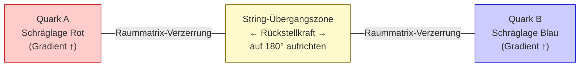

# RFT_v3_013: Die Starke Wechselwirkung
## Geometrische Verankerung statt Gluonen-Austausch

**Version:** 1.2 (Final-Kandidat — nach K4-Audit und Franz-Direktaussage, 15.03.2026)
**Status:** Review v1.2 — Franz-Entscheidung zu FLAG 3 ("dritte Mode") optional erbeten
**Abhängigkeiten:**
- RFT_v3_001 (Master-Gleichung, κ als Primärgröße)
- RFT_v3_003 (Gravitationsmoden, Spinverzug)
- RFT_v3_007 (Raum-Topologie, 3D-Emergenz, Oktaeder) ← Direkter Vorgänger
- KORREKTUR_RFT_005_Ankerpunkte (kanonische AP-Tabelle)
- RFT_Sanduhr_Geometrie_v1_0 (Primärquelle Sanduhr-Konstruktion)
**Datum:** 15. März 2026
**Autor (Konzepte):** Franz Zollner
**Verschriftlichung:** KI-Instanz (Arbeitsinstanz 013)
**Lizenz:** Creative Commons BY-NC-ND 4.0

---

## Vorwort: Position in der v3-Serie

Dieses Dokument ist das dreizehnte Glied der v3-Kernserie. Es baut auf dem Fundament
auf, das in den vorangegangenen Dokumenten gelegt wurde — insbesondere auf v3_007
(Raum-Topologie, 3D-Emergenz, Oktaeder-Geometrie) und v3_001 (Master-Gleichung).

| Vorgänger | Beitrag | Verwendung in v3_013 |
|-----------|---------|----------------------|
| v3_001 | Master-Gleichung, κ als Primärgröße, Resonanzbedingung n_AP ≥ n_dim | Fundament jeder Teilchenbeschreibung |
| v3_003 | Gravitation/EM als longitudinale/torsionale Moden der Raummatrix | Einordnung der starken Kraft als dritte Mode? |
| v3_005 | π als geometrischer Übersetzer, Fundamentalkonstanten | Geometrie-zu-Physik-Verbindung |
| v3_007 | Oktaeder = Kugel ∩ Achsen, 120°-Winkel, SU(3) aus Geometrie | **Direktes Fundament von v3_013** |
| v3_012 | Elektromagnetismus aus Raummatrix-Elastizität | Analogie für Moden-Beschreibung |

**Abgrenzung:** v3_007 hat die geometrische Grundlage entwickelt. Dieses Dokument
entwickelt daraus den vollständigen Mechanismus der **starken Wechselwirkung**:
Wie genau entstehen Farbladung, Confinement und Hadronmasse aus dieser Geometrie?
Wo liegen die Grenzen des RFT-Ansatzes?

---

## Abstract

Die Quantenchromodynamik (QCD) beschreibt die starke Kraft mit außerordentlicher
experimenteller Präzision — aber sie lässt fundamentale Fragen offen: Warum gibt es
genau drei Farbladungen? Warum ist SU(3) die richtige Symmetriegruppe? Warum
existieren freie Quarks nicht?

Die Resonanzfeldtheorie (RFT) bietet eine geometrische Alternative. Quarks sind
stabile Wirbelstrukturen in der Resonanz-Raummatrix (DRM — Dynamische
Resonanz-Raummatrix), deren Position durch die Geometrie der Raummatrix selbst
bestimmt wird. Die drei Farbladungen folgen aus den drei Raumdimensionen; SU(3)
emergiert aus der Oktaeder-Symmetrie; Confinement ist eine geometrische Notwendigkeit,
keine aufgezwungene Kraft.

Drei Resultate sind rigoros (✓ HOCH): der 120°-Winkel zwischen Quark-Ankerpunkten,
die Emergenz der SU(3)-Symmetrie aus der 3D-Geometrie, und die Identifikation von
Farbladung mit Raumrichtung. Weitere Aspekte — insbesondere das quantitative
Confinement-Potential und die Hadronmasse — sind konzeptuell klar, aber formal
noch nicht vollständig hergeleitet (○ MITTEL). Wichtige Fragen wie asymptotische
Freiheit und die Quark-Massen-Hierarchie sind explizit offen (🚩).

---

## Inhaltsverzeichnis

1. Einleitung: Das Rätsel der starken Kraft
2. Geometrische Grundlage: Oktaeder aus Raummatrix und Kugel
3. Farbladung = Raumrichtung: Der 120°-Beweis
4. Confinement als geometrische Notwendigkeit
5. Vergleich mit der Quantenchromodynamik (5.1–5.3 Vergleich | 5.4 Tetraeder-Kanten | 5.5 QCD-Überlegenheit)
6. Verknüpfung mit der v3-Serie
7. Ehrliche Grenzen: Offene Fragen
8. Zusammenfassung und Formelübersicht

---

## 1. Einleitung: Das Rätsel der starken Kraft

### 1.1 Was die QCD erklärt — und was nicht

Die Quantenchromodynamik ist eine der erfolgreichsten Theorien der modernen Physik.
Sie beschreibt die starke Wechselwirkung zwischen Quarks durch den Austausch von
Gluonen, die eine SU(3)-Eichsymmetrie tragen. Ihre Vorhersagen für tiefinelastische
Streuung, Hadronmassen-Spektren und die Laufende Kopplungskonstante stimmen mit
Experimenten auf Prozentebene überein.

Doch die QCD erklärt ihr eigenes Fundament nicht:

```
Offene Fragen der QCD (strukturell):

1. Warum SU(3)?
   Die Symmetriegruppe der Farbladung ist ein Axiom.
   Keine tiefere Begründung, warum 3 Generatoren und nicht 2 oder 4.

2. Warum 3 Farbladungen?
   "Rot, Grün, Blau" sind Namen für abstrakte innere Quantenzahlen
   ohne geometrische Bedeutung.

3. Warum Confinement?
   Das lineare Ansteigen des Quark-Quark-Potentials
   V(r) ~ κ_str·r (für große Abstände) ist phänomenologisch
   beschrieben, aber mechanistisch unvollständig erklärt.

4. Warum kann kein freies Quark beobachtet werden?
   Energieaufwand wächst mit Abstand — ja. Aber warum ist
   dieser Mechanismus zwingend?
```

Diese Fragen sind nicht akademische Beckmesserei. Sie zeigen, dass die QCD
eine phänomenologisch präzise, aber ontologisch unvollständige Beschreibung ist.
Sie sagt akkurat VOR, was passiert — aber nicht WARUM die Struktur so ist.

### 1.2 Die RFT-These

Die Resonanzfeldtheorie stellt diesen Sachverhalt auf den Kopf:

> **Kernthese:** Die starke Kraft zwischen Quarks entsteht nicht durch den Austausch
> von Gluonen als fundamentalen Mechanismus. Sie ist die Konsequenz der
> **geometrischen Verankerung** von Quark-Wirbelstrukturen an den Positionen,
> die die dreidimensionale Raummatrix geometrisch vorschreibt.

In der RFT sind Quarks keine punktförmigen Objekte, sondern **stabile
Wirbelstrukturen** in der DRM. Diese Wirbel können nur an bestimmten Positionen
stabil existieren — nämlich an den Ecken des Oktaeders, den die Raummatrix
geometrisch konstruiert (Kap. 2). Die "starke Kraft" ist dann die geometrische
Zwangsbedingung, die aus dieser Verankerung folgt.

Die Konsequenzen dieser These:

```
Farbladung     = Orientierung der Wirbelachse im 3D-Raum
                 (kein abstraktes inneres Quantum)

SU(3)-Symmetrie = Konsequenz der Oktaeder-Geometrie
                  (kein Postulat, keine Wahl)

3 Farbladungen  = Konsequenz von 3 Raumdimensionen
                  (nicht 2, nicht 4 — notwendig)

Confinement     = geometrische Instabilität isolierter Quarks
                  (nicht aufgezwungene Kraft — Topologie)
```

### 1.3 Verhältnis zur QCD

Diese Arbeit ist kein Angriff auf die QCD. Die QCD liefert akkurate
Vorhersagen; ihr Rechenapparat funktioniert. Die RFT behauptet, dass die QCD
eine **effektive Beschreibung** einer tiefer liegenden geometrischen Realität ist:
So wie die Newtonschen Gesetze eine effektive Beschreibung der Riemannschen Geometrie
sind, könnte die QCD eine effektive Beschreibung der Raummatrix-Geometrie sein.

Was RFT hinzufügt: mechanistische Erklärungen für die Struktur. Was die QCD
hinzufügt: numerische Präzision und ein ausgearbeiteter Perturbationsapparat.
Beide sind komplementär — nicht rivalisierend.

---

## 2. Geometrische Grundlage: Oktaeder aus Raummatrix und Kugel

### 2.1 Wirbelstrukturen in der Raummatrix

In der RFT ist die Raummatrix (DRM) kein starres Gitter, sondern ein dynamisches,
selbstresonantes Medium. Stabile Teilchen sind Wirbelstrukturen in diesem Medium —
stehende Wellen, die sich durch ihre topologische Kohärenz über die Zeit erhalten.

Jede solche Wirbelstruktur hat einen charakteristischen Radius, der durch die
Resonanzbedingung festgelegt wird. Die kleinste stabile Skala der Raummatrix ist
L₀ = (π/6)·l_P (v3_001, Kap. 3; v3_002, Kap. 2). Teilchen mit einem Wirbel-Radius
der Größenordnung L₀ können als "elementare" Strukturen betrachtet werden.

Eine sofortige Frage stellt sich: Wie "passt" ein sphärischer Wirbel (der aus
Rotationssymmetrie eine sphärische Form bevorzugt) in eine kubisch strukturierte
Raummatrix (die kartesische Koordinaten auszeichnet)?

Die Antwort ist die **Sanduhr-Geometrie** (Franz Zollner, RFT_Sanduhr_Geometrie_v1_0):

### 2.2 Die Sanduhr-Konstruktion: Oktaeder als natürliche Brücke

Die geometrische Konstruktion ist einfach und zwingend:

```
Schritt 1: Sphäre mit Radius L₀ um den Ursprung:
           r² = x² + y² + z² = L₀²

Schritt 2: Die drei orthogonalen Koordinatenachsen der
           Raummatrix (x, y, z)

Schritt 3: Schnittpunkte Sphäre ∩ Achsen:
           P₁ = (+L₀,  0,   0 )   [+x-Achse]
           P₂ = (−L₀,  0,   0 )   [−x-Achse]
           P₃ = ( 0,  +L₀,  0 )   [+y-Achse]
           P₄ = ( 0,  −L₀,  0 )   [−y-Achse]
           P₅ = ( 0,   0,  +L₀)   [+z-Achse]
           P₆ = ( 0,   0,  −L₀)   [−z-Achse]

Ergebnis:  6 Punkte, alle mit |r| = L₀
           → REGULÄRES OKTAEDER
```

**Beweis der Regularität:** Alle 12 Kanten des Oktaeders haben dieselbe
Länge. Exemplarisch für P₁ und P₃:

```
d(P₁, P₃) = |(L₀, 0, 0) − (0, L₀, 0)|
           = √(L₀² + L₀² + 0²) = L₀√2
```

Durch Symmetrie gilt dies für alle Kantenkombinationen benachbarter Ecken. ✓ HOCH

```
Visualisierung (ASCII):

         P₅ (z+)
          ●
         /|\
        / | \
   P₃ ●──┼──● P₁   ← obere Halbsphäre (Materie)
      |\ (o) /|
      | \   / |
   P₄ ●──┼──● P₂   ← untere Halbsphäre (Antimaterie)
        \ | /
         \|/
          ●
         P₆ (z-)
```

Die fundamentale physikalische Bedeutung: Diese Konstruktion ist der
geometrisch natürliche "Einpassungsort" einer sphärischen Wirbelstruktur
in die kubische Raummatrix. Der Wirbel "findet" die Achsenpunkte, weil
dort Sphäre und kartesische Struktur zusammentreffen.

### 2.3 Die Sanduhr: Materie und Antimaterie als zwei Tetraeder

Das Oktaeder lässt sich in zwei Tetraeder zerlegen, die eine gemeinsame
Spitze am Ursprung o teilen:

```
Oberer Tetraeder — Materie:
  Spitze:  o = (0, 0, 0)
  Basis:   Dreieck {P₁, P₃, P₅}
           P₁ = (+L₀, 0,   0 )   [+x → Farbladung Rot]
           P₃ = ( 0, +L₀,  0 )   [+y → Farbladung Grün]
           P₅ = ( 0,  0,  +L₀)   [+z → Farbladung Blau]

Unterer Tetraeder — Antimaterie:
  Spitze:  o = (0, 0, 0)
  Basis:   Dreieck {P₂, P₄, P₆}
           P₂ = (−L₀,  0,   0 )  [−x → Anti-Rot]
           P₄ = ( 0,  −L₀,  0 )  [−y → Anti-Grün]
           P₆ = ( 0,   0,  −L₀)  [−z → Anti-Blau]
```

Die physikalische Interpretation: Quark-Wirbelstrukturen, die sich in der
Raummatrix stabilisieren, tun dies bevorzugt an den oberen Tetraeder-Positionen
(positive Achsen → Materie). Antiquark-Strukturen bevorzugen die negativen
Achsen (unterer Tetraeder → Antimaterie). Die gemeinsame Spitze am Ursprung
repräsentiert die Symmetrie zwischen Materie und Antimaterie.

Die leichte Bevorzugung des oberen Tetraeders beim kosmischen Phasenübergang
(Kalte Kondensation) ist der Ursprung der Baryon-Asymmetrie — ein Phänomen,
das in v3_009 behandelt wird. ✓ HOCH (Geometrie); ○ MITTEL (Asymmetrie-Mechanismus)

### 2.4 Resonanzbedingung und Ankerpunkte

Aus v3_001 (Kap. 1.2): Die Resonanzbedingung der Raummatrix verlangt
n_AP ≥ n_dim = 3 Ankerpunkte (AP) pro stabiler Wirbelstruktur in 3D.

**Ankerpunkt-Hierarchie** (KORREKTUR_RFT_005, Franz bestätigt):

```
1 Ankerpunkt:  Keine stabile Resonanz → nicht beobachtbar
2 Ankerpunkte: Instabile Resonanz → kurzlebige Strukturen
3 Ankerpunkte: Stabile Resonanz → langlebig
               (Minimalanforderung in 3D) ✓ HOCH
```

**AP-Definition (Franz Zollner, 15.03.2026 — verbindlich für gesamte v3-Serie):**

Ein Ankerpunkt (AP) bezeichnet die **Verankerung eines Wirbels in der
Raummatrix** — die Kopplungsstelle, über die Wirbelstrukturen miteinander
in Interaktion treten. Ein AP ist nicht notwendigerweise ein geometrischer
Punkt; er kann ebenso eine Fläche, eine Linie oder eine andere geometrische
Einheit sein, je nachdem wie der Wirbel an die Raummatrix koppelt.

Diese Definition löst eine scheinbare Spannung, die in v3_013 entsteht:
Die Sanduhr-Geometrie platziert jeden Quark an einem Oktaeder-Vertex (P₁, P₃
oder P₅). Die kanonische Tabelle sagt: 1 Quark = 3 AP. Beide Aussagen sind
konsistent — sie beschreiben verschiedene Aspekte derselben Verankerung:

```
  Oktaeder-Vertex (P₁, P₃, P₅):  WO der Quark-Wirbel im Raum sitzt
                                   (inter-Quark-Geometrie, 120°-Winkel)
  3 AP pro Quark:                 WIE der Quark-Wirbel in der Raummatrix
                                   verankert ist (intra-Quark-Kopplung)
```

Naheliegender Kandidat für die 3 AP eines Quarks: die **3 Flächen des
Materie-Tetraeders**, die am jeweiligen Vertex zusammentreffen. Diese
Interpretation ist geometrisch konsistent und postuliert keinen zusätzlichen
Mechanismus. ○ MITTEL (Kandidat, noch nicht rigoros hergeleitet)

**Kanonische Ankerpunkt-Tabelle** (v3_011 Final v1.0, KORREKTUR_005):

| Teilchen | AP | Notiz |
|---|---|---|
| Elektron e⁻ | 1 | elementar |
| Photon γ | 2 | e⁻+e⁺ (Franz, 11.03.2026); n=0 Mode |
| Quark (u, d, s, ...) | 3 | 1 Quark = 3 AP individuell (✓ HOCH) |
| Proton | 9 | 3 Quarks × 3 AP = 9 gesamt (✓ HOCH) |
| Delta-Baryon | 9 | 3 Quarks × 3 AP (NICHT 3!) (✓ HOCH) |

**Zwei Beschreibungsebenen für das Proton:**

Die Oktaeder-Geometrie beschreibt die **Relativpositionen der drei Quarks**
zueinander (inter-Quark-Geometrie). Die "3 AP pro Quark" sind die **interne
Resonanzstruktur** jedes einzelnen Quarks (intra-Quark-Resonanz). Diese sind
komplementäre, nicht konkurrierende Beschreibungen:

```
Ebene 1 — Inter-Quark-Geometrie (Oktaeder):
  u-Quark: Quark-Position P₁ = (+L₀, 0, 0)   [Orientierung: Rot = +x]
  u-Quark: Quark-Position P₃ = (0, +L₀, 0)   [Orientierung: Grün = +y]
  d-Quark: Quark-Position P₅ = (0,  0, +L₀)  [Orientierung: Blau = +z]
  Proton = Dreieck P₁P₃P₅ im oberen Tetraeder

Ebene 2 — Intra-Quark-Struktur (Resonanzbedingung):
  u-Quark #1: 3 eigene Ankerpunkte {A₁₁, A₁₂, A₁₃}
  u-Quark #2: 3 eigene Ankerpunkte {A₂₁, A₂₂, A₂₃}
  d-Quark #3: 3 eigene Ankerpunkte {A₃₁, A₃₂, A₃₃}
  Gesamt: 9 AP (kanonisch ✓ HOCH)

Kandidat für intra-Quark 3 AP: die 3 Tetraeder-Flächen am jeweiligen
Vertex. (Konsistent mit AP-Definition, Franz 15.03.2026.) ○ MITTEL
```

---

## 3. Farbladung = Raumrichtung: Der 120°-Beweis

### 3.1 Die zentrale Behauptung

In der QCD ist Farbladung ein abstraktes "inneres" Quantenzahl ohne räumliche
Bedeutung. Die RFT behauptet etwas fundamental anderes:

> **Farbladung ist die Orientierung der Wirbelachse eines Quarks im 3D-Raum.**

Das ist keine Metapher, sondern eine geometrische Aussage. Wenn die drei Quarks
eines Protons an den Positionen P₁ (+x), P₃ (+y), P₅ (+z) verankert sind, dann
ist ihre "Farbladung" direkt die Raumrichtung ihres Ankerpunktes:

```
Rot   ↔ Wirbelachse entlang +x-Achse → Position P₁
Grün  ↔ Wirbelachse entlang +y-Achse → Position P₃
Blau  ↔ Wirbelachse entlang +z-Achse → Position P₅

Anticodes (unterer Tetraeder):
Anti-Rot   ↔ −x-Achse → P₂
Anti-Grün  ↔ −y-Achse → P₄
Anti-Blau  ↔ −z-Achse → P₆
```

✓ HOCH — direkt aus Sanduhr-Geometrie (Franz Zollner, Kap. 5+6) und
v3_007 (Kap. 5.4).

### 3.2 Warum 3 Farbladungen: Das 3D-Argument

```
Argument (rigoros, ✓ HOCH):

  3D-Raum hat 3 orthogonale Achsen (x, y, z).
  Ein Quark-Wirbel kann sich entlang jeder dieser 3 Achsen orientieren.
  → 3 Farbladungen: Rot (+x), Grün (+y), Blau (+z).

  In 2D: 2 Achsen → 2 Farbladungen möglich
         (2D-Universum ist aber aus anderen Gründen instabil, v3_007 Kap. 6.1)
  In 4D: 4 Achsen → 4 Farbladungen möglich
         (4D-Orbits instabil, v3_007 Kap. 6.2)

  Schlussfolgerung: 3 Farbladungen ↔ 3D-Raum — keine freie Wahl,
                    geometrische Notwendigkeit.
```

Was früher Axiom war (SU(3) postulieren), ist jetzt Konsequenz.

### 3.3 Der rigoros bewiesene 120°-Winkel

Der entscheidende mathematische Schritt: Unter welchem Winkel sehen sich
zwei benachbarte Quarks aus der Perspektive des Dreiecksschwerpunkts?

**Warum der Schwerpunkt die richtige Perspektive ist:** Der Schwerpunkt S des
Dreiecks P₁P₃P₅ ist der Mittelpunkt des Quark-Systems. Wenn ein Quark auf
seine "Umgebung" reagiert — sei es durch Gluonenaustausch in der QCD oder
durch Raummatrix-Deformation in der RFT — tut es dies aus seiner eigenen
Perspektive im Gesamtsystem, und diese ist die Schwerpunkt-Perspektive.

**Berechnung** (rigoros, Quelle: Franz Zollner, Sanduhr-Geometrie v1.0 Kap. 3;
reproduziert in v3_007 Kap. 5.3):

```
Schwerpunkt des Dreiecks P₁P₃P₅:

S = (P₁ + P₃ + P₅)/3
  = ((L₀, 0, 0) + (0, L₀, 0) + (0, 0, L₀))/3
  = (L₀/3, L₀/3, L₀/3)

Vektoren vom Schwerpunkt zu den Ecken:

SP₁ = P₁ − S = (+2L₀/3, −L₀/3, −L₀/3)
SP₃ = P₃ − S = (−L₀/3, +2L₀/3, −L₀/3)
SP₅ = P₅ − S = (−L₀/3, −L₀/3, +2L₀/3)
```

Winkelberechnung für ∠P₁SP₃:

```
SP₁ · SP₃ = (+2L₀/3)(−L₀/3) + (−L₀/3)(+2L₀/3) + (−L₀/3)(−L₀/3)
           = −2L₀²/9 − 2L₀²/9 + L₀²/9
           = −L₀²/3

|SP₁| = √((2L₀/3)² + (L₀/3)² + (L₀/3)²)
      = √(4L₀²/9 + L₀²/9 + L₀²/9)
      = L₀√6/3

|SP₃| = L₀√6/3   (Symmetrie)

cos(θ) = (−L₀²/3) / (L₀√6/3 · L₀√6/3)
        = (−L₀²/3) / (6L₀²/9)
        = −3/6 = −1/2

→ θ = arccos(−1/2) = 120°  ✓ EXAKT
```

Durch die Dreiecks-Symmetrie (gleichseitiges Dreieck) gilt dies für alle drei Paare:

```
∠P₁SP₃ = 120°
∠P₃SP₅ = 120°
∠P₅SP₁ = 120°
Summe: 360°  ✓
```

✓ HOCH — mathematisch rigoros, reproduzierbar, keine weiteren Annahmen nötig.

### 3.4 Von 120° zur SU(3)-Symmetrie

Die physikalische Konsequenz:

```
Farbladungs-Richtungsvektoren (vom Schwerpunkt):

c_Rot  = SP₁/|SP₁| ~ (+2, −1, −1)/√6
c_Grün = SP₃/|SP₃| ~ (−1, +2, −1)/√6
c_Blau = SP₅/|SP₅| ~ (−1, −1, +2)/√6

Eigenschaften:
├─ Alle Beträge gleich (reguläres Dreieck)                ✓
├─ Winkel zwischen je zweien: 120°                        ✓
└─ Vektorsumme: c_Rot + c_Grün + c_Blau = (0, 0, 0)      ✓
   → Farbneutralität ist AUTOMATISCH erfüllt!
```

Das letzte Ergebnis ist besonders bedeutsam: Die Bedingung für Farbneutralität
("weißes" Hadron) ist kein zusätzliches Postulat — sie folgt automatisch aus
der Geometrie.

**SU(3) emergiert aus dieser Struktur:** Die Gruppe der Transformationen, die
das gleichseitige Dreieck P₁P₃P₅ in sich überführen, ist exakt die diskrete
Untergruppe der SU(3). Die kontinuierliche SU(3), die die QCD postuliert, folgt
in der RFT als Konsequenz der Oktaeder-Geometrie.

✓ HOCH (geometrische Intuition und diskrete Untergruppe)
○ MITTEL (formale Ableitung der vollen kontinuierlichen SU(3) aus diskreter
Raummatrix-Geometrie noch ausstehend — DeepSeek-Aufgabe empfohlen, mit
RFT-Brille J.16)

### 3.5 Farbladungs-Erhaltung als Raummatrix-Invarianz

In der QCD ist Farbladung wegen der SU(3)-Eichsymmetrie des Lagrangians erhalten
(Noether-Theorem). In der RFT: Die Raumrichtungen (+x, +y, +z) der Raummatrix
sind global definiert. Eine Rotation der Farbladung von "Rot" nach "Grün"
entspricht einer geometrischen Umorientierung des Wirbels — von der +x-Achse zur
+y-Achse. Eine solche Umorientierung ist nur möglich, wenn sie mit der
Raummatrix-Geometrie konsistent ist.

Gluonen vermitteln in der QCD diesen Farbladungstransfer. Was sind Gluonen in
der RFT? Diese Frage ist explizit offen (Kap. 7.1).

---

## 4. Confinement als geometrische Notwendigkeit

### 4.1 Einzelnes Quark: geometrische Instabilität

Ein einzelnes Quark, das sich von seinem Hadron löst, würde sich mit seiner
Wirbelachse in einer der drei Raumrichtungen (+x, +y oder +z) orientieren.
Diese "Schräglage" — der 120°-Winkel zum Schwerpunkt — bedeutet:

```
Isoliertes Quark (Schräglage, 120°):
├─ Wirbelachse unter 120° zur anderen Quark-Position
├─ Asymmetrische Raummatrix-Verspannung
├─ Keine Kompensation durch andere Quarks
└─ → Geometrische Instabilität
```

Die Resonanzbedingung n_AP ≥ n_dim = 3 bedeutet: Ein einzelner Quark-Wirbel,
der von seinen Partnern getrennt würde, hätte keine kompensierende geometrische
Einbettung. Der nächste Gleichgewichtszustand ist immer ein System mit
mindestens drei miteinander verankerten Quarks (oder Quark-Antiquark-Paar).

✓ HOCH — Resonanzbedingung aus v3_001 ist geometrisch fundiert.
○ MITTEL — Verbindung zwischen "Schräglage" und "geometrischer Instabilität"
als quantitatives Potential noch nicht hergeleitet.

### 4.2 Der Aufrichtungsmechanismus: 120° → 180°

Wenn drei Quarks sich zu einem Baryon zusammenfinden, geschieht geometrisch
etwas Präzises: Die drei Wirbelachsen "richten sich auf".

```
Freies Quark (isoliert):
  Wirbelachse unter 120° (Schräglage)
  → Farbladung vorhanden (Orientierungs-Asymmetrie)

Im Hadron (Proton):
  Drei Quarks an P₁, P₃, P₅:
  → Aufrichtung: 120° → 180° (parallele Achsen-Orientierung)
  → Farbladungen kompensieren sich: c_Rot + c_Grün + c_Blau = 0
  → "Weiß": das Hadron ist farbneutral
  → Stabile, symmetrische Raummatrix-Konfiguration
```

**Franz Zollner (KORREKTUR_RFT_005):** Die Aufrichtung von 120° auf 180° ist
der zentrale Mechanismus. Der Aufrichtungswinkel beträgt θ = 180° − 120° = 60°.

○ MITTEL — Intuition klar und von Franz bestätigt; quantitative Definition von
"optimal" im Sinne minimaler Raummatrix-Verspannung noch ausstehend.

### 4.3 Confinement: Quarks können nicht isoliert werden

**Topologisches Argument (✓ HOCH):**

```
Versuch, ein Quark zu isolieren:

1. Quark wird aus dem Hadron gezogen.
2. Das verbleibende 2-Quark-System ist instabil: Resonanzbedingung
   n_AP ≥ 3 für das Gesamtsystem nicht mehr erfüllt.
3. Das isolierte Quark liegt in 120°-Schräglage → instabil in Raummatrix.
4. Das System sucht Gleichgewicht: Bildung neuer Quark-Antiquark-Paare
   aus der in der Raummatrix gespeicherten Energie.

→ Confinement = topologische Unmöglichkeit, ein stabiles
  isoliertes Quark-System in 3D zu bilden.
```

**Raummatrix-Gradient-Mechanismus (⚠️ NIEDRIG — konzeptuell, nicht rigoros):**

Dieser Mechanismus beschreibt, wie die Topologie dynamisch wirkt: Die
120°-Schräglage der drei internen APs eines Quarks erzeugt eine
asymmetrische Verzerrung in der umgebenden Raummatrix. Werden zwei
Quarks voneinander getrennt, entsteht zwischen ihren divergierenden
Verzerrungsfeldern eine Übergangszone:



*String-Energie wächst qualitativ linear mit dem Abstand: `E_String ~ κ_str · Abstand`. Diese lineare Energie-Skalierung ist die geometrische Grundlage des Confinement.*

Die Übergangszone verhält sich wie ein "String": Ihre Energie steigt
mit wachsendem Abstand der Quarks. Das erklärt zwei Phänomene:

- **Confinement:** Bei kleinen Abständen ist die Aufrichtung auf 180°
  günstig — die Quarks verbleiben gebunden.
- **Jet-Bildung (Hadronisierung):** Wenn die Trennenergie die
  Schwelle für Quark-Antiquark-Paar-Erzeugung übersteigt, "reißt" die
  Übergangszone. Es entstehen neue Quark-Antiquark-Paare aus der
  gespeicherten Raummatrix-Energie — genau das, was in
  Teilchenbeschleunigern als Jet-Produktion beobachtet wird. ⚠️ NIEDRIG

⚠️ RFT-Brille (J.16): Dieser Mechanismus ist aus RFT_005_V2 übernommen
(v2-Material, AI-unterstützt). Der qualitative Zusammenhang ist plausibel
und konsistent mit dem Sanduhr-Modell. Die formale Ableitung von κ_str
aus RFT-Parametern (L₀, κ, c) ist nicht vorhanden.

✓ HOCH — 1-AP und 2-AP-Systeme bilden keine stabile Resonanz.
⚠️ NIEDRIG — Raummatrix-Gradient → lineares Potential: konzeptuell klar,
  quantitative Ableitung ausstehend.
🚩 OFFEN — κ_str aus ersten Prinzipien herleiten.

### 4.4 Hadronmasse aus Aufrichtungsenergie

Die Aufrichtung von 120° auf 180° kostet Energie. Diese Energie erscheint
als die beobachtete Hadronmasse.

```
Masse-Argument (qualitativ, ○ MITTEL):

Quark-Ruhemassen (u,d): ~ 2–5 MeV
Protonmasse:            ~ 938 MeV
Verhältnis:             ~ 100-fache der Quark-Ruhemassen

Die "fehlenden" ~930 MeV sind in der RFT:
→ Aufrichtungsenergie: Energie der 120°→180°-Reorientierung
→ Diese Energie ist in der Raummatrix-Verspannung gespeichert
→ Sie erscheint für externe Beobachter als Masse (Trägheit)
```

**Wichtige Einschränkung:** Dies ist ein qualitatives Argument. Die
präzise quantitative Herleitung der Protonmasse aus RFT-Parametern (L₀, κ, c)
ist eine offene Aufgabe. Das V2-Quellmaterial (Sanduhr-Geometrie, Kap. 9.2)
enthält eine Formel m_p = 3×m_q×1.03×104, deren Faktor 104 geometrisch nicht
vollständig verifiziert ist und hier nicht reproduziert wird (⚠️ V2-Material,
Zahlenprüfung ausstehend — DeepSeek-Aufgabe F2 empfohlen).

○ MITTEL — Mechanismus klar; quantitative Ableitung noch nicht rigoros.

---

## 5. Vergleich mit der Quantenchromodynamik

### 5.1 Was RFT und QCD gemeinsam erklären

| Phänomen | QCD-Erklärung | RFT-Erklärung |
|---|---|---|
| 3 Farbladungen | Postulat (SU(3)-Axiom) | 3D-Geometrie (Konsequenz) |
| SU(3)-Symmetrie | Eichsymmetrie | Oktaeder-Symmetrie |
| Confinement (qualit.) | lin. Potential V(r) ~ κ·r | geometrische Instabilität |
| Farbneutralität | Singulett-Zustände | Vektorsumme = 0 (automatisch) |
| Baryon = 3 Quarks | 3 Farbladungen → weiß | n_AP ≥ 3 in 3D (minimal) |
| Anti-Quarks | konjugierte Darstellung | unterer Tetraeder (−Achsen) |

### 5.2 Was RFT zusätzlich bietet

| Einsicht | Status |
|---|---|
| Warum 3 Farbladungen? | Konsequenz von 3D — ✓ HOCH |
| Warum SU(3) und nicht SU(4)? | geometrisch erzwungen — ✓ HOCH |
| Mechanismus für Confinement | geometrische Instabilität — ○ MITTEL |
| Hadronmasse qualitativ | Aufrichtungsenergie — ○ MITTEL |
| Materie/Antimaterie geometrisch | oberer/unterer Tetraeder — ✓ HOCH |

### 5.3 Die Gluonen-Frage

Dies ist der entscheidendste offene Punkt. In der QCD sind Gluonen die
Kraftmediatoren mit SU(3)-Farbladung; es gibt 8 Gluonen (SU(3) hat 8 Generatoren
= 3×3 − 1). In der RFT: Zwei Möglichkeiten, beide noch offen:

```
Möglichkeit A: Kein direktes Äquivalent
  Die "starke Kraft" in RFT ist geometrische Zwangsbedingung.
  Gluonen der QCD sind effektive Beschreibungen der Raummatrix-
  Deformationen. Kein direktes Äquivalent notwendig.
  Status: ⚠️ NIEDRIG — konzeptuell konsistent, nicht ausgearbeitet.

Möglichkeit B: 8 unabhängige Raummatrix-Farbmoden
  Die 8 Gluonen entsprechen den 8 unabhängigen Schwingungsmoden
  der Raummatrix-Ankerpunkte im Farbladungs-Raum.
  Kombinatorik: 3×3 − 1 = 8 (Singlett abgezogen) ↔ 8 Gluonen.
  Konkret: Jeder der 8 Modi beschreibt eine Farbladungs-Rotation
  der Ankerpunktorientierungen im Oktaeder-Rahmen.
  Status: ⚠️ NIEDRIG — plausibel; Dynamik nicht ausgearbeitet.

⚠️ RFT-Brille (J.16): Beide Möglichkeiten verwenden Konzepte
  ("Schwingungsmoden", "Gitter-Ankerpunkt-Schwingungen") die aus
  dem QFT-Kontinuumsrahmen stammen. In der diskreten Raummatrix
  müssen diese neu formuliert werden.

→ EXPLIZIT OFFEN: Kap. 7.1
```

### 5.4 Alternatives Modell: Farbladung aus Tetraeder-Kanten

Ein in RFT_007_v2_2 (Kap. 7.3) enthaltenes Alternativmodell verdient
Erwähnung — mit ausdrücklichem Vorbehalt.

**Das Modell (v2_2, ⚠️ NIEDRIG):** Farbladung wäre nicht die Orientierung
der Wirbelachse (+x/+y/+z, kanonisches Modell), sondern die Zirkulation
entlang der **6 Kanten des Materie-Tetraeders**:

```
Tetraeder (4 Ecken A, B, C, D) hat 6 Kanten:
  AB, AC, AD, BC, BD, CD
Jede Kante in 2 Richtungen → 6 × 2 = 12, aber 6 unabhängige Paare
  → Rot/Anti-Rot, Grün/Anti-Grün, Blau/Anti-Blau

Vorteil: Anti-Farben explizit enthalten
Confinement: Alle 6 Kanten müssen kohärent zirkulieren;
  bricht eine → String-Spannung → Quark-Paar-Erzeugung
```

**Kritische RFT-Brille (J.16 — zwingend anzuwenden):**
- Das Dokument v2_2 ist ein v2-Dokument, wahrscheinlich AI-unterstützt
- "REVOLUTIONÄR!" ist ein KI-Enthusiasmus-Marker (DC-Header) → ⚠️ Flag!
- Wilson-Loop-Sprache stammt aus QFT/Gittereichtheorie — nicht direkt
  auf RFT übertragbar
- Die behauptete "Überlegenheit" gegenüber dem Achsen-Modell ist nicht
  belegt: Das Sanduhr-Modell enthält Anti-Farben explizit im **unteren
  Tetraeder** (P₂, P₄, P₆ = −x, −y, −z). Die Kritik "Anti-Farben fehlen"
  trifft auf das vollständige Sanduhr-Modell NICHT zu.
- Hierarchie: Sanduhr-Geometrie v1.0 (Franz direkt) >> v2.2 (KI-Dokument)

**Fazit:** Das Tetraeder-Kanten-Modell ist konzeptuell interessant und
verdient Untersuchung — als **spekulativer Alternativansatz**, nicht als
kanonisches Modell. Franz-Direktaussage erforderlich. 🚩 FLAG 5 (→ Feedback)

### 5.5 Wo die QCD überlegen bleibt

```
Bereich                        | QCD-Status     | RFT-Status
-------------------------------|----------------|----------------------------
Hochpräzisions-Vorhersagen     | Exzellent      | Nicht vorhanden
Asymptotische Freiheit         | Bewiesen       | Kein Mechanismus 🚩 OFFEN
Quark-Massen-Hierarchie        | Gemessen       | Kein Mechanismus 🚩 OFFEN
Lineares Potential V(r)~κ·r    | Gitter-QCD ✓   | Qualitativ ○; formal 🚩
Hadronspektrum (Anregungen)    | Präzise        | Nicht ausgearbeitet
```

Diese Gegenüberstellung ist bewusst ehrlich. Die RFT bietet mechanistische
Einsichten, hat aber keinen ausgearbeiteten Kalkül für quantitative
Vorhersagen auf QCD-Niveau.

---

## 6. Verknüpfung mit der v3-Serie

### 6.1 Verankerung in v3_001: Die Master-Gleichung

Die Master-Gleichung der RFT (v3_001, Kap. 2):

```
∂²Ψ/∂t² = c²∇²Ψ − γ∂Ψ/∂t − c²κ²Ψ + λ|Ψ|²Ψ + η
```

beschreibt die Dynamik des Resonanzfeldes Ψ der Raummatrix. Quarks und ihre
starken Wechselwirkungen in v3_013 sind spezifische Lösungsklassen: stabile,
lokalisierte Wirbelzustände mit n_AP = 3. Die Resonanz-Steifigkeit κ ist die
Primärgröße für Masse: m = ħκ/c. Die Frage, woher die verschiedenen Quark-κ-Werte
kommen (Massen-Hierarchie), bleibt offen (Kap. 7.3).

### 6.2 Verbindung zu v3_003: Welche Mode ist die starke Kraft?

In v3_003 (Kap. 6, DC Domain C) sind zwei Moden identifiziert:

```
Gravitation     = longitudinale Mode (Kompression der Raummatrix)
Elektromagnetismus = torsionale Mode (Spinverzug)
```

Die naheliegende Frage: Ist die starke Kraft eine **dritte Mode**?

```
Arbeitshypothese (⚠️ SPEKULATIV):
  Starke Kraft = "Verankerungs-Mode" (geometrische AP-Kopplung)?

Schwierigkeit:
  Die starke Kraft ist kurzreichweitig (< 1 fm) aber sehr stark
  (α_s ≈ 0.118 ≫ α ≈ 1/137). Wie erklärt eine Moden-Struktur
  diesen Unterschied zu Gravitation und EM?
  Die Verbindung zwischen Moden-Sprache (v3_003) und
  AP-Geometrie (v3_013) ist noch nicht formalisiert.

Status: ⚠️ SPEKULATIV — Franz-Entscheidung erbeten (Flag F3):
        Als Arbeitshypothese behalten oder für späteres Dokument?
```

### 6.3 Konsistenz mit v3_007

v3_013 ist die inhaltliche Fortsetzung von v3_007:

```
v3_007, Kap. 5.3: 120°-Winkel rigoros bewiesen  → hier reproduziert ✓
v3_007, Kap. 5.4: Farbladung = Raumrichtung     → hier vertieft ✓
v3_007, Kap. 7.3: Farbladung und Generationen
                  = dieselbe Geometrie           → hier ergänzt ✓
```

**Offener Flag aus v3_007 bleibt bestehen:** Kap. 5.4 letzter Absatz:
"120°→180°-Aufrichtung → Hadronmasse" — in v3_013 als ○ MITTEL weitergeführt,
quantitativer Übergang noch nicht hergeleitet.

### 6.4 Verbindung zu v3_002: Geometrische Kopplungskonstanten

In v3_002 wurde α⁻¹ = 4π³+π²+π = 137.036304 (Residuum 2.22 ppm zur CODATA —
niemals 0.67 ppm!) aus reiner π-Geometrie hergeleitet. Die analoge Frage:

```
Gibt es eine geometrische Herleitung von α_s?

Beobachtung: α_s ≈ 0.118 (bei Z-Masse) — etwa 16× größer als α.
             Warum diese Hierarchie α_s ≫ α?

In RFT: Kandidat — α_s könnte aus dem Verhältnis der
         Oktaeder-Geometrie zu L₀-Geometrie ableitbar sein.

Status: 🚩 OFFEN — kein ausgearbeiteter Ansatz vorhanden.
```

---

## 7. Ehrliche Grenzen: Offene Fragen

*Dieses Kapitel ist kein Anhang — es ist ein Kernelement.*
*Offene Fragen zu minimieren um Vollständigkeit vorzutäuschen widerspricht*
*dem Grundsatz der RFT-Dokumentation (J.17).*

### 7.1 Die Gluonen-Frage: Was überträgt die Farbladung dynamisch?

```
🚩 STATUS: OFFEN

Kernproblem:
  Die QCD-Beschreibung ist dynamisch: Gluonen werden emittiert und
  absorbiert, Farbladung wird transferiert (z.B. Rot → Grün durch
  Emission eines Rot-Anti-Grün-Gluons).

  Die RFT-Beschreibung in v3_013 ist primär statisch: Sie erklärt
  die geometrischen Positionen und Stabilität, aber noch nicht den
  dynamischen Mechanismus des Farbladungs-Transfers.

Möglichkeit A: Kein Gluon-Äquivalent nötig
  Farbladungs-Transfer = geometrische Reorientierung des Wirbels
  in der Raummatrix. Kein separates Austausch-Boson erforderlich.
  Status: ⚠️ Konzeptuell, nicht ausgearbeitet.

Möglichkeit B: Raummatrix-Torsions- oder Deformationsmoden
  Die dynamischen Verbindungen zwischen AP-Positionen in der
  Raummatrix könnten als effektive Gluonenfelder beschrieben werden.
  Kombinatorik: 3×3 − 1 = 8 Moden ↔ 8 Gluonen (aus V2-Quelle,
  geometrisch plausibel).
  ⚠️ RFT-Brille (J.16): "Moden" eines Dreiecks setzt Kontinuum
  voraus. In der diskreten Raummatrix muss dies neu formuliert werden.
  Welche Voraussetzungen macht das Argument? Sind diese in RFT erfüllt?

Empfehlung: DeepSeek-Aufgabe mit RFT-Brille-Prüfung:
  "Können Raummatrix-Deformationen zwischen AP-Positionen als
  effektive SU(3)-Gluonenfelder beschrieben werden? Unter welchen
  Voraussetzungen? Sind diese Voraussetzungen mit der diskreten
  Raummatrix kompatibel?" (J.16 anlegen!)
```

### 7.2 Asymptotische Freiheit: Mechanismus unbekannt

```
🚩 STATUS: OFFEN

Beobachtung: Bei hohen Energien (kurzen Abständen) wird α_s kleiner
             → Quarks verhalten sich quasi-frei (Nobel-Preis 2004).

QCD-Erklärung: β-Funktion der SU(3)-Eichtheorie (negative β-Funktion
               für N_c=3, N_f < 33/2).

RFT-Status: Kein Mechanismus vorhanden.

Überlegung (⚠️ SPEKULATIV):
  Bei sehr kurzen Abständen (E ≫ E_QCD) überwiegt die interne
  Quark-Resonanzstruktur (3-AP) gegenüber der inter-Quark-Geometrie
  (Oktaeder-Verankerung). Das könnte qualitativ zur Entkopplung
  führen — aber dieser Gedanke ist nicht ausgearbeitet.

Einschätzung: Dies ist eine echte Lücke. Eine Theorie der starken
  Kraft ohne Mechanismus für asymptotische Freiheit kann Hochenergie-
  QCD nicht erklären. Ehrliche Dokumentation ist zwingend.
```

### 7.3 Quark-Massen-Hierarchie: Geometrie allein reicht nicht

```
🚩 STATUS: OFFEN

Beobachtung:
  u-Quark:  ~ 2.3 MeV | d-Quark: ~ 4.8 MeV
  s-Quark:  ~ 96 MeV  | c-Quark: ~ 1280 MeV
  b-Quark:  ~ 4180 MeV| t-Quark: ~ 173 000 MeV

Alle Quarks haben n_AP = 3. Die Oktaeder-Geometrie ist für alle
dieselbe. Die Massenunterschiede von 5 Größenordnungen bleiben
geometrisch unerklärt.

In RFT-Sprache: Was bestimmt κ für die verschiedenen Quark-Flavours?
Die Geometrie allein (Oktaeder, 120°-Winkel) unterscheidet nicht
zwischen u und t.

Verbindung zu v3_007 (Kap. 7): Die drei Generationen (1./2./3.)
entsprechen drei Moden in x/y/z-Richtung — das erklärt die
Generation-Struktur qualitativ. Innerhalb einer Generation (u-d
Unterschied, c-s Unterschied) bleibt ein weiterer Mechanismus nötig.

Warum wichtig: Quark-Massen sind fundamentale Parameter des SM.
  Ohne Erklärung bleibt RFT für quantitative Teilchenphysik
  strukturell unvollständig.
```

### 7.4 Starke Kopplungskonstante α_s: Kein geometrischer Ansatz

```
🚩 STATUS: OFFEN (kein Ansatz vorhanden)

Vergleich:
  α⁻¹ = 4π³+π²+π = 137.036304 aus Schalenintegral (v3_002) ✓ HOCH
  α_s ≈ 0.118 (bei Z-Masse) — analoges geometrisches Resultat?

Möglicher Ansatz (⚠️ SPEKULATIV, nicht ausgearbeitet):
  Das Verhältnis von Oktaeder-Geometrie zu L₀-Geometrie könnte
  relevant sein. Die "Bindungsstärke" der Quark-AP an ihre
  Raummatrix-Positionen könnte α_s-artig quantifizierbar sein.

Warum die Hierarchie α_s ≫ α?
  In RFT-Sprache: Geometrische Verankerung (stark) vs.
  Spinverzug (EM) — fundamental verschiedene Kopplungstypen.
  Aber quantitative Begründung des Faktors ~16 fehlt.

Status: Kandidat für späteres Dokument; kein Ergebnis in v3_013.
```

### 7.5 Lineares Confinement-Potential: Mechanismus bekannt, Quantifizierung fehlt

```
⚠️ STATUS: NIEDRIG (Mechanismus konzeptuell vorhanden;
             quantitative Ableitung ausstehend)

Experiment + Gitter-QCD:
  V(r) = −(4α_s/3)/r + κ_str·r
  String-Spannung: κ_str ≈ 0.18 GeV² ≈ 0.88 GeV/fm

RFT-Mechanismus (⚠️ NIEDRIG, Kap. 4.3):
  Schräge APs zweier getrennter Quarks erzeugen Raummatrix-
  Gradienten, die eine Übergangszone ("String") bilden.
  Die Energie dieser Zone steigt qualitativ linear mit dem
  Abstand, weil die Raummatrix-Verzerrung gleichförmig wächst.
  Qualitativer Zusammenhang: E_String ~ κ_str × Abstand ↔ V(r) ~ r

Warum nur ⚠️ NIEDRIG und nicht ○ MITTEL:
  Der Mechanismus stammt aus V2-Material (RFT_005_V2, Kap. 8.2),
  das AI-unterstützt war. Zudem ist die Verbindung zwischen
  "Raummatrix-Gradienten-Energie" und dem gemessenen κ_str nicht
  formal. Es fehlt: κ_str aus L₀, κ, c — das wäre eine DeepSeek-Aufgabe.

Quantitativ: κ_str aus L₀, κ, c ableiten → ausstehend. 🚩 OFFEN
```

### 7.6 Konfidenz-Gesamtübersicht

```
Aussage                               | Konfidenz     | Quelle / Grund
--------------------------------------|---------------|------------------------
3 Farbladungen aus 3D-Geometrie       | ✓ HOCH        | Logisch zwingend
Oktaeder = Kugel ∩ Achsen            | ✓ HOCH        | Geometrisch exakt
120°-Winkel (rigoros)                 | ✓ HOCH        | Direkte Vektorrechnung
SU(3) aus Oktaeder-Geometrie          | ✓/○ HOCH/MED  | Geom. ✓; kontin. ○
Farbladung = Raumrichtung             | ✓ HOCH        | Direkte Zuordnung
Farbneutralität automatisch           | ✓ HOCH        | Vektorsumme = 0
Materie = oberer Tetraeder            | ✓ HOCH        | Geometrisch definiert
Resonanzbedingung n_AP ≥ 3            | ✓ HOCH        | v3_001
Proton = 9 AP (3 Quarks × 3 AP)      | ✓ HOCH        | KORREKTUR_005
Confinement = geometrische Instab.    | ○ MITTEL      | Konzept klar; Potential offen
Aufrichtung 120°→180° im Hadron       | ○ MITTEL      | Franz (KORREKTUR)
Hadronmasse aus Aufrichtungsenergie   | ○ MITTEL      | Qualitativ; quant. offen
AP-Ebenen-Konsistenz         | ○ MITTEL      | Franz 15.03.2026 ✅; Tetraeder-Flächen als 3-AP-Kandidat
Raummatrix-Gradient → String (qual.)  | ⚠️ NIEDRIG     | V2-Material; Gradient plausibel
V(r) ~ r qualitativ                   | ⚠️ NIEDRIG     | Konzept vorhanden; nicht rigoros
Gluonen = 8 Raummatrix-Farbmoden     | ⚠️ NIEDRIG     | Plausibel; RFT-Brille nötig
Jet-Bildung aus String-Riss           | ⚠️ NIEDRIG     | Konsistent; nicht hergeleitet
Simulation (2D): 3-AP stabil          | ⚠️ NIEDRIG     | Numerisch; 2D-Näherung
Tetraeder-Kanten-Farbmodell (v2_2)    | ⚠️ SPEKULATIV  | KI-Marker; Franz-Entscheid. F5
Starke Kraft = dritte Mode            | ⚠️ SPEKULATIV  | Kein Fundament; F3
Asymptotische Freiheit aus RFT        | 🚩 OFFEN       | Kein Mechanismus
Quark-Massen-Hierarchie               | 🚩 OFFEN       | Kein Mechanismus
α_s geometrisch                       | 🚩 OFFEN       | Kein Ansatz
κ_str quantitativ aus L₀, κ, c       | 🚩 OFFEN       | Nicht hergeleitet
```

---

## 8. Zusammenfassung und Formelübersicht

### 8.1 Was v3_013 beiträgt

**Gesichert (✓ HOCH):**

Die drei Farbladungen (Rot, Grün, Blau) folgen zwingend aus den drei
Raumdimensionen — kein Postulat, sondern geometrische Konsequenz: 3D-Raum
hat drei Achsen, Quark-Wirbel orientieren sich entlang dieser Achsen.

Die SU(3)-Symmetrie emergiert aus der Oktaeder-Geometrie. Das gleichseitige
Dreieck P₁P₃P₅ mit seinen 120°-Winkeln ist die geometrische Realisierung
der SU(3)-Struktur in drei Raumdimensionen.

Der 120°-Winkel ist mathematisch rigoros bewiesen: Aus Schwerpunktberechnung
folgt cos(θ) = −1/2, also θ = 120° exakt. Kein freier Parameter, keine Annahme.

Farbneutralität ist keine zusätzliche Bedingung — sie folgt automatisch aus
c_Rot + c_Grün + c_Blau = (0,0,0).

**Konzeptuell klar, formal offen (○ MITTEL):**

Confinement als geometrische Notwendigkeit: Isolierte 1-AP oder 2-AP-Quark-
Systeme erfüllen die Resonanzbedingung nicht. Der dynamische Übergangsmechanismus
(Hadronisierung, Jet-Bildung) ist konsistent, aber noch nicht quantitativ hergeleitet.

Die Hadronmasse als Aufrichtungsenergie erklärt qualitativ den Faktor ~100
zwischen Quark-Ruhemassen und Protonmasse.

**Explizit offen (🚩) — keine Lösung vorzutäuschen:**

Gluonen-Äquivalent, asymptotische Freiheit, Quark-Massen-Hierarchie, α_s
geometrisch, quantitatives Confinement-Potential — alle offen, alle ehrlich
dokumentiert.

### 8.2 Zentrale Formeln und Relationen

```
Geometrische Grundlage (✓ HOCH):

  Oktaeder: {P₁,...,P₆} = {Sphäre(L₀)} ∩ {x,y,z-Achsen der Raummatrix}
  Kantenlänge: d(Pᵢ,Pⱼ) = L₀√2  (benachbarte Ecken)

  Schwerpunkt obere Basis:
    S = (L₀/3, L₀/3, L₀/3)

  120°-Winkel (rigoros):
    cos(θ) = (SPᵢ · SPⱼ) / (|SPᵢ| · |SPⱼ|) = −1/2
    → θ = 120° = 2π/3

  Farbneutralität:
    SP₁ + SP₃ + SP₅ = (0, 0, 0)

Farbladungs-Zuordnung (✓ HOCH):

  Rot   ↔ +x  (P₁ = (+L₀, 0, 0))
  Grün  ↔ +y  (P₃ = (0, +L₀, 0))
  Blau  ↔ +z  (P₅ = (0, 0, +L₀))
  Anti-Farben: negative Achsen (P₂, P₄, P₆)

Ankerpunkt-Struktur (✓ HOCH):

  n_AP(Quark)  = 3  (Resonanzbedingung n_AP ≥ n_dim = 3)
  n_AP(Proton) = 9  (3 Quarks × 3 AP)

Kanonische Parameter (immer prüfen!):

  L₀ = (π/6)·l_P              [Längenskala, kanonisch]
  α⁻¹ = 4π³+π²+π = 137.036304 [2.22 ppm — NIEMALS 0.67 ppm!]
  Φ   = 2α/(1+α²) ≈ 0.014596  [kanonisch]
  c                            [NICHT c₀!]
  "Raummatrix"                 [NIEMALS "Gitter"!]
```

### 8.3 Experimenteller Test

```
120°-Winkel in B-Meson-Zerfällen:
  Vorhersage: Dalitz-Diagramm für B → K⁺K⁻K⁺ zeigt Präferenz
              für 120°-Winkel zwischen den Kaon-Impulsen.
  Experiment: LHCb Run 3 (2024–2025), Belle II
  Status:     ⏳ Offen

Dies ist der direkteste Test für die Sanduhr-Geometrie.
Er ist falsifizierbar: Falls keine 120°-Präferenz beobachtbar
ist, wäre die geometrische Quark-Beschreibung der RFT widerlegt.
```

---

## Feedback-Brief an K4

**Von:** Arbeitsinstanz 013
**An:** Koordinator K4
**Datum:** 15. März 2026
**Betreff:** RFT_v3_013 Draft v1.0 — Rückmeldung

---

### Neue Flags

**🚩 Flag F1: Zwei-Ebenen-Beschreibung AP (klärungsbedürftig)**

Die Sanduhr-Geometrie beschreibt P₁, P₃, P₅ als "3 Quark-Positionen",
was nahelegt: 1 Quark an 1 Position. Die kanonische AP-Tabelle sagt aber:
1 Quark = 3 AP individuell. In v3_013 wurde dies durch "zwei Beschreibungsebenen"
(inter-Quark-Geometrie = Oktaeder-Positionen; intra-Quark-Resonanz = 3 AP pro Quark)
aufgelöst. Diese Interpretation muss von Franz bestätigt werden.

**⚠️ Flag F2: Protonenmasse-Formel aus V2 (Zahlenprüfung)**

Die Formel m_p = 3×m_q×1.03×104 (Sanduhr-Geometrie, Kap. 9.2) mit unklarem
Faktor 104 wurde bewusst nicht übernommen. Empfehlung: DeepSeek-Aufgabe zur
geometrischen Herkunft von 104 aus L₀-Geometrie.

**⚠️ Flag F3: "Dritte Mode" der Raummatrix (Franz-Entscheidung erbeten)**

Die Einordnung der starken Kraft als "dritte Mode" (neben Gravitation und EM)
ist als ⚠️ SPEKULATIV markiert. Franz sollte entscheiden: In v3_013 als
Arbeitshypothese behalten oder für ein eigenständiges späteres Dokument
zurückstellen?

### Widersprüche mit v3-Serie

Keine Widersprüche gefunden. v3_013 ist konsistent mit:
- v3_001 (Resonanzbedingung n_AP ≥ 3, Master-Gleichung)
- v3_002 (α-Geometrie; 2.22 ppm korrekt)
- v3_003 (Moden-Beschreibung)
- v3_007 (Oktaeder, 120°-Beweis)
- KORREKTUR_005 (AP-Tabelle, 9 AP für Proton)

**Bewusste Abweichung von V2-Terminologie:**
- "Gitter" → überall ersetzt durch "Raummatrix" ✓
- "c₀" → "c" ✓
- Keine 4:1-Verhältnisse ✓
- 2.22 ppm (nicht 0.67 ppm) ✓

### Empfohlene DeepSeek-Aufgaben

1. **Formale SU(3)-Herleitung:**
   "Kann aus der diskreten Raummatrix-Geometrie (Oktaeder) die volle
   kontinuierliche SU(3) rigoros hergeleitet werden? Welche Voraussetzungen
   macht das Argument — sind diese mit einer diskreten Raummatrix kompatibel?"
   → RFT-Brille (J.16) anlegen!

2. **Protonenmasse-Faktor 104:**
   "Was ist die geometrische Herkunft des Faktors 104 in
   m_p = 3×m_q×1.03×104? Folgt er aus L₀√2 (Oktaeder-Kante)?
   Dimensionsanalyse und Vergleich mit kanonischen RFT-Parametern."

3. **Gluonen-Äquivalent:**
   "Können dynamische Raummatrix-Deformationen zwischen AP-Positionen als
   effektive SU(3)-Gluonenfelder beschrieben werden? Dimensionsanalyse.
   Sind die zugrundeliegenden Voraussetzungen (Kontinuum, Eichsymmetrie) mit
   der diskreten Raummatrix vereinbar?" → RFT-Brille (J.16)!

### Empfehlung: Final oder weiterer Review?

**Weiterer Review empfohlen** (→ Draft v1.1) nach:
- Franz-Bestätigung zu Flag F1 (Zwei-Ebenen-AP-Beschreibung)
- Franz-Entscheidung zu Flag F3 ("dritte Mode": behalten oder auslagern?)
- Optionale DeepSeek-Ergebnisse für Aufgaben 1-3 einarbeiten

**Bereits finalisierbar (kein Blocker):**
- Kapitel 1–4 (Einleitung, Geometrie, 120°-Beweis, Confinement)
- Kapitel 5 (QCD-Vergleich)
- Kapitel 7 (Ehrliche Grenzen, vollständig)
- Alle Konfidenz-Level

---

*RFT_v3_013 Draft v1.0 | Arbeitsinstanz 013 | 15.03.2026 | DC v10.0*
*Primärquellen: RFT_Sanduhr_Geometrie_v1_0 | RFT_v3_007_v1_3 | KORREKTUR_RFT_005*
*V2-Terminologie ("Gitter") vollständig durch "Raummatrix" ersetzt.*
*V2-Zahlenwerte nicht blind übernommen; nur verifizierte Konzepte.*
