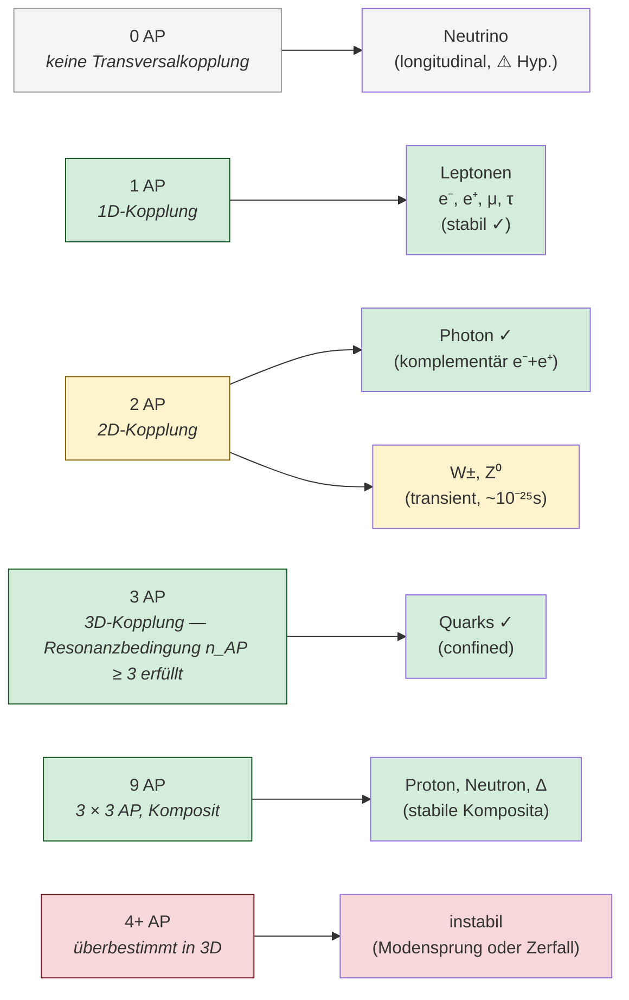
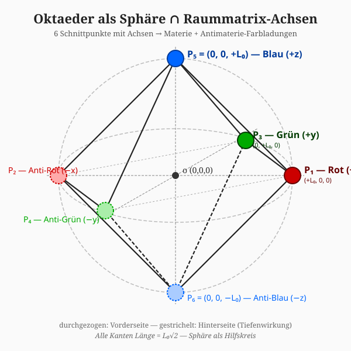
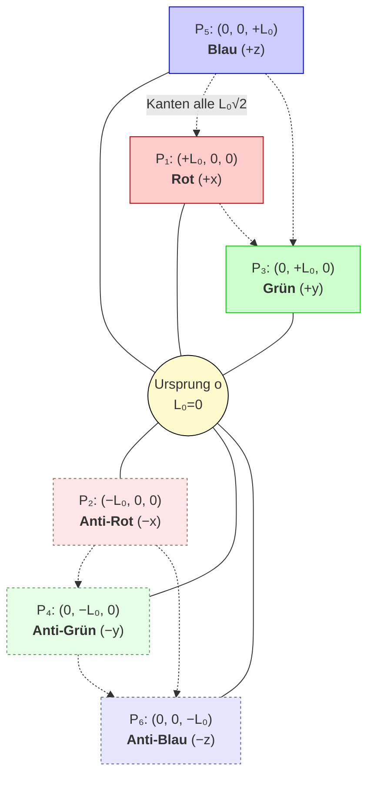
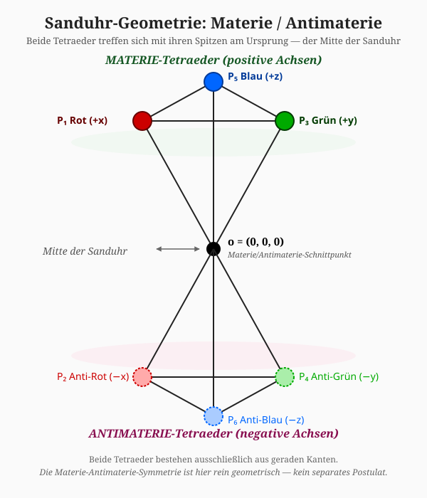
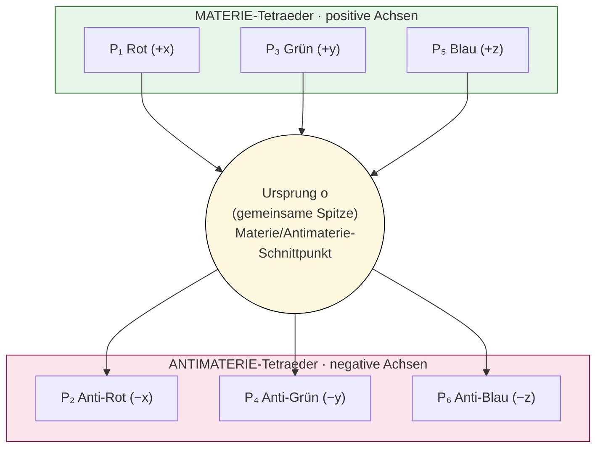

# RFT_v3_020: Taxonomie der Teilchen

*Untertitel: Klassifikation nach geometrischen Ankerpunkten*

**Version:** v1.0 (2026-04-04)  
**Autor:** Franz Zollner  
**Sprache:** DE — EN-Übersetzung folgt unter `en/docs/v3_konsolidierung/`  
**Status:** Final-Kandidat (Synthesis-Dokument Stufe IV)  
**Lizenz:** Creative Commons BY-NC-SA 4.0  
**Zitation:** Zollner, F. (2026). *RFT_v3_020: Taxonomie der Teilchen.* RFT-Series. https://github.com/da-Franze/RFT-Physik-Projekt/blob/main/de/docs/v3_konsolidierung/RFT_v3_020_Taxonomie.md
**Stufe:** IV — Teilchenphysik & Eigenschaften (Synthesis-Dokument)  

---

## Symbol-Glossar

| Symbol | Bedeutung | Wert / Definition |
|---|---|---|
| `AP` | Ankerpunkt | Kopplungsstelle Wirbel ↔ Raummatrix (Franz 15.03.2026) |
| `n_AP` | AP-Zahl | bestimmt Dimensionskopplung; `n_AP ≥ n_dim = 3` für stabile 3D-Struktur |
| `m = ħκ/c` | Effektive Masse | aus κ-Feld der Raummatrix |
| `κ` | Resonanz-Steifigkeit | Primärgröße `[1/m]` |
| `L₀ = 1/κ = (π/6)·l_P` | Fundamentale Längenskala | ħ-frei |
| `α⁻¹ = 4π³+π²+π` | Feinstrukturkonstante | `≈ 137.036304`, 2.22 ppm |
| `Spin ⊥ AP` | Orthogonalitätsprinzip | AP = Dimensionskopplung; Spin = Wirbel-Topologie (v3_016) |
| `120°` | Farbladungs-Winkel im isolierten Quark | Vektorrechnung im Oktaeder |
| `180°` | Aufgerichtete Quark-Konfiguration im Hadron | Farbneutralität |
| `n=0` | Cooper-Paar-Topologie | π + (−π) = 0 |

**Cross-Refs:** [RFT_v3_001](RFT_v3_001_Mathematische_Grundlagen.md) (Master-Gleichung, m=ħκ/c, AP §8), [RFT_v3_007](RFT_v3_007_Raum_Topologie_3D_Emergenz.md) (3D-Emergenz, Oktaeder — Primärquelle), [RFT_v3_012](RFT_v3_012_Elektromagnetismus.md) (Photon-AP), [RFT_v3_013](RFT_v3_013_Starke_Wechselwirkung.md) (120°-Beweis, Confinement), [RFT_v3_014](RFT_v3_014_Schwache_Wechselwirkung.md) (W/Z transient, Neutrino), [RFT_v3_016](RFT_v3_016_Spin_Topologie.md) (Spin-Topologie, AP⊥Spin — Primärquelle), [RFT_v3_019](RFT_v3_019_Supraleitung.md) (Cooper-Paar n=0)

---

> **Konfidenz-Marker:** ✓ HOCH (mehrfach bestätigt), ○ MITTEL (konzeptuell klar, formal noch offen), ⚠️ NIEDRIG (Arbeitshypothese, in richtiger Größenordnung), 🚩 OFFEN (Originator-Entscheid oder DeepSeek-Aufgabe ausstehend). Alle offenen Fragen explizit dokumentiert — keine falsche Vollständigkeit.

---

## Inhaltsverzeichnis

1. [Taxonomie als Wissenschaft: SM vs. RFT](#1-taxonomie-als-wissenschaft)
2. [Der Ankerpunkt als Klassifikationsgröße](#2-der-ankerpunkt-als-klassifikationsgroesse)
3. [Die Sanduhr-Geometrie: Grundlage der Klassifikation](#3-die-sanduhr-geometrie)
4. [Vollständige Teilchen-Taxonomie](#4-vollstaendige-teilchen-taxonomie)
5. [Leptonen: 1-AP-Strukturen](#5-leptonen)
6. [Quarks: 3-AP-Strukturen](#6-quarks)
7. [Bosonen und Sonderfälle](#7-bosonen-und-sonderfaelle)
8. [Offene Probleme der Taxonomie](#8-offene-probleme)
9. [Taxonomie im Vergleich mit dem Standardmodell](#9-vergleich-mit-dem-standardmodell)
10. [Zusammenfassung: Die RFT-Teilchen-Referenztabelle](#10-zusammenfassung)

---

## 1. Taxonomie als Wissenschaft: SM vs. RFT

### 1.1 Das taxonomische Problem

Jede Physik braucht eine Antwort auf die Frage: *Was gibt es, und wie ist es geordnet?* Die Biologie hat die Linné-Taxonomie. Die Chemie hat das Periodensystem. Die Teilchenphysik hat das Standardmodell (SM).

Das Standardmodell ordnet Teilchen durch Quantenzahlen: Spin, Isospin, Hyperladung, Farbladung, Baryonenzahl, Leptonenzahl. Diese Zahlen sind empirisch ermittelt und funktionieren mit außerordentlicher Präzision. Aber sie beantworten die tiefere Frage nicht: *Warum hat ein Elektron Spin ½? Warum haben Quarks Farbladung? Warum gibt es genau drei Generationen?*

```
SM-Antwort:   "Das sind fundamentale, postulierte Eigenschaften."
RFT-Antwort:  "Das sind geometrische Konsequenzen der Raummatrix-Struktur."
```

Die Resonanzfeldtheorie (RFT) versucht eine geometrische Taxonomie: Teilchen werden nicht durch postulierte Quantenzahlen klassifiziert, sondern durch ihre strukturelle Einbettung in die dynamische Resonanz-Raummatrix (DRM). Die fundamentale Klassifikationsgröße ist die Zahl der Ankerpunkte (AP).

### 1.2 Ziel dieses Dokuments

RFT_v3_020 ist das letzte Dokument der Stufe IV (Teilchenphysik & Eigenschaften) der v3-Serie. Als Synthese-Dokument bringt es zusammen, was die Dokumente v3_007 bis v3_019 erarbeitet haben. Es ist kein Forschungsdokument — es ist ein Referenz-Werk.

Das Ziel ist eine vollständige RFT-Taxonomie: alle bekannten Teilchen nach AP-Zahl geordnet, mit expliziter Angabe der Konfidenz-Level und der offenen Fragen. Wo das Schema an Grenzen stößt, wird das klar benannt.

Ausdrücklich nicht Ziel dieses Dokuments: Neue Derivationen oder Lösungen für offene Probleme zu liefern. Diese bleiben offen — und ihre explizite Dokumentation ist ein Qualitätsmerkmal, kein Defizit.

---

## 2. Der Ankerpunkt als Klassifikationsgröße

### 2.1 Definition des Ankerpunkts

Die kanonische Definition des Ankerpunkts wurde von Franz Zollner am 15.03.2026 festgelegt und gilt für die gesamte v3-Serie:

```
AP = Ankerpunkt = Verankerung eines Wirbels in der Raummatrix (DRM).

Ein AP ist NICHT notwendigerweise ein geometrischer Punkt.
Ein AP kann sein: Punkt, Fläche, Linie oder andere geometrische Einheit.

Entscheidend: AP = Kopplungsstelle des Wirbels zur Raummatrix,
über die Wirbel miteinander in Interaktion treten können.

Konfidenz: ✓ HOCH — Franz-Direktdefinition, 15.03.2026
```

Dieser Begriff unterscheidet sich fundamental vom Konzept eines "Raumgitterknotens" oder einer festen Position. Der Ankerpunkt ist kein Ort im Raum, sondern eine Kopplung — eine Wechselwirkungsbrücke zwischen Wirbelstruktur und dem sie tragenden Medium.

### 2.2 AP als Dimensionskopplung

Ein weiterführendes Verständnis des Ankerpunktbegriffs ergibt sich aus dem Dimensionskopplungs-Bild (Franz Zollner, 15.03.2026):

```
Da die RFT ein Lorentzfeld beschreibt, gibt es keine
ausgezeichnete Position oder Richtung im Raum.
→ APs sind nicht feste Raumpunkte, sondern Kopplungen an
  dimensionale Freiheitsgrade der Raummatrix.
  n AP = Kopplung an n Dimensionen der Raummatrix.

Konfidenz: ○ MITTEL — Franz-Denkanstoß, konzeptuell konsistent,
           formal aus Master-Gleichung noch nicht hergeleitet
```

Dieses Bild hat weitreichende Konsequenzen für die Taxonomie, die in den folgenden Kapiteln entfaltet werden.

### 2.3 Stabilitätshierarchie der AP-Zahl

Die Zahl der Ankerpunkte bestimmt die Stabilitätseigenschaften einer Wirbelstruktur in der dreidimensionalen Raummatrix (DC v10.13, Domain E; v3_007 Kap. 4):

```
Stabilitätshierarchie (kanonisch):

0 AP: Keine transversale Dimensionskopplung
      → Teilchen kann keine transversale Wirbelstruktur aufrechterhalten
      → Candidate: longitudinale Druckwelle (Neutrino, Arbeitshypothese)
      → Konfidenz: ⚠️ MITTEL

1 AP: Kopplung an 1 Raumdimension
      → Minimale Kopplung → freie Existenz möglich
      → Kein Confinement, keine Farbladung (geometrische Konsequenz!)
      → Beispiel: Elektron, Positron (stabil ✓)
      → Konfidenz: ✓ HOCH

2 AP: Kopplung an 2 Raumdimensionen
      → Zwei Fälle:
        A) Stabil durch strukturelle Komplementarität:
           Photon (e⁻ + e⁺ als komplementäres Wirbelpaar) ✓
        B) Instabil als transiente Resonanz:
           W±, Z⁰ (kurzlebig, Kap. 7)
      → Konfidenz: ✓ HOCH (Photon) | ○ MITTEL (W/Z)

3 AP: Kopplung an alle 3 Raumdimensionen
      → Resonanzbedingung n_AP ≥ n_dim = 3 erfüllt
      → Stabile Struktur, aber nicht frei isolierbar (Confinement)
      → Farbladung: geometrische Konsequenz der 3D-Kopplung
      → Beispiel: Quarks (confined ✓)
      → Konfidenz: ✓ HOCH

9 AP: Drei Quarks × 3 AP = zusammengesetztes Objekt
      → Farbneutralität durch geometrische Aufrichtung (120°→180°)
      → Stabil als Komposit
      → Beispiel: Proton, Neutron, Delta-Baryon
      → Konfidenz: ✓ HOCH (AP-Zahl) | 🚩 OFFEN (Spin-Mapping, Kap. 8)

4+ AP: Überbestimmt in 3D (n_AP > n_dim)
       → Topologisch instabil → kollabiert oder Modensprung
       → Nicht als freies Teilchen beobachtet (v3_007 Kap. 4.4)
       → Konfidenz: ○ MITTEL (v3_007, konzeptuell)
```

**Wichtige Klarstellung:** Jeder Wirbel hält seine eigenen Ankerpunkte. Im Hadron teilen Quarks keine Ankerpunkte — jedes Quark hat seine eigenen, die durch die Raummatrix dynamisch gekoppelt, aber topologisch getrennt sind (Franz Zollner, bestätigt; v3_007 Kap. 4.3).

**Schematische Darstellung der AP-Stabilitätshierarchie:**



*Die AP-Zahl bestimmt die Stabilität in 3D: 1 AP frei (Lepton), 3 AP confined (Quark), 9 AP komposit-stabil (Baryon). Die Übergänge sind topologisch zwingend, keine Postulate.*

### 2.4 AP und Spin: Orthogonale Eigenschaften

Eine der wichtigsten konzeptuellen Klärungen der v3-Serie betrifft das Verhältnis von AP-Zahl und Spin. Intuitiv könnte man erwarten: mehr APs → höherer Spin. Diese intuitive Formel versagt jedoch (v3_016 Kap. 2.4):

```
Naïve Formel: n_AP × ½ → Spin

Elektron: 1 AP × ½ = ½  ✓
Photon:   2 AP × ½ = 1   ✓
Quark:    3 AP × ½ = 3/2 ≠ ½  ✗ ← WIDERSPRUCH

Quarks haben 3 AP und trotzdem Spin ½ — nicht 3/2!
Die Formel versagt bereits auf elementarer Ebene.
```

Die korrekte Sichtweise (v3_016 Kap. 2.4, ○ MITTEL):

```
SPIN und AP-ZAHL sind ORTHOGONALE Eigenschaften:

  SPIN ½  ←→  1D-Wirbelrotation (720°-Topologie)
              → kommt aus der internen Rotationsstruktur des Wirbels
              → NICHT direkt aus der AP-Zahl!

  AP-ZAHL ←→  Dimensionskopplung (wie viele Raumdim. koppeln?)
              → bestimmt: Farbladung, Stabilität, Confinement
              → KEIN direkter Zusammenhang mit dem Spin-Wert!

Konsequenzen:
  Lepton (1 AP): Spin ½ aus 1D-Wirbelrotation ✓
  Quark  (3 AP): Spin ½ aus 1D-Wirbelrotation — OBWOHL 3 AP!
                 Die 3 AP kodieren die Farbladung (3D-Kopplung),
                 NICHT eine Vervielfachung des Spins.
```

Die naïve Formel `n_AP × ½` ist ein Spezialfall, der nur für 1-AP-Objekte (Leptonen) und den Sonderfall Photon (2-AP-Komplementärpaar) zutrifft. Für Quarks und Komposita ist sie falsch. Die volle Diskussion der offenen Spin-Mapping-Frage findet sich in Kapitel 8.1.

---

## 3. Die Sanduhr-Geometrie: Grundlage der Klassifikation

### 3.1 Die zentrale Konstruktion: Oktaeder aus Kugel und Raummatrix

Teilchen in der RFT sind sphärische Wirbelstrukturen — rotationssymmetrisch — die in die kubisch-strukturierte Raummatrix (DRM) eingebettet sind. Die geometrische Frage lautet: Wie "passt" eine Sphäre in die dreidimensionale kartesische Symmetrie der Raummatrix?

Die Antwort ist eindeutig (v3_007 Kap. 5, ✓ HOCH):

```
Schritt 1: Einheitssphäre mit Radius L₀ um den Ursprung:
           r² = x² + y² + z² = L₀²

Schritt 2: Die drei orthogonalen Koordinatenachsen der Raummatrix.

Schritt 3: Schnittpunkte Sphäre ∩ Achsen:
           P₁ = (+L₀,  0,  0)    P₂ = (−L₀,  0,  0)   [x-Achse]
           P₃ = (0, +L₀,  0)    P₄ = (0, −L₀,  0)   [y-Achse]
           P₅ = (0,  0, +L₀)    P₆ = (0,  0, −L₀)   [z-Achse]

Ergebnis: Ein reguläres Oktaeder (6 Ecken, alle Kanten = L₀√2)



*Sechs Schnittpunkte der Einheitssphäre (Radius L₀) mit den drei kartesischen Achsen ergeben ein reguläres Oktaeder. Materie-Farbladungen (P₁/P₃/P₅, kräftige Farben) und Anti-Farbladungen (P₂/P₄/P₆, gedämpft) sind im selben Oktaeder enthalten — keine separaten Postulate nötig.*
```

Konfidenz: ✓ HOCH — direkte geometrische Konstruktion, in v3_007 rigoros etabliert.

**Schematische Darstellung des Oktaeders:**



*Sechs Schnittpunkte der Einheitssphäre (Radius L₀) mit den drei Raumachsen ergeben ein reguläres Oktaeder. Positive Achsen tragen Materie-Farbladungen (Rot/Grün/Blau), negative Achsen die zugehörigen Anti-Farben.*

### 3.2 Die Sanduhr: Materie- und Antimaterie-Tetraeder

Das Oktaeder lässt sich in zwei Tetraeder zerlegen, die eine gemeinsame Spitze am Ursprung teilen (v3_007 Kap. 5.2):



*Die Sanduhr-Form mit gemeinsamer Spitze am Ursprung. Die zwei Tetraeder (Materie oben, Antimaterie unten) treffen sich in der **Mitte** der Sanduhr — beide Tetraeder bestehen ausschließlich aus geraden Kanten. Dies ist die geometrische Darstellung der Materie-Antimaterie-Symmetrie ohne separates Postulat.*

**Listendarstellung der Vertices:**

| Tetraeder | Vertex | Koordinaten | Farbladung |
|---|---|---|---|
| Materie (oben) | P₁ | (+L₀, 0, 0) | Rot (+x) |
| Materie (oben) | P₃ | (0, +L₀, 0) | Grün (+y) |
| Materie (oben) | P₅ | (0, 0, +L₀) | Blau (+z) |
| **Spitze (Mitte)** | **o** | **(0, 0, 0)** | **gemeinsam** |
| Antimaterie (unten) | P₂ | (−L₀, 0, 0) | Anti-Rot (−x) |
| Antimaterie (unten) | P₄ | (0, −L₀, 0) | Anti-Grün (−y) |
| Antimaterie (unten) | P₆ | (0, 0, −L₀) | Anti-Blau (−z) |

Die Sanduhr-Form mit gemeinsamer Spitze ist die geometrische Darstellung der Materie-Antimaterie-Symmetrie: beide Hemisphären sind spiegelbildlich und verbunden am Ursprung.

Wichtig: Die Anti-Farben sind im Oktaeder explizit enthalten (P₂, P₄, P₆). Sie müssen nicht separat postuliert werden — sie emergieren aus der Geometrie der negativen Achsenrichtungen (v3_013).

**Schematische Darstellung der Sanduhr-Geometrie:**



*Das Oktaeder zerfällt in zwei Tetraeder mit gemeinsamer Spitze am Ursprung. Materie (oberer Tetraeder, positive Achsen) und Antimaterie (unterer Tetraeder, negative Achsen) sind spiegelbildlich verbunden — die "Sanduhr"-Form erklärt die Materie-Antimaterie-Symmetrie geometrisch, ohne separates Postulat.*

### 3.3 Farbladung = Raumrichtung

Die physikalisch bedeutsamste Konsequenz der Sanduhr-Geometrie ist die Identifikation von Farbladung und Raumrichtung (v3_007 Kap. 5.3, v3_013 Kap. 3 — ✓ HOCH):

```
3 Farbladungen (r, g, b) = 3 Raumrichtungen (+x, +y, +z)
3 Anti-Farben (r̄, ḡ, b̄) = 3 negative Raumrichtungen (−x, −y, −z)

Geometrischer Beweis:
Drei Quarks P₁, P₃, P₅ im oberen Tetraeder:
  Schwerpunkt S = (L₀/3)(1,1,1)
  Vektor P₁−S = (2L₀/3, −L₀/3, −L₀/3)
  Vektor P₃−S = (−L₀/3, 2L₀/3, −L₀/3)
  cos θ = (P₁−S)·(P₃−S) / |P₁−S||P₃−S| = −1/2
  → θ = 120°   ✓ (identisch mit Farbladungswinkel in QCD)

→ Farbladung ist die "Schräglage" der Ankerpunkte in der Raummatrix.
→ Ein isolierter Quark hat seine 3 AP bei 120° zueinander: farbgeladen.
→ Im Hadron werden die Quarks "aufgerichtet": 120° → 180° (parallel)
   → Farbladungen kompensieren sich → farbneutral (weiß).
```

Konfidenz: ✓ HOCH für den 120°-Beweis (direkte Vektorrechnung, v3_013); ○ MITTEL für die Aufrichtungsinterpretation.

### 3.4 SU(3) emergiert aus Geometrie

Die Farbsymmetrie des Standardmodells (SU(3)_Farbe) ist in der RFT keine postulierte Eichsymmetrie, sondern eine geometrische Folge (v3_007 Kap. 5, v3_013):

```
SU(3) folgt aus dem regulären Oktaeder:
  → 3 Farbladungen = 3 positive Achsenpunkte (P₁, P₃, P₅)
  → SU(3) = Symmetriegruppe der Transformationen dieser 3 Punkte
  → 8 Gluonen = 3×3 − 1 = 8 Generatoren
     (Farb-Singlett propagiert nicht frei → zieht sich selbst aus)
  → Confinement:  3D-Kopplung kann nicht isoliert werden
     (kein 1-Quark- oder 2-Quark-Zustand ist farbneutral außer
      durch vollständige Farbvektorsumme = 0, d.h. Hadron)

Konfidenz: ✓ HOCH (Geometrie) | ○ MITTEL (Confinement-Mechanismus quantitativ)
```

---

## 4. Vollständige Teilchen-Taxonomie

### 4.1 Kanonische AP-Tabelle

Die folgende Tabelle gibt die vollständige RFT-Teilchen-Taxonomie nach dem Stand der v3-Serie wieder. Die AP-Zählung ist kanonisch (DC v10.13, Domain E). Spin-Werte sind experimentell etablierte Fakten — ihre Herleitung aus der RFT ist teilweise noch offen (vgl. Kap. 8).

```
KANONISCHE RFT-TEILCHEN-TAXONOMIE (DC v10.13, 04.04.2026)
─────────────────────────────────────────────────────────────────────────
Klasse     | Teilchen      | AP  | Spin | Farbldg.| Stabilität | Konfid.
─────────────────────────────────────────────────────────────────────────
Pseudo-0AP | Neutrino ν    |  0  |  ½   | nein    | stabil(?)  | ⚠️ ARBTSHYP
           |               |     |      |         | κ>0: m_ν≠0 |
─────────────────────────────────────────────────────────────────────────
Lepton     | Elektron e⁻   |  1  |  ½   | nein    | ✅ stabil  | ✓ HOCH
           | Positron e⁺   |  1  |  ½   | nein    | ✅ stabil  | ✓ HOCH
           | Myon μ⁻       |  1  |  ½   | nein    | ⚠️ instabil| ○ MITTEL
           | Tauon τ⁻      |  1  |  ½   | nein    | ⚠️ instabil| ○ MITTEL
─────────────────────────────────────────────────────────────────────────
Boson      | Photon γ      |  2  |  1   | nein    | ✅ stabil  | ✓ HOCH
(stabil)   |               |     |      |         |(komplementär)|
─────────────────────────────────────────────────────────────────────────
Boson      | W⁺, W⁻, Z⁰   | (2) |  1   | nein    | ❌ transient| ○ MITTEL
(transient)|               |     |      |         | ~10⁻²⁵ s   |
─────────────────────────────────────────────────────────────────────────
Quark      | u, d, s, c,   |  3  |  ½   | ja      | ∞ confined | ✓ HOCH
(elementar)|    b, t       |     |      | (r/g/b) | (kein freies|
           |               |     |      |         |  Quark!)   |
─────────────────────────────────────────────────────────────────────────
Baryon     | Proton p      |  9  |  ½   | nein    | ✅ stabil  | ✓ HOCH
(Komposit) | Neutron n     |  9  |  ½   | nein    | ⚠️ β-Zerfall| ✓ HOCH
           | Delta Δ       |  9  | 3/2  | nein    | ⚠️ instabil| ✓ HOCH
           | (weitere)     | 3×N |  ?   | nein    | variabel   | ○ MITTEL
─────────────────────────────────────────────────────────────────────────
Meson      | π⁰, π±        |  ?  |  0   | nein    | ⚠️ instabil| 🚩 OFFEN
(Komposit) | K, η, ρ...    |  ?  |  ?   | nein    | variabel   | 🚩 OFFEN
─────────────────────────────────────────────────────────────────────────
Sonderfall | Cooper-Paar   | (2) |  0   | nein    | ✅ kond.   | ○ MITTEL
           |               |     |      |         | (n=0 Top.) |
─────────────────────────────────────────────────────────────────────────
Offen      | Higgs-Boson H |  ?  |  0   | nein    | ⚠️ instabil| 🚩 OFFEN
─────────────────────────────────────────────────────────────────────────
```

### 4.2 Spin und AP: Getrennte Spalten — getrennte Physik

Die Tabelle listet Spin und AP-Zahl als getrennte Eigenschaften, weil sie unterschiedliche geometrische Aspekte repräsentieren:

```
AP-ZAHL → Dimensionskopplung → Farbladung / Confinement / Stabilität
SPIN    → Topologie des Wirbels → Statistik / Wechselwirkungsart

Diese Trennung ist nicht konventionell, sondern physikalisch notwendig:
Quarks haben 3 AP und Spin ½ — nicht 3/2.
Die naïve Formel n_AP × ½ gilt NICHT allgemein. (v3_016 Kap. 2.4)
```

### 4.3 Quark-Ladungen aus der Würfel-Geometrie

Die elektrischen Ladungen der Quarks ergeben sich aus der Würfelgeometrie auf den vier Ebenen der Sanduhr-Projektion (DC v10.13, Domain E):

```
Würfelgeometrie — 8 Ecken auf 4 Ebenen:
  Ebene 3: 1 Ecke  →  Ladung ±1     (Elektron/Positron)
  Ebene 2: 3 Ecken →  Ladung ±2/3   (u, c, t — up-Quarks)
  Ebene 1: 3 Ecken →  Ladung ±1/3   (d, s, b — down-Quarks)
  Ebene 0: 1 Ecke  →  Ladung  0     (Neutrino-Kandidat)

Konfidenz: ✓ HOCH (PDF-verifiziert, DC v10.13 Domain E)
```

Diese Struktur erklärt die fraktionalen Quark-Ladungen geometrisch — ohne Postulat.

---

## 5. Leptonen: 1-AP-Strukturen

### 5.1 Elektrische Neutralität ohne Farbladung: Eine geometrische Konsequenz

Das Elektron ist der bekannteste Vertreter der Leptonen. In der RFT ist es eine Wirbelstruktur mit genau einem Ankerpunkt. Die physikalischen Eigenschaften des Elektrons folgen direkt aus dieser minimalen Kopplung (v3_016 Kap. 2.2):

```
1 AP → 1D-Kopplung an die Raummatrix

Konsequenzen:
  (a) Keine Farbladung:
      Farbladung = 3D-Dimensionskopplung (3 AP nötig)
      1 AP koppelt nur an 1 Dimension → keine Farbladung
      → geometrische Konsequenz, kein Postulat! ✓ HOCH

  (b) Freie Existenz möglich:
      1-AP-Struktur ist nicht an 3D-Confinement gebunden
      → Elektron kann isoliert propagieren ✓

  (c) Spin ½:
      1D-Wirbelachse → 720°-Periodizität → Spin ½
      (Details: Kap. 2.4, v3_016 Kap. 3)
      Konfidenz: ○ MITTEL (formal noch ausstehend)

  (d) Elektrische Ladung −1:
      Geometrisch aus Ebene 3 der Würfelgeometrie (Kap. 4.3) ✓
```

### 5.2 Wellencharakter des Leptons: Links- und Rechts-Polarisation

Das Dimensionskopplungs-Bild erlaubt eine geometrische Interpretation der Polarisation (v3_016 Kap. 2.2, ○ MITTEL):

```
Polarisiertes-Wellen-Bild:
  e⁻  (links-zirkulare Polarisation)  →  1 AP, +Orientierung
  e⁺  (rechts-zirkulare Polarisation) →  1 AP, −Orientierung
  ν   (longitudinale Welle)           →  0 AP, keine Transversalkopplung

→ Das Leptonentriplett e⁻ / e⁺ / ν entspricht den drei Polarisationsmoden
  der Raummatrix-Welle (links / rechts / longitudinal).
→ li/re/longi → e⁻/e⁺/ν wird geometrisch begründet.

Konfidenz: ○ MITTEL — konsistent, formal ausstehend
```

### 5.3 Drei Lepton-Generationen: Harmonische Anregungsmoden

Das Standardmodell kennt drei Lepton-Generationen: (e, ν_e), (μ, ν_μ), (τ, ν_τ). Die Massen folgen ungefähr einer Hierarchie m_e : m_μ : m_τ ≈ 1 : 207 : 3477.

Die RFT bietet einen Kandidat-Mechanismus (v3_007 Kap. 7):

```
Kandidat-Mechanismus (○ MITTEL — konzeptuell plausibel, nicht formal hergeleitet!):

  1. Generation (Grundmode):  e, ν_e    — fundamentale Resonanz
  2. Generation (1. Oberton): μ, ν_μ   — erste harmonische Anregung
  3. Generation (2. Oberton): τ, ν_τ   — zweite harmonische Anregung

  Masses ~ n² (harmonische Anregung des Wirbelmodes)
  Warum genau 3? → v3_007: n > 2 Obertonstruktur topologisch instabil

⚠️ KONFIDENZ: NIEDRIG für die quantitative Massenrelation
   (v2-Quelle, nicht aus Master-Gleichung formal hergeleitet)
   Formal bleibt das "Drei-Generationen-Problem" offen.
   RFT-Brille: "harmonische Anregung" = strukturelle Analogie zu QFT,
   kein direkter Beweis!
```

### 5.4 Myonen und Tauonen: Höhere Leptonen-Moden

Wenn die Drei-Generationen-Interpretation korrekt ist, dann sind Myon und Tauon angeregte Moden derselben 1-AP-Wirbelstruktur wie das Elektron. Die Lebensdauer dieser Anregungen ist kurz, weil angeregte Moden zerfallen. Der Zerfallskanal verläuft über die Schwache Wechselwirkung (v3_014).

```
Myon (μ):   1 AP, Spin ½, m ≈ 207 m_e   → zerfällt via W± (schwach)
Tauon (τ):  1 AP, Spin ½, m ≈ 3477 m_e  → zerfällt via W± (schwach)

Interpretiert als: angeregte Wirbelzustände des Leptons
AP-Zahl: unverändert (1 AP) — die Anregung betrifft den Modencharakter,
          nicht die Anzahl der Dimensionskopplungen.

Konfidenz: ○ MITTEL (strukturell plausibel, nicht rigoros)
```

---

## 6. Quarks: 3-AP-Strukturen

### 6.1 Die minimale stabile Dimensionskopplung in 3D

Ein Quark ist in der RFT eine Wirbelstruktur mit drei Ankerpunkten — eine pro Raumdimension. Diese Zahl ist nicht zufällig, sondern geometrisch erzwungen:

```
Resonanzbedingung (v3_007 Kap. 4, ✓ HOCH):
  n_AP ≥ n_dim  für stabile Struktur in n_dim Dimensionen.
  In 3D:  n_AP ≥ 3

  Konsequenz:
  n_AP = 1: koppelt nur an 1 Dimension → kann frei existieren (Lepton)
  n_AP = 2: koppelt an 2 Dimensionen → instabil in 3D (oder stabil durch
             Komplementarität wie das Photon, s. Kap. 7)
  n_AP = 3: koppelt an alle 3 Dimensionen → minimal stabile
             3D-Struktur → Quark ✓
```

Das Quark hat die minimale AP-Zahl, die für eine stabile dreidimensionale Wirbelstruktur erforderlich ist. Es kann jedoch nicht isoliert existieren, weil seine 3D-Kopplung nicht aus dem Gesamtgefüge der Raummatrix herausgelöst werden kann — das ist das Confinement.

### 6.2 Farbladung = Schräglage der Ankerpunkte

Ein isoliertes Quark hat seine drei Ankerpunkte in "Schräglage" relativ zur Raummatrix: die drei AP zeigen in Richtungen, die 120° voneinander entfernt liegen (aus Kapitel 3.3). Diese Schräglage ist die RFT-Erklärung für die Farbladung:

```
Isoliertes Quark:
  3 AP bei 120° zueinander (Schwerpunktsperspektive, v3_007)
  → Asymmetrische Raummatrix-Kopplung
  → Farbladung (r, g, oder b) → nicht farbneutral

Im Hadron (Aufrichtung, KORREKTUR_005 + v3_013 ○ MITTEL):
  3 Quarks werden aufgerichtet: 120° → 180° (anti-parallel)
  → Farbvektorsumme = 0  (r + g + b = weiß)
  → farbneutral ✓
  → Aufrichtungsenergie ~ Hadronmasse − Quark-Summe (~100×)

Stativ-Analogie:
  Quark = Stativ-Bein mit 120°-Schräglage → kippt ohne Partner
  Hadron = drei Stative aufgerichtet auf 180° → stabiles System
```

Konfidenz: ✓ HOCH für 120°-Beweis | ○ MITTEL für Aufrichtungsmechanismus.

### 6.3 Confinement: Topologische Unmöglichkeit der Isolation

Das Quark-Confinement — das experimentell gesicherte Faktum, dass einzelne Quarks nicht freigelassen werden können — ist in der RFT ein geometrisches Prinzip, kein dynamisch erzwungenes Phänomen (v3_013, ○ MITTEL):

```
Mechanismus (v3_013 Kap. 4):
  1. Quark mit 3-AP-Struktur → koppelt an alle 3 Raumdimensionen
  2. Entfernung vom Hadron → Raummatrix-"Faden" (String) dehnt sich
  3. String-Energie wächst linear mit Abstand: V(r) ~ κ_str · r
  4. Ab kritischer Dehnung: String reißt → Quark-Antiquark-Paar
     aus Raummatrix-Energie (Paarerzeugung aus κ-Feld)
  5. Ergebnis: nie ein freies Quark, sondern immer Hadron-Bildung

⚠️ KONFIDENZ: ○ MITTEL (String-Mechanismus qualitativ plausibel,
   quantitative Herleitung von κ_str aus L₀, κ, c fehlt noch)
🚩 Asymptotische Freiheit: kein RFT-Mechanismus ausgearbeitet
```

### 6.4 Proton und Neutron: 9-AP-Komposita

Das Proton (uud) und das Neutron (udd) sind die stabilsten bekannten Baryon-Zustände. In der RFT haben beide 9 Ankerpunkte (3 Quarks × 3 AP):

```
Proton (uud):
  u-Quark #1: {A₁₁, A₁₂, A₁₃}  (3 AP individuell)
  u-Quark #2: {A₂₁, A₂₂, A₂₃}  (3 AP individuell)
  d-Quark #3: {A₃₁, A₃₂, A₃₃}  (3 AP individuell)
  ────────────────────────────────
  GESAMT: 9 Ankerpunkte

  Quarks aufgerichtet auf 180° → farbladungsneutral (weiß)
  Elektrische Ladung: +2/3 + 2/3 − 1/3 = +1e ✓
  Spin: ½  (🚩 Mechanismus offen — Kap. 8.1)
  Masse: ~938 MeV ≈ 100 × m_quark (Aufrichtungsenergie)

Konfidenz: ✓ HOCH (AP-Zahl, Ladung, Farbladung-Neutralität)
           🚩 OFFEN (Spin-Mapping für 9-AP-Komposita)
```

Das Delta-Baryon (Δ) hat dieselbe Quark-Zusammensetzung (uud für Δ⁺), dieselben 9 AP, aber Spin 3/2 statt ½. Wie dieselbe AP-Struktur zwei verschiedene Spin-Werte erzeugen kann, ist die zentrale offene Frage der Taxonomie (Kap. 8.1).

---

## 7. Bosonen und Sonderfälle

### 7.1 Das Photon: Stabiles 2-AP-Komplementärpaar

Das Photon nimmt eine besondere Stellung in der RFT ein. Seine AP-Zahl wurde von Franz Zollner am 11.03.2026 definitiv festgelegt (✓ HOCH):

```
Photon = e⁻ (1 AP) + e⁺ (1 AP) = 2 AP total

Mechanismus (v3_012 Final v1.3.1, ✓ HOCH):
  Das Photon ist kein elementarer Wirbel, sondern ein komplementäres
  Wirbelpaar aus einem Elektron-Wirbel und einem Positron-Wirbel.
  Die Komplementarität (links-zirkular + rechts-zirkular) erzeugt
  eine stabile propagierende Welle.

Eigenschaften:
  AP = 2  (komplementäres Paar)
  Spin = 1  (ganzzahlig, weil 2-AP-Objekt)
  Masse = 0  (keine transversale Fixierung = keine κ-Kopplung)
  Stabil: propagiert unendlich lange im Vakuum ✓

Komplementäre Beschreibung:
  Feldmodus: n=0, transversale Welle (Wellencharakter)
  Teilchenstruktur: 2 AP = e⁻ + e⁺ (Teilchencharakter)
  → Kein Widerspruch: zwei Darstellungen desselben Objekts.

Konfidenz: ✓ HOCH — Franz-Direktaussage, 11.03.2026
```

### 7.2 W±- und Z⁰-Bosonen: Transiente 2-AP-Moden

Die W- und Z-Bosonen vermitteln die Schwache Wechselwirkung. In der RFT sind sie keine stabilen Objekte, sondern transiente geometrische Relaxationszustände (v3_014 Final v1.0):

```
W±, Z⁰ in der RFT (v3_014, ○ MITTEL):

  Entstehung:   Bei bestimmten Energieübertragungen relaxiert die
                Raummatrix über einen 2-AP-Übergangszustand.
                → transiente Resonanz (keine dauerhafte Wirbelstruktur)

  AP = (2): in Klammern, weil kein stabiles 2-AP-Objekt wie das Photon,
            sondern ein Übergangszustand während geometrischer Relaxation

  Spin = 1: wie Photon (2-AP-Übergangszustand)
  Masse: W ≈ 80 GeV, Z ≈ 91 GeV → kurze Lebensdauer ~10⁻²⁵ s
  Unterschied zum Photon: W/Z sind NICHT durch Komplementarität stabilisiert

  Paritätsverletzung (v3_014 Kap. 5):
    In der RFT: geometrische Asymmetrie der Relaxation
    Spezifisch: der γ-Term der Master-Gleichung ist nicht
    paritätssymmetrisch → schwache WW verletzt P ○ MITTEL

Konfidenz: ○ MITTEL (Mechanismus konzeptuell, formal ausstehend)
```

### 7.3 Das Neutrino: Der schwierigste Sonderfall

Das Neutrino ist der problematischste Eintrag in der RFT-Taxonomie. Es hat 0 AP — und damit keine transversale Dimensionskopplung. Gleichzeitig ist es empirisch mit Spin ½ bekannt. Dies erzeugt einen scheinbaren Widerspruch:

```
Kanonische RFT-Beschreibung des Neutrinos (v3_014 Final v1.0):
  AP = 0 (keine transversale Kopplung)
  → Longitudinalwelle (Druckwelle) der Raummatrix
  → koppelt NICHT an transversale Moden (kein EM, kein Colour)
  → koppelt NUR indirekt über Gravitation (longitudinale Mode)
  → propagiert mit c im Vakuum

  κ > 0 → winzige nicht-null Masse möglich (v3_014):
    m_ν = ħκ_ν/c  mit κ_ν ≪ κ_e
    Konsistent mit Neutrino-Oszillationen (ΔM ≠ 0 → m ≠ 0 ✓)

Konfidenz: ○ MITTEL (Franz, 15.03.2026)
```

**Das offene Problem:** Wie hat ein 0-AP-Objekt Spin ½?

```
⚠️ Widerspruch: Spin ½ ohne AP (⚠️ Arbeitshypothese):

  Standard-RFT-Bild: Spin ½ kommt aus 1D-Wirbelrotation (720°-Topologie)
  → Wirbelrotation setzt transversale Kopplung (AP) voraus!
  → 0 AP = keine transversale Kopplung = kein Wirbel = kein Spin ½?

Zwei Kandidat-Auflösungen (beide ⚠️ Arbeitshypothese):
  A) Spin ½ aus Wellenpolarisation:
     Longitudinalwellen können polarisiert sein.
     Zirkulare Polarisation einer Longitudinalwelle → halbzahlige Windungszahl?
     Strukturell unklar.

  B) Neutrino als Grenzfall 1 AP → 0 AP:
     Neutrino ist das "entartete" Lepton, bei dem der AP
     gegen null geht → Grenzfall der Lepton-Familie.
     Dann: Spin ½ als "Reststruktur" aus dem 1-AP-Vorläufer?

Beide Bilder sind spekulativ.
→ Als offene Frage darstellen (Kap. 8.3), nicht lösen!
```

### 7.4 Das Cooper-Paar: Sonderfall n=0-Topologie

Das Cooper-Paar aus v3_019 (Supraleitung) ist ein weiterer Sonderfall:

```
Cooper-Paar (v3_019, ○ MITTEL):
  AP = (2): zwei Elektronen mit je 1 AP
  Spin = 0: antiparallele Spins → effektiver Spin 0
  Topologie: n=0-Mode (kollektiver Grundzustand des Kondensats)
  Besonderheit: effektive Masse m_g → 0 (Meissner-Effekt)
                durch n=0-Topologie, NICHT durch AP-Zahl allein.

Konsequenz: Das Cooper-Paar zeigt, dass AP-Zahl allein die Eigenschaften
            nicht vollständig bestimmt — der topologische Modenzustand
            ist ein weiteres Klassifikationskriterium.

Konfidenz: ○ MITTEL
```

### 7.5 Das Higgs-Boson: Offene Frage

Das Higgs-Boson des Standardmodells ist der Mechanismus für die Masse der W/Z-Bosonen. In der RFT wird Masse nicht durch ein Higgsfeld erzeugt:

```
Masse in der RFT (v3_001, v3_004 — ✓ HOCH):
  m = ħκ/c
  κ = Resonanz-Steifigkeit der Raummatrix (Primärgröße)
  → Masse emergiert aus κ-Feld, kein Higgs-Mechanismus nötig.

Higgs-Boson in der RFT:
  🚩 OFFEN — kein ausgearbeiteter Ansatz in der v3-Serie vorhanden.

  Spekulativer Kandidat (sehr niedrige Konfidenz, NICHT als Theorie darstellen):
    Higgs ↔ skalare Anregungsmode des κ-Feldes?
    Würde bedeuten: Higgs-Boson = Quant der Raummatrix-Steifigkeit.
    → Keine formale Herleitung, keine Konsistenzprüfung.

  Empfehlung: Ehrlich als offene Frage dokumentieren.
              Den Massengebungs-Widerspruch (RFT vs. SM-Higgs) explizit
              benennen, nicht übergehen.
```

---

## 8. Offene Probleme der Taxonomie

Die folgende Übersicht ist ein Pflicht-Bestandteil dieses Dokuments. Offene Fragen sind kein Defizit — ihre präzise Formulierung ist ein Qualitätsmerkmal.

### 8.1 🚩 AP→Spin-Mapping bei Komposita (höchste Priorität)

Dies ist die wichtigste offene Frage in der RFT-Teilchentaxonomie:

```
Beobachtung:
  Proton:         9 AP,  Spin ½
  Delta-Baryon:   9 AP,  Spin 3/2

  Gleiche AP-Zahl, verschiedener Spin.
  Zusätzlich:
  Quark (elementar): 3 AP, Spin ½  (nicht 3/2!)

Problem:
  Was bestimmt den Spin eines Quarks (3 AP, Spin ½)?
  Ist es dieselbe 720°-Topologie wie beim Elektron (1 AP, Spin ½)?
  Oder ein separater Mechanismus innerhalb der 3-AP-Struktur?

  Und: Warum haben Proton und Delta-Baryon (beide 9 AP)
  verschiedene Spin-Werte?

Kandidat-Antwort (sehr spekulativ, ⚠️ NIEDRIG):
  Spin des Komposita aus der relativen Orientierung
  der Quark-Wirbelachsen → verschiedene Konfigurationen
  → verschiedener Gesamt-Spin (wie in der QM: J = L ⊕ S)
  → Proton: antiparallele Quark-Spins → Gesamt ½
  → Delta: parallele Quark-Spins → Gesamt 3/2
  Diese Analogie zur QM ist formal nicht aus der RFT hergeleitet.

→ 🚩 Franz-Entscheid erbeten!
   Frage: Soll die Wirbelachsen-Konfiguration als RFT-Mechanismus
   für Kompositum-Spin aufgenommen werden?
```

### 8.2 ⚠️ Spin ½ bei Quarks: Formaler Mechanismus

```
Quark hat 3 AP (alle 3 Dimensionen gekoppelt).
Aber Spin ½ kommt laut v3_016 aus 1D-Wirbelrotation.

Frage: Kann eine 3D-gekoppelte Struktur noch "1D rotieren"?
       Oder hat der Quark-Wirbel einen separaten 1D-Rotationsfreiheitsgrad,
       der von den 3 Dimensionskopplungen unabhängig ist?

Stand: DS-016-A (720°-Herleitung) formell ausstehend.
Konfidenz: ⚠️ NIEDRIG bis 🚩 OFFEN
```

### 8.3 ⚠️ Neutrino: Spin ½ ohne AP

```
Neutrino = 0 AP = keine transversale Dimensionskopplung.
Aber: Spin ½ empirisch gesichert.

Spin ½ aus 720°-Topologie setzt Wirbelstruktur voraus.
0 AP → kein Transversalwirbel → woher kommt Spin ½?

Zwei Kandidaten (beide ⚠️ Arbeitshypothese):
  A) Longitudinal kann polarisiert sein → Spin ½ aus Polarisationsmode
  B) Neutrino als Grenzfall 1-AP → 0-AP (Reststruktur)

→ Kein Franz-Entscheid vorhanden. Als offene Frage dokumentieren.
```

### 8.4 ⚠️ Drei Generationen: Formale Herleitung fehlt

```
Kandidat-Mechanismus (○ MITTEL, v3_007 Kap. 7):
  3 Generationen = 3 stabile harmonische Moden in 3D-Raummatrix
  Warum genau 3? → Topologische Stabilität n > 2 bricht zusammen

Formal: Nicht aus Master-Gleichung hergeleitet.
RFT-Brille (J.16): "harmonische Anregung" = strukturelle QFT-Analogie,
kein direkter Beweis in RFT-Formalism.

→ Als konzeptuellen Kandidaten mit ○ MITTEL aufführen, nicht als Ergebnis.
```

### 8.5 ⚠️ Mesonen: AP-Zahl unklar

```
Mesonen (π, K, η, ρ, D, B...):
  SM: Quark-Antiquark-Paare
  RFT-Kandidat: Quark (3 AP) + Antiquark (3 AP) = ?

  Frage: AP-Zahl eines Mesons?
         3 AP (Quark) + 3 AP (Antiquark) = 6 AP total?
         Oder kommt es zur Annihilation der komplementären AP?
         (Ähnlich wie e⁻ + e⁺ → Photon = 2 AP statt 2 AP)

→ Kein kanonischer Eintrag in DC v10.13.
→ Als 🚩 OFFEN dokumentieren.
```

### 8.6 🚩 Exotische Hadronen: Stabilitätsanalyse fehlt

```
Beobachtete Exoten:
  Tetraquark: 4 Quarks → 12 AP?
  Pentaquark: 5 Quarks → 15 AP?

  RFT-Kandidat-Problem: 12 AP in 3D → überbestimmt?
  (Vgl. v3_007: 4 AP in 3D bereits überbestimmt für elementare Strukturen)

  Oder gilt das Überbestimmtheitsprinzip nur für elementare Objekte,
  nicht für Komposita? → Konsistenz mit Proton (9 AP, stabil) unklar.

→ Stabilitätsanalyse für N × 3 AP Komposita fehlt.
→ 🚩 OFFEN
```

### 8.7 🚩 Higgs-Boson: Kein RFT-Bild

```
Standardmodell:
  Higgs-Boson H: Spin 0, Masse ~125 GeV, Massengeber für W/Z.

RFT:
  Masse durch m = ħκ/c → kein Higgsfeld nötig.
  Was entspricht dem Higgs-Boson in der RFT?
  → Kein Ansatz in v3-Serie.
  → Kandidat-Spekulation: Higgs = κ-Feld-Quant? (extrem spekulativ)
  → Als 🚩 OFFEN dokumentieren, keine Theorie darstellen!
```

### 8.8 Konfidenz-Übersicht: Vollständige Tabelle

```
Taxonomie-Element                      | Konfidenz  | Blocker?
──────────────────────────────────────|────────────|────────
AP-Definition (Franz, 15.03.2026)     | ✓ HOCH     | —
Elektron = 1 AP                       | ✓ HOCH     | —
Photon = 2 AP (Franz, 11.03.2026)     | ✓ HOCH     | —
Quark = 3 AP                          | ✓ HOCH     | —
Proton = 9 AP                         | ✓ HOCH     | —
Spin ⊥ AP (Orthogonalität)            | ○ MITTEL   | —
AP = Dimensionskopplung               | ○ MITTEL   | —
Farbladung = 3D-Kopplung              | ✓ HOCH     | —
120°-Beweis (direkte Vektorrechnung)  | ✓ HOCH     | —
SU(3) aus Oktaeder-Geometrie          | ✓ HOCH     | —
Confinement = topologisch             | ○ MITTEL   | Quantitativ offen
W/Z = transiente 2-AP-Moden          | ○ MITTEL   | —
Neutrino = Longitudinalwelle (0 AP)   | ○ MITTEL   | —
Neutrino-Spin ½                       | ⚠️ NIEDRIG | Mechanismus fehlt
Drei Generationen (harmonisch)        | ⚠️ NIEDRIG | formal nicht hergeleitet
Spin ½ bei Quarks (3 AP)             | ⚠️ NIEDRIG | formal offen
AP→Spin-Mapping Komposita             | 🚩 OFFEN   | Franz-Entscheid!
Mesonik AP-Zahl                       | 🚩 OFFEN   | kein Ansatz
Higgs in RFT                          | 🚩 OFFEN   | kein Ansatz
Exotische Hadronen                    | 🚩 OFFEN   | Stabilitätsanalyse fehlt
```

---

## 9. Taxonomie im Vergleich mit dem Standardmodell

### 9.1 Vergleichsprinzip

Das SM und die RFT beschreiben dasselbe Teilchenspektrum aus unterschiedlichen Ausgangspunkten. Das SM postuliert Quantenzahlen empirisch; die RFT leitet sie geometrisch aus der Raummatrix-Struktur her (oder versucht es). Der folgende Vergleich zeigt, was die RFT geometrisch erklärt, was sie übernimmt, und was noch fehlt.

### 9.2 SM vs. RFT: Klassifikationsvergleich

```
Eigenschaft          | SM                       | RFT-Erklärung            | Status
─────────────────────|──────────────────────────|──────────────────────────|────────
Elektrische Ladung   | Postulat                 | Würfel-Ebenenstruktur    | ✓ HOCH
Farbladung SU(3)     | Postulierte Eichsymmetrie| Oktaeder-Geometrie (3D)  | ✓ HOCH
Spin ½ (Leptonen)   | Postulat (Dirac)         | 720°-Topologie (1 AP)    | ○ MITTEL
Spin ½ (Quarks)     | Postulat                 | 🚩 offen (AP⊥Spin!)     | 🚩 OFFEN
Confinement          | Dynamisch (α_s Anstieg)  | Topologisch (3D-Kopplung)| ○ MITTEL
3 Generationen       | Beobachtet, unerklärt    | Harmonische Moden (Kand.)| ⚠️ NIEDRIG
Paritätsverletzung   | Postulat (SM-Struktur)   | γ-Term-Asymmetrie        | ○ MITTEL
Boson-Spin 1         | Postulat (Eichboson)     | 2-AP-Objekt (geometrisch)| ✓ HOCH (Photon)
Neutrino-Masse        | Seesaw (ad hoc)          | κ > 0 → m_ν = ħκ_ν/c   | ○ MITTEL
Higgs-Mechanismus    | Spontane Symmetriebr.    | 🚩 kein RFT-Bild         | 🚩 OFFEN
Asymptotische Freiheit| QCD (formale Rechnung) | 🚩 kein RFT-Mechanismus  | 🚩 OFFEN
Myon g-2 Anomalie    | ~4σ Abweichung           | 🚩 kein RFT-Bild         | 🚩 OFFEN
```

### 9.3 Was die RFT geometrisch erklärt

Die größten Erfolge der geometrischen Taxonomie sind:

1. **Farbladung als Raumrichtung:** Die drei Farbladungen entsprechen drei Raumrichtungen im Oktaeder. SU(3) ist keine postulierte Eichsymmetrie, sondern die Symmetriegruppe der Oktaeder-Geometrie. Das ist eine nicht-triviale Übereinstimmung.

2. **Fraktionale Quark-Ladungen:** Die Ladungswerte ±2/3 und ±1/3 folgen aus der Würfel-Ebenenstruktur — ohne freien Parameter.

3. **Anti-Farben im Oktaeder:** P₂, P₄, P₆ (negative Achsen) enthalten die Anti-Farbladungen automatisch. Antimaterie ist geometrisch im selben Oktaeder enthalten.

4. **Photon-Stabilität:** Die Kombination e⁻ + e⁺ (komplementäre Polarisationen) erklärt, warum das Photon stabil propagiert, obwohl ein einzelner 2-AP-Zustand instabil wäre.

5. **Keine freien Quarks:** 3D-Kopplung kann topologisch nicht isoliert werden — Confinement als geometrisches Prinzip.

### 9.4 Offene Korrespondenzen

Folgende SM-Phänomene haben noch kein ausgearbeitetes RFT-Gegenstück:

- Higgs-Mechanismus und Higgs-Boson
- Asymptotische Freiheit der starken Wechselwirkung
- CKM-Mischungsmatrix (Quark-Generationsmischung)
- Neutrino-Mischungsmatrix (PMNS-Matrix)
- Anomales magnetisches Moment des Myons (g-2)
- Exotische Hadronenstruktur (Tetra-, Pentaquarks)

Diese Lücken sind ehrliche Grenzen des aktuellen Stands. Sie mindern nicht den Wert der geometrischen Grundstruktur — zeigen aber, dass die RFT-Taxonomie noch unvollständig ist.

---

## 10. Zusammenfassung: Die RFT-Teilchen-Referenztabelle

### 10.1 Kernthese

> **In der RFT werden Teilchen nicht durch Quantenzahlen postuliert,
> sondern durch ihre geometrische Struktur in der Raummatrix klassifiziert.
>
> Die fundamentale Klassifikationsgröße ist die Zahl der Ankerpunkte (AP):
>   AP-Zahl → Dimensionskopplung → Farbladung / Stabilität / Wechselwirkung.
>
> Spin ist eine davon orthogonale topologische Eigenschaft (v3_016).
>
> Alle bekannten stabilen Teilchen lassen sich in dieses Schema einordnen.
> Wo das Schema versagt oder lückenhaft ist, ist das klar benannt —
> kein Defizit, sondern eine präzise Aufgabenliste für die weitere Forschung.**

### 10.2 Vollständige Referenztabelle

```
RFT-TEILCHEN-REFERENZTABELLE — Final v1.0
(Synthesis: gesamte v3-Serie, Stand 04.04.2026)
═══════════════════════════════════════════════════════════════════════════════
Teilchen       │ AP  │ Spin │ Farbldg. │ Wechselwirkung      │ Konfidenz
───────────────┼─────┼──────┼──────────┼─────────────────────┼─────────────
Neutrino ν     │  0  │  ½   │ nein     │ Gravitation (indir.) │ ⚠️ Arbeitshyp
               │     │      │          │ NICHT EM, NICHT Farb │ Spin: 🚩 offen
───────────────┼─────┼──────┼──────────┼─────────────────────┼─────────────
Elektron e⁻   │  1  │  ½   │ nein     │ EM, Schwach, Grav.  │ ✓ HOCH
Positron e⁺   │  1  │  ½   │ nein     │ EM, Schwach, Grav.  │ ✓ HOCH
Myon μ⁻       │  1  │  ½   │ nein     │ EM, Schwach, Grav.  │ ○ MITTEL
Tauon τ⁻      │  1  │  ½   │ nein     │ EM, Schwach, Grav.  │ ○ MITTEL
───────────────┼─────┼──────┼──────────┼─────────────────────┼─────────────
Photon γ       │  2  │  1   │ nein     │ EM (Träger!)        │ ✓ HOCH
               │ (e+e)│     │          │ stabil, masselos    │ (Franz 11.3.)
───────────────┼─────┼──────┼──────────┼─────────────────────┼─────────────
W⁺, W⁻        │ (2) │  1   │ nein     │ Schwach (Träger)    │ ○ MITTEL
Z⁰             │ (2) │  1   │ nein     │ Schwach (Träger)    │ ○ MITTEL
               │     │      │          │ transient, ~10⁻²⁵s │
───────────────┼─────┼──────┼──────────┼─────────────────────┼─────────────
Quark (u,d)   │  3  │  ½   │ ja (r/g/b)│ Stark, EM, Schwach  │ ✓ HOCH
Quark (s,c)   │  3  │  ½   │ ja (r/g/b)│ Stark, EM, Schwach  │ ✓ HOCH
Quark (b,t)   │  3  │  ½   │ ja (r/g/b)│ Stark, EM, Schwach  │ ✓ HOCH
               │     │      │          │ confined (∞)        │ Spin: ⚠️ NIEDR
───────────────┼─────┼──────┼──────────┼─────────────────────┼─────────────
Proton p      │  9  │  ½   │ nein (weiß)│ EM, Schwach, Grav. │ ✓ HOCH AP
               │ (3Q)│      │          │ stabil               │ 🚩 Spin offen
Neutron n     │  9  │  ½   │ nein (weiß)│ Schwach, Grav.     │ ✓ HOCH AP
               │ (3Q)│      │          │ frei: β-Zerfall     │ 🚩 Spin offen
Delta Δ       │  9  │ 3/2  │ nein (weiß)│ Stark, EM          │ ✓ HOCH AP
               │ (3Q)│      │          │ instabil (~10⁻²⁴s)  │ 🚩 Spin offen
───────────────┼─────┼──────┼──────────┼─────────────────────┼─────────────
Cooper-Paar   │ (2) │  0   │ nein     │ kond. (n=0 Top.)    │ ○ MITTEL
───────────────┼─────┼──────┼──────────┼─────────────────────┼─────────────
Mesonen π,K.. │  ?  │  0/1 │ nein     │ Stark (resid.)      │ 🚩 OFFEN
Higgs H       │  ?  │  0   │ nein     │ Masse? (kein Bild)  │ 🚩 OFFEN
═══════════════════════════════════════════════════════════════════════════════

Legende:
  ✓ HOCH      = rigoros hergeleitet / Franz-Direktaussage
  ○ MITTEL    = konzeptuell etabliert, formal ausstehend
  ⚠️ NIEDRIG  = konzeptuell plausibel, nicht rigoros
  🚩 OFFEN    = kein ausgearbeiteter Ansatz
  (2) in AP   = transient / nicht-elementar (Kap. 7)
```

### 10.3 Drei Kernsätze der RFT-Taxonomie

```
1. AP-Zahl → Dimensionskopplung → Farbladung / Stabilität / Confinement
   (AP und Spin sind orthogonale Eigenschaften — nie verwechseln!)

2. Sanduhr-Geometrie: Oktaeder = Kugel ∩ Raummatrix-Achsen
   → 3 Farbladungen = 3 Raumrichtungen
   → Anti-Farben automatisch enthalten (negative Achsen)
   → SU(3) als Konsequenz der 3D-Geometrie, nicht als Postulat

3. Wichtigste offene Frage: AP→Spin-Mapping bei Komposita
   (Proton vs. Delta, beide 9 AP — Franz-Entscheid ausstehend)
```

---

## Anhang: Kanonische Parameter (v3-Serie)

```
α⁻¹  = 4π³ + π² + π = 137.036 304   [2.22 ppm — NIEMALS 0.67 ppm!]
L₀   = 1/κ                           [PRIMÄRDEFINITION, ħ-frei!]
     = (π/6)·l_P                     [numerische Verifikation, nicht Def.]
m    = ħκ/c                          [NICHT: m = ħκ/c² × 1/N_AP!]
κ    = Resonanz-Steifigkeit der Raummatrix [Primärgröße]
AP   = Dimensionskopplung (Franz, 15.03.2026)
Resonanzbedingung: n_AP ≥ n_dim = 3  [für stabile 3D-Struktur]
Spin ⊥ AP: orthogonale Eigenschaften (v3_016)

Terminologie (verbindlich):
  "Raummatrix" / "DRM"   (NIEMALS "Gitter"!)
  c                      (NIEMALS c₀!)
  "Ur-Chaos"             (NIEMALS "Vakuum" für Mode 0!)
  ART-Sprache            (NICHT in RFT verwenden!)
```

---

© 2026 Franz Zollner — Resonance Field Theory Project  
Lizenz: Creative Commons BY-NC-SA 4.0  
Kontakt: rft.projekt@posteo.de

---

*Dokument-ID: RFT_v3_020 · Stand: 2026-04-04 · Synthesis-Dokument Stufe IV · [Mapping zur alten Reihe](../_MAPPING_ALT_NEU.md) · [Style-Guide](../_STYLE_GUIDE.md) · [Repo-Hauptseite](../../../README.md)*
