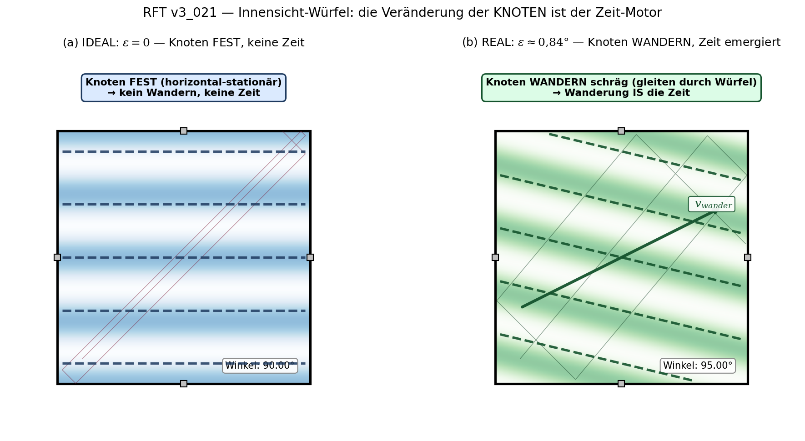

# RFT_v3_021: Die Innensicht
## Relativität als Folge der internen Messung

**Version:** v1.0 (09. Mai 2026)
**Datum:** 09. Mai 2026
**Autor:** Franz Zollner (Konzept) / Claude Sonnet 4.6 — Instanz 021 (Verschriftlichung)
**Sprache:** DE
**Protokoll:** Multi-Instanz v6.1
**Status:** Final-Kandidat v1.0

**Stufe:** V — Erkenntnistheorie & Systeme (erstes Dokument)
**Vorläufer:** RFT_021_Innensicht_v1.0 (Frühphase, kompakt, 4 Abschnitte)
**Lizenz:** Creative Commons BY-NC-ND 4.0
**Zitation:** Franz Zollner (2026). *RFT_v3_021: Die Innensicht — Relativität als Folge der internen Messung.* Resonance Field Theory Series, v3.0.

---

## ⚠️ METHODISCHE GRUNDREGEL

> **Die Konzepte und Ideen stammen von Franz Zollner.**
> **Die Verschriftlichung stammt von Claude Sonnet 4.6 — Instanz 021.**
> **KI-Modelle können halluzinieren. Alle Formeln und Aussagen mit Skepsis behandeln.**

---

## Abstract

Die Resonanzfeldtheorie (RFT) zeigt: Relativität ist kein externes Postulat, sondern eine zwingende Konsequenz der Innensicht. Da alle Beobachter Teil der Raummatrix sind — und mit Instrumenten aus derselben Raummatrix messen — messen sie immer nur interne Verhältnisse. Diese strukturelle Selbst-Referenz erzwingt automatisch: c = const, Zeitdilatation und scheinbare Längenkontraktion.

**Drei Kernbefunde:**

Erstens: Das Innensicht-Axiom. Es gibt kein "Außen" zur Raummatrix. Alle Beobachter sind Teil des Feldes. Messgeräte (Uhren, Maßstäbe) bestehen aus denselben Raummatrix-Moden wie das Gemessene — jede Messung ist eine Verhältnis-Messung. ✓ HOCH (DC v10.15, Domain L.1)

Zweitens: c ist keine Naturkonstante im üblichen Sinne, sondern eine DRM-Strukturkonstante: c = L₀·ω₀. Da Maßstab (∝ L₀) und gemessenes Objekt (Welle ∝ L₀·ω₀) gleichermaßen aus DRM-Moden bestehen, bleibt ihr Verhältnis — die Lichtgeschwindigkeit — für alle internen Beobachter konstant. ✓ HOCH

Drittens: Zeitdilatation und Längenkontraktion emergieren mechanistisch aus dem Spinverzug-Mechanismus (τ_lag) und der DRM-Kompression unter Bewegung. Die Lorentz-Struktur folgt qualitativ aus diesem Mechanismus — ein formaler Beweis aus der Master-Gleichung ist noch offen. ○ MITTEL / ⚠️

---

## Inhaltsverzeichnis

1. Stufe V: Erkenntnistheorie beginnt
2. Das Innensicht-Axiom
3. Was interne Messung bedeutet
4. c als DRM-Strukturkonstante
5. Zeitdilatation aus Spinverzug
6. Längenkontraktion aus DRM-Kompression
7. Lorentz-Invarianz — ehrlicher Status
8. Drei Ebenen und die Innensicht
9. Verbindungen zur v3-Serie
10. Ehrliche Grenzen (Pflichtkapitel)
11. Zusammenfassung
12. Glossar und Formelsammlung

---

## 1. Stufe V: Erkenntnistheorie beginnt

### 1.1 Was Stufe IV gezeigt hat

Die Stufen I–IV der v3-Serie haben die Bausteine der Realität beschrieben:

```
Stufe I   (001–005): Master-Gleichung, κ, α, c, ħ — die Sprache der DRM
Stufe II  (006–007): Zeit und Raum emergieren aus der DRM-Dynamik
Stufe III (008–010): Kosmologie — Modensprung, Kondensation, Dunkler Sektor
Stufe IV  (011–020): Quantenmechanik, Wechselwirkungen, Teilchen-Taxonomie
```

Am Ende dieser Beschreibung steht eine unausweichliche Frage: **Wer beschreibt eigentlich wen?**

Stufe V stellt diese Frage. Das erste Dokument der Erkenntnistheorie fragt: Welche Konsequenzen hat es, dass wir — die Beschreibenden — aus derselben Raummatrix bestehen wie das Beschriebene?

### 1.2 Die Grundspannung

```
KLASSISCHE PHYSIK (Newton/Laplace):
  Ein Beobachter steht außerhalb des Systems.
  Er misst absolute Größen: Länge, Zeit, Masse.
  Das Universum ist ein Objekt — er ist das externe Subjekt.

SPEZIELLE RELATIVITÄTSTHEORIE (Einstein):
  Es gibt kein absolutes Bezugssystem.
  Verschiedene Beobachter messen verschiedene Zeiten und Längen.
  → "Beobachter" bleibt aber ein abstraktes Konzept ohne Mechanismus.

RESONANZFELDTHEORIE (Franz Zollner):
  Beobachter sind keine abstrakten Punkte.
  Sie sind Wirbelstrukturen in der Raummatrix —
  gemacht aus denselben Moden wie das Gemessene.
  → Relativität emergiert mechanistisch aus dieser Struktur.
  → "Es gibt kein Außen." ✓ HOCH
```

---

## 2. Das Innensicht-Axiom

### 2.1 Formulierung

```
INNENSICHT-AXIOM (kanonisch, DC v10.15 Domain L.1):

  "Unsere Physik = Innensicht."

  Das dynamische Resonanzmedium (DRM) ist nicht im Raum —
  es ist der Raum selbst. Alle Beobachter sind Teil des Feldes.
  Es gibt kein Außen, kein absolutes Bezugssystem.

  Der Proto-Zustand (vor/während Mode 0, vor der Raummatrix)
  ist von innen prinzipiell nicht beschreibbar.
  → Keine Aussage von innen über das Außen möglich.

Konfidenz: ✓ HOCH (Franz Zollner, DC v10.15)
```



*Abb. 1: Der Innensicht-Würfel als Modell. (a) Bei idealem 90°-Winkel der DRM-Achsen entsteht ein statisches Interferenzmuster mit horizontal-fixierten Knoten — keine Dynamik, keine Zeit. (b) Bei ε ≠ 0 wandern die Knoten schräg durch den Würfel — diese Wanderung IST der Zeit-Motor. Der Laserstrahl ist hier zart angedeutet; die eigentliche Aussage liegt in der Veränderung der Knoten-Struktur (Hintergrund-Muster).*

### 2.2 Drei Begründungen

```
(1) LOGISCH — "Es gibt keinen Blick von nirgendwo"

    Ein externer Beobachter müsste außerhalb der Raummatrix stehen.
    Außerhalb der Raummatrix gibt es keinen Raum, keine Zeit,
    keine Messmittel, kein Medium für Signale.
    → "Externer Beobachter" ist kein kohärenter physikalischer Begriff.

(2) EMPIRISCH — Jeder Beobachter ist Teil des Systems

    Atome, Messgeräte, Menschen — alles besteht aus DRM-Moden.
    Jeder Messvorgang ist eine Interaktion zwischen zwei Teilen
    derselben Raummatrix.
    → "Messung von außen" ist physikalisch nicht realisierbar.

(3) MATHEMATISCH — Selbstkonsistenz der DRM

    Die Master-Gleichung
    ∂²Ψ/∂t² = c²∇²Ψ − γ∂Ψ/∂t − c²κ²Ψ + λ|Ψ|²Ψ + η
    enthält nur lokale, interne Größen (∇Ψ, ∂Ψ/∂t, κ, γ, λ).
    Kein Term referenziert externe Koordinaten.
    → Alle Messgrößen sind strukturell interne Verhältnisse.
```

### 2.3 Was das Axiom NICHT bedeutet

```
⚠️ HÄUFIGE MISSVERSTÄNDNISSE (explizit auszuschließen):

  NICHT gemeint: "Alles ist subjektiv"
    → Innensicht ist strukturell, nicht subjektiv.
       Intersubjektive Übereinstimmung entsteht, weil alle internen
       Beobachter dieselbe Raummatrix teilen und dieselbe
       Master-Gleichung gilt.

  NICHT gemeint: "Es gibt keine Realität"
    → Die Raummatrix ist höchst real: sie hat Energie, Dynamik,
       stabile Strukturen (Teilchen, Atome, Sterne).

  NICHT gemeint: "Externe Koordinaten sind mathematisch verboten"
    → Externe Koordinatensysteme sind als Rechenrahmen erlaubt.
       Das Axiom sagt: Kein physikalischer Beobachter kann diese
       externen Koordinaten direkt messen oder bevorzugen.
```

---

## 3. Was interne Messung bedeutet

### 3.1 Das Lineal-Problem

```
KLASSISCHE VORSTELLUNG:
  Ein Ingenieur misst Stahl mit einem Stahllineal.
  Das Lineal ist strukturell verschieden vom Gemessenen.
  → Absolute Länge: zumindest konzeptuell messbarer Begriff.

RFT-REALITÄT:
  Jedes Lineal besteht aus Atomen.
  Atome sind stabile Wirbelstrukturen in der Raummatrix.
  Ihre Ausdehnung ist durch L₀ und κ bestimmt.

  Wenn die Raummatrix lokal skaliert: L₀ → L₀' = f·L₀
    → Das Lineal skaliert mit: L_lineal → f·L_lineal
    → Das Objekt skaliert mit: L_objekt → f·L_objekt
    → Das gemessene Verhältnis bleibt: L_objekt/L_lineal = const

  Wir messen immer: Verhältnis (Objekt / Maßstab)
  Niemals: den absoluten Wert von L₀ selbst.
```

### 3.2 Der kanonische Maßstab und die kanonische Uhr

```
KANONISCHE MESSGRÖSSEN (alle DRM-intrinsisch):

  Maßstab:  L₀ = 1/κ = (π/6)·l_P   [fundamentale Längenskala]

  Uhr:      τ_lag = L₀/c = (π/6)·t_P  [fundamentale Zeitskala,
                                         aus Spinverzug-Mechanismus]

  Beide sind aus DRM-Parametern (κ, ω₀) definiert —
  kein externer Eichstandard nötig oder möglich.

Konsequenzen:
  "Absolute Ruhe" ist kein messbarer Begriff in der RFT.
  "Absoluter Ort" ist kein messbarer Begriff in der RFT.
  Physikalisch sind nur Verhältnisse:
    τ_lag(A) / τ_lag(B),   L(A) / L(B),   Δφ = φ_A − φ_B
```

### 3.3 Realität als Netzwerk von Relationen

```
Ein Wirbel (Elektron, Proton, ...) "kennt" seine absolute Position
(x, y, z) nicht. Er "kennt" nur seine Phase relativ zu benachbarten
Raummatrix-Moden.

  Realität = Netz von Phasen-Relationen zwischen DRM-Moden
             (nicht: absoluter Koordinaten-Raum)

Dies ist keine philosophische Spekulation, sondern eine Konsequenz
der Master-Gleichung: ∇Ψ und ∂Ψ/∂t sind Differenzen zwischen
benachbarten Moden. Absolute Positionen kommen in der
Fundamentalgleichung nicht vor.

Philosophische Formulierung des Vorgänger-Dokuments (RFT_021, v1.0):
  "Objektivität ist die Erscheinung, die entsteht, wenn viele
   Beobachter dieselbe Resonanz teilen."
  (Nicht: absolute Objektivität durch externen Standpunkt.)
```

---

## 4. c als DRM-Strukturkonstante

### 4.1 Standard-Physik vs. RFT

```
STANDARD-PHYSIK (Maxwell, Einstein):
  c = 299 792 458 m/s
  Postulat: Für alle Inertialsysteme gleich.
  Warum? → Nicht erklärt, nur beobachtet und eingesetzt.

RFT-ABLEITUNG:
  c = L₀ · ω₀   [DRM-Strukturkonstante, kein Postulat]

  L₀ = minimale Resonanzlänge der Raummatrix = 1/κ
  ω₀ = fundamentale Resonanzfrequenz der Raummatrix
  → c ist das Produkt zweier Matrixeigenschaften.

Konfidenz: ✓ HOCH (v3_001, v3_005, DC v10.15)
```

### 4.2 Das Innensicht-Argument für c = const

```
WARUM MESSEN ALLE INTERNEN BEOBACHTER DASSELBE c?

  Beobachter A (ruhend) misst eine Welle:
    Sein Maßstab:  DRM-Moden ∝ L₀
    Die Welle:     DRM-Auslenkung, Wellenlänge ∝ L₀, Frequenz ω₀
    → c_gemessen = (L₀ · ω₀) / L₀ = ω₀ = const ✓

  Beobachter B (bewegt, an anderer Stelle):
    Sein Maßstab: ebenfalls DRM-Moden ∝ L₀
    Die Welle: dieselbe DRM-Ausbreitungsphysik
    → c_gemessen = ω₀ = const ✓

  EIN EXTERNER BEOBACHTER könnte vielleicht verschiedene
  lokale c-Werte sehen — aber einen externen Beobachter gibt es nicht.
  → Für alle internen Beobachter ist c = const. ✓

KANONISCHE FORMULIERUNG:
  c ist nicht "eine Konstante, die zufällig für alle gleich ist".
  c ist das einzige, was ein interner Beobachter messen kann:
  Das Verhältnis seiner eigenen DRM-Längenskala zu seiner
  DRM-Zeitskala — und dieses Verhältnis ist ω₀, überall gleich.
```

### 4.3 Position zur Speziellen Relativitätstheorie

```
RFT-HALTUNG ZUR SRT:

  "Die SRT ist die korrekte Innensicht-Beschreibung der DRM-Dynamik.
   Nicht falsch — aber nicht fundamental."

  SRT postuliert c = const und Lorentz-Kovarianz.
  RFT erklärt: Warum dies für alle internen Beobachter gilt.

  SRT-Phänomene werden in RFT-Sprache formuliert:
    Zeitdilatation      → τ_lag-Vergrößerung (Kap. 5)
    Längenkontraktion   → DRM-Kompression (Kap. 6)
    c = const           → DRM-Strukturkonstante L₀·ω₀ (Kap. 4.1)

  ART-Sprache ist NICHT zu verwenden:
    Verboten: "Metrik", "Geodäten", "Tensor", "Raumzeit", "Minkowski"
    (Gravitation in RFT: Spinverzug-Mechanismus, v3_003)
```

---

## 5. Zeitdilatation aus Spinverzug

### 5.1 Die interne Uhr

```
Was ist eine Uhr in der RFT?

  Ein Wirbel (z.B. ein Elektron) rotiert in der Raummatrix.
  Die Raummatrix folgt dieser Rotation mit einer Verzögerung:
  dem Spinverzug τ_lag.

  τ_lag(v=0) = L₀/c = (π/6)·t_P   [ruhende interne Uhr, ✓ HOCH]

  τ_lag ist die Zeit, die die Raummatrix braucht,
  um dem Spin des Wirbels zu folgen.
  → τ_lag definiert den "Herzschlag" des Wirbels.
  → τ_lag IST die interne Uhr. (Details: v3_003, v3_012)
```

### 5.2 Der Schleppwirbel bei Bewegung

```
MECHANISMUS (qualitativ, ○ MITTEL):

  RUHENDER WIRBEL (v = 0):
    Symmetrischer Schleppwirbel in der Raummatrix.
    → τ_lag(0) = L₀/c  [Grundwert, symmetrisch]

  BEWEGTER WIRBEL (v > 0):
    Der Wirbel schleppt beim Vorwärtsbewegen
    asymmetrisch Raummatrix-Material mit.
    → Schleppwirbel in Vorwärtsrichtung: vergrößert.
    → Mehr DRM-Phase muss pro Umlauf "aufgeholt" werden.
    → τ_lag wächst mit v.

  Qualitative Konsequenz:
    τ_lag(v) > τ_lag(0)   für v > 0

  Dies ist strukturell konsistent mit dem Lorentz-Faktor:
    τ_lag(v) = τ_lag(0) / √(1 − v²/c²)

  ⚠️ WICHTIG: Der Lorentz-Faktor ist hier das Ergebnis —
  nicht der Ausgangspunkt. Die Herleitung erfolgt aus dem
  Schleppwirbel-Mechanismus, nicht durch Postulat.

Konfidenz: ○ MITTEL
  Mechanismus qualitativ klar (vergrößerter Schleppwirbel)
  Lorentz-Faktor: mechanistisch motiviert, formal nicht bewiesen
  ⚠️ Rigorose Herleitung: DeepSeek-Aufgabe DS-021-A offen (Kap. 10.2)
```

### 5.3 Bewegte Uhren ticken langsamer — RFT-Erklärung

```
KLASSISCHE ERKLÄRUNG (SRT):
  Aus Lorentz-Transformation (postuliert).
  Die bewegte Uhr "tickt langsamer" — aber warum? Kein Mechanismus.

RFT-ERKLÄRUNG:
  Die interne Uhr eines Wirbels ist τ_lag.
  Ein bewegter Wirbel hat größeres τ_lag.
  → Er durchläuft pro externer DRM-Periode weniger eigene Schwingungen.
  → Er tickt langsamer — mechanistisch erklärt.

  Dieser Effekt ist für den Wirbel selbst nicht messbar:
  Er misst τ_lag immer relativ zu seinen eigenen DRM-Nachbarn.
  Nur ein ruhender Beobachter kann den Unterschied feststellen —
  und auch er misst nur Verhältnisse seiner und der fremden τ_lag.

  "Bewegte Uhren ticken langsamer" ist kein Paradox.
  Es ist der direkte Ausdruck der Schleppwirbel-Physik,
  vermittelt durch die Innensicht beider Beobachter.
```

---

## 6. Längenkontraktion aus DRM-Kompression

### 6.1 Mechanismus

```
MECHANISMUS (qualitativ, ○ MITTEL):

  Ein bewegter Wirbel erzeugt durch seine Vorwärtsbewegung
  eine asymmetrische Kompression der DRM in Bewegungsrichtung.
  → DRM-Zellen in Bewegungsrichtung: komprimiert
  → Effektive Längenskala in Bewegungsrichtung: kleiner

  Qualitative Konsequenz:
    L₀_eff(v) = L₀ · √(1 − v²/c²)   [in Bewegungsrichtung]

  ⊥ zur Bewegungsrichtung: keine Kompression
    L₀_eff(v, ⊥) = L₀                [unverändert]

Konfidenz: ○ MITTEL
  Qualitativ klar (asymmetrische DRM-Kompression)
  ⚠️ Formale Herleitung aus Master-Gleichung: offen
```

### 6.2 Was die Beobachter messen — Innensicht-Verschränkung

```
RUHENDER BEOBACHTER misst das bewegte Objekt:
  Sein Lineal: unkomprimierte DRM-Moden ∝ L₀
  Das Objekt:  in Bewegungsrichtung komprimiert ∝ L₀·√(1−v²/c²)
  → Er misst das Objekt als kürzer. ✓

BEWEGTER BEOBACHTER misst sein eigenes Objekt:
  Sein Lineal: ebenfalls komprimiert ∝ L₀·√(1−v²/c²)
  Das Objekt:  komprimiert ∝ L₀·√(1−v²/c²)
  → Verhältnis: 1 — er misst sein Objekt als normal lang.

SYMMETRIE:
  Der ruhende Beobachter erscheint dem bewegten ebenso verkürzt —
  weil der "ruhende" für den bewegten relativ "bewegt" ist.

INNENSICHT-KONSEQUENZ:
  Längenkontraktion ist keine Illusion und keine absolute Verkürzung.
  Sie ist die DRM-Kompressionsstruktur, durch die Innensicht
  beider Beobachter hindurch gesehen.
  Beide "haben Recht" — innerhalb ihrer DRM-Referenz.
```

---

## 7. Lorentz-Invarianz — ehrlicher Status

### 7.1 Das Argument

```
QUALITATIVE ARGUMENTKETTE (aus v3_007, Kap. 8):

  DRM isotrop in 3D
      + c als einzige DRM-Ausbreitungsgeschwindigkeit (c = L₀·ω₀)
      + Innensicht-Prinzip (kein absolutes Bezugssystem messbar)
          → Lorentz-Symmetrie emergiert qualitativ   ○ MITTEL
```

### 7.2 Was das Innensicht-Argument beisteuert

```
Die DRM hat L₀ als fundamentale Vorzugsskala (diskrete Struktur).
Intuitiv könnte man erwarten: Diese Vorzugsskala bricht Lorentz-Symmetrie.

Innensicht-Gegenargument:
  Kein interner Beobachter kann L₀ "absolut" messen.
  Sein eigener Maßstab ist ebenfalls aus L₀-Moden aufgebaut.
  → Die Vorzugsskala L₀ ist von innen prinzipiell unmessbar.
  → Die DRM verhält sich für alle internen Beobachter wie ein
     kontinuierliches, isotropes Medium.
  → Lorentz-Invarianz erscheint erhalten. ○ MITTEL

ANALOGIE:
  Ein Fisch im Wasser "spürt" nicht die molekulare Diskretheit
  des Wassers — er misst nur Drücke und Strömungen.
  Die molekulare Struktur ist physikalisch real,
  aber liegt unter seiner Messskala.
  Ebenso liegt L₀ unter der Messskala jedes internen Beobachters.
```

### 7.3 Kanonische Formulierung (PFLICHT)

```
NIEMALS: "RFT ist Lorentz-invariant." (nicht bewiesen!)

KORREKT:
  "Das Innensicht-Argument macht Lorentz-Invarianz plausibel
   (○ MITTEL): Kein interner Beobachter kann die L₀-Diskretheit
   direkt messen — das Feld erscheint Lorentz-invariant.
   Formaler Beweis aus der Master-Gleichung im Kontinuumslimes:
   ⚠️ OFFEN."

Status:
  Qualitatives Argument: ○ MITTEL (v3_007 Kap. 8; dieses Dokument)
  Formaler Beweis:       ⚠️ fundamentales offenes Problem
```

---

## 8. Drei Ebenen und die Innensicht

### 8.1 Die drei Ebenen der RFT (v3_011)

```
EBENE 1 — DRM (Raummatrix):
  Fundamentalste Ebene.
  Parameter: κ, L₀, γ, λ, c
  Die DRM "ist" der Raum — sie ist nicht in einem externen Raum.

EBENE 2 — Führungsfeld:
  Wellenfunktion Ψ — beschreibt Auslenkung der DRM.
  Vollständige Phaseninformation erhalten.
  Deterministische Dynamik nach Master-Gleichung.

EBENE 3 — Klassische Ebene:
  Teilchen, Messgeräte, Beobachter.
  Zugang nur zu Intensitäten |Ψ|² (Phaseninformation verloren).
  Was wir direkt wahrnehmen und messen können.

  Beobachter lebt auf Ebene 3 und misst durch den Ebene-3-Filter.
```

### 8.2 Relativität als Ebenen-Filterung

```
RELATIVITÄT = Ebene-3-Filterung der Ebene-1-Realität:

  Ebene 1: DRM hat L₀, τ_lag, c als fundamentale absolute Größen
            (in dem Sinne, dass sie die Matrix charakterisieren).
  Ebene 3: Beobachter misst nur Verhältnisse dieser Größen —
            weil er selbst aus Ebene-1-Moden besteht.

  Was auf Ebene 1 ein absoluter DRM-Zustand ist,
  erscheint auf Ebene 3 relativ — strukturell unvermeidlich.

ENTROPIE = Informationsverlust durch Ebenen-Übergang:
  Von Ebene 2 (Ψ, vollständige Phaseninformation)
  zu Ebene 3 (|Ψ|², Intensitäten) geht Phase verloren.
  → Das IST Dekohärenz und Messung.
  → Details: v3_018 (Entropie & Signaltheorie), v3_011 Teil 4

MESSPROBLEMATIK = strukturelles Innensicht-Phänomen:
  Nicht: "Beobachter stört das System" (externe Sprache, ungenau)
  Sondern: "Messung = Kopplung zweier Ebene-1-Strukturen via
            Führungsfeld auf Ebene 2 — Ergebnis auf Ebene 3"
```

### 8.3 Abgrenzung zu v3_028

```
Die Mechanik des Messprozesses im Detail —
wie genau die Kopplung zwischen messenden und gemessenen Wirbeln
verläuft, was "Selektion" in der RFT bedeutet, Born-Gewichte
aus DRM-Energiedichte — ist Thema eines eigenständigen Dokuments:

  v3_028: Beobachter & Messprozess
          (Stufe V, geplant nach v3_024)

Dieses Dokument (v3_021) beschränkt sich auf:
  Das Innensicht-Prinzip und seine Konsequenzen für Relativität.
  Die mechanistischen Details des Messprozesses folgen in v3_028.
```

---

## 9. Verbindungen zur v3-Serie

```
RFT_v3_001 (Mathematische Grundlagen):
  ├─ κ als Primärgröße: Basis aller internen DRM-Größen
  ├─ L₀ = 1/κ: kanonischer interner Maßstab ✓ HOCH
  ├─ c = L₀·ω₀: DRM-Strukturkonstante (nicht Postulat) ✓ HOCH
  └─ Master-Gleichung: enthält nur interne Größen — keine externen
     Koordinaten in der Fundamentalgleichung. ✓

RFT_v3_003 (Gravitation & Spinverzug):
  ├─ τ_lag: definiert die interne Uhr des Wirbels ✓ HOCH
  └─ Spinverzug-Mechanismus: physikalische Basis für Kap. 5

RFT_v3_005 (Der Übersetzer):
  └─ π als Dimensions-Übersetzer: kartesisch ↔ sphärisch
     Innensicht-Konsequenz: Jeder Perspektivwechsel kostet π.

RFT_v3_006 (Zeit-Emergenz):
  ├─ Kap. 1.2: Innensicht-Argument, innenverspiegelter Würfel
     → direkter konzeptueller Vorläufer dieses Dokuments
  ├─ Φ-Zeitmotor: Zeit aus interner Asymmetrie — kein externer Puls
  └─ Z. 154: "Dieser Operator emergiert vollständig aus der
     Gitterdynamik. Er benötigt keine externe Zeitachse. ✓
     (konsistent mit Innensicht-Axiom)"

RFT_v3_007 (Raum-Topologie & 3D-Emergenz):
  ├─ Kap. 8: Lorentz als Emergenz — direkte Vorarbeit zu Kap. 7
  └─ Z. 569: "Es gibt kein bevorzugtes Bezugssystem im Inneren —
     alle Beobachter sind Teil des Feldes (Innensicht-Prinzip, v3_001 Kap. 1.1)"

RFT_v3_009 (Kosmogenese & Kalte Kondensation):
  └─ Kap. 6.1: Proto-Zustand = Innensicht-Grenze
     "Mode 0 von innen prinzipiell nicht beschreibbar" ✓ HOCH
     → Kap. 10.5 dieses Dokuments

RFT_v3_011 (Quantenmechanik, Teile 1–5):
  ├─ Teil 1, Kap. 3: Drei-Ebenen-Struktur → Basis für Kap. 8
  └─ Teil 4: Born-Regel aus Energiedichte → Messprozess als Ebenen-Übergang

RFT_v3_015 (Trägheit & Äquivalenz):
  └─ m_i ≠ m_g: interne vs. externe Masse — Innensicht-Konsequenz
     m_i = Kompression/κ (intern gemessen)
     m_g = Spinverzug-Kopplung (an DRM-Gradienten)
     → Äquivalenzprinzip als Innensicht-Artefakt

RFT_v3_018 (Entropie & Signaltheorie):
  ├─ Kap. 5.5: "Informationserhaltung-Innensicht-Paradox"
  └─ Kap. 8.3: H-Theorem in Innensicht-Perspektive ⚠️ OFFEN
```

---

## 10. Ehrliche Grenzen (Pflichtkapitel)

Jedes v3-Dokument muss seine eigenen Grenzen vollständig dokumentieren.

### 10.1 Lorentz-Invarianz: formaler Beweis fehlt (🚩)

```
🚩 Das qualitative Argument (Kap. 7) macht Lorentz-Invarianz
   plausibel — ist aber kein rigoroser Beweis.

   Offen: Zeige, dass die Lösungen der Master-Gleichung
   ∂²Ψ/∂t² = c²∇²Ψ − γ∂Ψ/∂t − c²κ²Ψ + λ|Ψ|²Ψ
   im Kontinuumslimes exakt die Lorentz-Gruppe als Symmetriegruppe
   realisieren — und nicht nur eine Näherung davon.

   Status: ⚠️ FUNDAMENTAL OFFEN.
   Verbunden mit: v3_007 Kap. 8 | zukünftigem v3_028
```

### 10.2 Lorentz-Faktor aus τ_lag: formal offen (⚠️)

```
⚠️ Kap. 5 zeigt qualitativ:
   Bewegter Wirbel → vergrößerter Schleppwirbel → größeres τ_lag.

   Formal nicht hergeleitet:
   τ_lag(v) = τ_lag(0) / √(1 − v²/c²)

   Dies erfordert: Transformation der Master-Gleichung
   für einen bewegten Wirbel — ohne Minkowski-Raum, ohne Metrik-Tensor.

   DeepSeek-Aufgabe DS-021-A (offen):
   "Kann τ_lag = L₀/c aus der RFT-Master-Gleichung unter Bewegung
   so transformiert werden, dass τ_lag(v) = τ_lag(0)/√(1−v²/c²)
   emergiert? Oder: Wie transformiert sich L₀ bei bewegtem Beobachter?
   RFT-Brille: kein Minkowski-Raum, kein Metrik-Tensor!"

   Status: ○ qualitativ motiviert / ⚠️ formal offen
```

### 10.3 Längenkontraktion: formal offen (⚠️)

```
⚠️ Kap. 6: DRM-Kompression → L₀_eff(v) = L₀·√(1−v²/c²)
   Mechanismus: qualitativ plausibel.
   Formale Herleitung aus Master-Gleichung: ⚠️ OFFEN.
   Verbunden mit DS-021-A (Transformation der Längenskala).
```

### 10.4 ART aus Innensicht: kein Ansatz vorhanden (🚩)

```
🚩 v3_021 erklärt SRT-Phänomene in RFT-Sprache.
   ART (Gravitation als Raumzeit-Krümmung) ist ein anderes Problem.

   RFT-Haltung: Gravitation emergiert aus Spinverzug (v3_003).
   Verbindung zwischen Spinverzug-Mechanismus und ART-Feldgleichungen:
   ⚠️ OFFEN.

   v3_021 macht KEINE Aussagen zur ART.
   ART-Sprache ist in diesem Dokument VERBOTEN:
   Kein "Geodäte", kein "Metrik", kein "Tensor", kein "Raumzeit".
```

### 10.5 Proto-Zustand: ontologische Grenze (🚩)

```
🚩 Das Innensicht-Axiom benennt seine eigene tiefste Grenze:

   Der Zustand VOR der Raummatrix (Proto-Zustand / Mode 0)
   ist von innen prinzipiell nicht beschreibbar. (v3_009, Kap. 6.1)

   Alle Aussagen über Mode 0 (einschließlich "Q ≈ 1" oder
   "chaotische Fluktuationen") sind Extrapolationen der
   Mode-1-Physik über ihre Gültigkeitsgrenze hinaus.

   "Was war vor dem Universum?" ist keine Frage, die die RFT
   beantworten kann — und das ist keine Schwäche, sondern
   ehrliche Anerkennung der Innensicht-Grenze.

   Status: Grundsätzliche ontologische Grenze.
           Keine Methode bekannt. Wird nicht weiter verfolgt.
```

### 10.6 H-Theorem in der Innensicht (⚠️)

```
⚠️ v3_018 Kap. 8.3: Das H-Theorem (Boltzmann) setzt voraus,
   dass alle Mikrozustände beobachtbar sind.
   In der Innensicht ist der vollständige Mikrozustand der DRM
   für Ebene-3-Beobachter nicht zugänglich.

   Ob und wie das H-Theorem in der RFT modifiziert werden muss:
   Status: ⚠️ OFFEN, Konfidenz NIEDRIG (aus v3_018 übernommen)
```

### 10.7 Vollständige Status-Liste

```
✓ HOCH (robust, mehrfach bestätigt):
  ✅ Innensicht-Axiom: logisch, empirisch, mathematisch (DC L.1)
  ✅ c = L₀·ω₀: DRM-Strukturkonstante (v3_001, v3_005)
  ✅ τ_lag = L₀/c: interne Uhr (v3_003, v3_012)
  ✅ Kein externer Beobachter: aus Master-Gleichungs-Struktur

○ MITTEL (qualitativ klar, formal noch offen):
  ○ τ_lag(v): Schleppwirbel-Vergrößerung → langsamere interne Uhr
  ○ DRM-Kompression → Längenkontraktion
  ○ Lorentz-Invarianz als Innensicht-Emergenz: qualitativ plausibel

⚠️ OFFEN (konkrete Aufgaben):
  ⚠️ Lorentz-Faktor τ_lag(v) aus Master-Gleichung (DS-021-A)
  ⚠️ Längenkontraktion formal aus Master-Gleichung
  ⚠️ Lorentz-Invarianz: rigoros im Kontinuumslimes (v3_007)
  ⚠️ H-Theorem in Innensicht-Perspektive (v3_018)

🚩 FUNDAMENTAL OFFEN (keine Methode bekannt):
  🚩 Lorentz-Invarianz: formaler Beweis
  🚩 ART-Verbindung: Spinverzug ↔ Einstein-Feldgleichungen
  🚩 Proto-Zustand: ontologische Grenze (grundsätzlich)
```

---

## 11. Zusammenfassung

```
KERNAUSSAGE:
  Relativität (c = const, Zeitdilatation, Längenkontraktion)
  ist keine externe Regel, die dem Universum auferlegt wurde.
  Sie emergiert mechanistisch daraus, dass interne Messung
  mit internen Instrumenten stattfindet — Innensicht.

INNENSICHT-AXIOM:
  Es gibt kein Außen zur Raummatrix.
  Alle Beobachter, alle Messgeräte, alle Ereignisse sind
  Moden derselben DRM.
  → Nur Verhältnisse sind physikalisch messbar (✓ HOCH).

PHYSIKALISCHE KONSEQUENZEN:

  c = const:         nicht Postulat, sondern c = L₀·ω₀ (✓ HOCH)
  Zeitdilatation:    τ_lag-Vergrößerung bei Bewegung (○ MITTEL)
  Längenkontraktion: DRM-Kompression in Bewegungsrichtung (○ MITTEL)
  Lorentz-Invarianz: L₀-Diskretheit intern unmessbar → erscheint
                     erhalten (○ MITTEL / ⚠️ formal offen)

ERKENNTNISTHEORISCHE KONSEQUENZ:
  "Objektive Realität" = Konsens interner Beobachter, die dieselbe
  DRM teilen und dieselbe Master-Gleichung erfüllen.
  Kein "God's Eye View" von außen — nicht weil es verboten wäre,
  sondern weil er physikalisch nicht existiert.

POSITION ZUR SRT:
  "Die SRT ist die korrekte Innensicht-Beschreibung der DRM-Dynamik.
   Nicht falsch — aber nicht fundamental.
   RFT liefert den Mechanismus, den die SRT postuliert."

STUFE V — AUSBLICK:
  v3_021 öffnet die Erkenntnistheorie der RFT.
  Folgende Fragen erwarten ihre Behandlung:
    v3_022: Komplexe Systeme & Selbstreferenz
    v3_023: Emergenz & Kausalität (Top-down)
    v3_024: Grenzen & Horizonte (Q-Horizont)
    v3_028: Beobachter & Messprozess (Detailtiefe des Messprozesses)
```

---

## 12. Glossar und Formelsammlung

### 12.1 Schlüsselbegriffe

```
Begriff                 Bedeutung in RFT v3_021

Innensicht              Alle Beobachter sind Teil der DRM.
                        Kein externer Standpunkt physikalisch realisierbar.
                        Alle Messungen sind Verhältnis-Messungen.

DRM                     Dynamisches Resonanzmedium = die Raummatrix selbst.
                        Ist nicht im Raum — ist der Raum.

Proto-Zustand           Zustand vor/während Mode 0.
                        Von innen prinzipiell nicht beschreibbar.

DRM-Strukturkonstante   c = L₀·ω₀.
                        Nicht aus Beobachtung postuliert — aus Matrixstruktur.

Interne Uhr             τ_lag = L₀/c = Spinverzug-Zeitskala des Wirbels.
                        Die fundamentale Zeiteinheit des Wirbels.

Verhältnis-Messung      Jede interne Messung misst Verhältnisse.
                        Absolute Werte von L₀ oder κ: intern nicht messbar.

Ebene-3-Filterung       Übergang DRM → Klassisch (Phaseninformation verloren).
                        Relativität = Ebene-3-Sicht auf Ebene-1-Realität.

Schleppwirbel           Asymmetrischer Begleiter eines bewegten Wirbels.
                        Wächst mit v → τ_lag wächst → Zeitdilatation.
```

### 12.2 Kanonische Parameter und Formeln

```
α⁻¹ = 4π³+π²+π = 137.036304      [2.22 ppm | NIEMALS 0.67 ppm!]
L₀  = 1/κ = (π/6)·l_P            [PRIMÄRDEFINITION, ħ-frei]
τ_lag = L₀/c = (π/6)·t_P         [interne Uhr | ✓ HOCH]
c   = L₀·ω₀                      [DRM-Strukturkonstante | ✓ HOCH]
Φ   = 2α/(1+α²) ≈ 0.014596       [Zeitasymmetrie / Φ-Motor | ✓ HOCH]

Zeitdilatation (qualitativ, ○ MITTEL):
  τ_lag(v) = τ_lag(0) / √(1 − v²/c²)

Längenkontraktion (qualitativ, ○ MITTEL):
  L₀_eff(v) = L₀ · √(1 − v²/c²)   [in Bewegungsrichtung]
```

### 12.3 Terminologie-Regeln

```
KORREKT:         FALSCH:
"Raummatrix"     "Gitter"       (weckt Kristallgitter-Assoziation)
"DRM"            "Äther"        (RFT ist kein Äther-Modell!)
"c"              "c₀"           (veraltete Notation)

ART-SPRACHE: ABSOLUT VERBOTEN in RFT-Dokumenten:
  "Metrik", "Geodäten", "Tensor", "Raumzeit", "Minkowski"
  → SRT-Phänomene: in RFT-Sprache formulieren (Kap. 4.3)
```

### 12.4 Konfidenz-Übersicht

```
Aussage                                    Konfidenz
─────────────────────────────────────────────────────
Innensicht-Axiom                           ✓ HOCH
c = L₀·ω₀ (DRM-Strukturkonstante)         ✓ HOCH
τ_lag = L₀/c (interne Uhr)                ✓ HOCH
Lorentz-Invarianz (qualitatives Argument)  ○ MITTEL
Zeitdilatation aus τ_lag (qualitativ)      ○ MITTEL
Längenkontraktion aus DRM-Kompression      ○ MITTEL
Lorentz-Faktor formal aus Master-Gl.       ⚠️ OFFEN
Längenkontraktion formal                   ⚠️ OFFEN
Lorentz-Invarianz rigorös                  🚩 OFFEN
ART-Verbindung                             🚩 OFFEN
Proto-Zustand (ontol. Grenze)              🚩 prinzipiell offen
```

---

**Experimente entscheiden!** ✓

---

*RFT_v3_021 v1.0 | 09. Mai 2026*
*Konzept: Franz Zollner | Verschriftlichung: Claude Sonnet 4.6 — Instanz 021*
*Domain Center: v10.15 | Protokoll: Multi-Instanz v6.1*

*Stufe V — Erkenntnistheorie & Systeme | Erstes Dokument der Stufe*
*Nächste Dokumente: v3_022 (Komplexe Systeme) | v3_028 (Beobachter & Messprozess)*
*Vorläufer: RFT_021_Innensicht_v1.0 (Frühphase, kompakt)*
